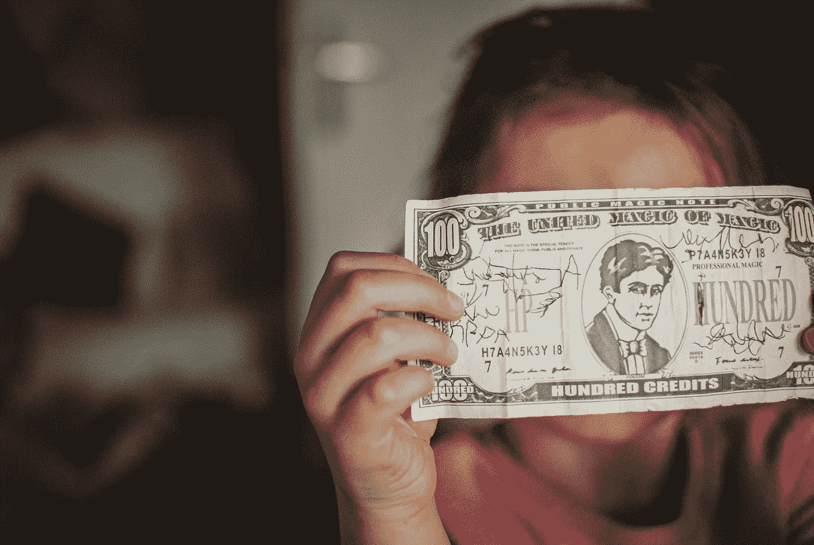

# 我们需要现在就开始在教育中教授个人理财

> 原文：<https://medium.datadriveninvestor.com/we-need-to-start-teaching-personal-finance-in-education-now-4a08d842716f?source=collection_archive---------1----------------------->

Photo by [Kelly Sikkema](https://unsplash.com/@kellysikkema?utm_source=medium&utm_medium=referral) on [Unsplash](https://unsplash.com?utm_source=medium&utm_medium=referral)

如果说这场危机教会了我们什么的话，那就是似乎没有人知道我们的金融体系发生了什么。他们为什么要这么做？你什么时候学会理财的？

现在我知道，金融危机比人们对个人财务管理不善更为严重。有很多欺骗，别有用心的人和次级抵押贷款正在进行(观看大空头得到解释给你！)，但归根结底是人们不理解金钱，以及金钱能为他们做什么。以及它不能为他们做什么。

我们期望受过医学训练的人了解医学。我们希望受过法律培训的人能够理解法律(或者至少能够解释不同的法律和治理)，我们也希望受过金融培训的人能够理解金融。但并不是生活中的每个人都必须知道如何进行心脏直视手术，或者赢得诉讼。但是生活中每个人都会和钱打交道。然后突然之间，没有受过训练就成了一个问题。

 [## 外汇投资如何帮助偿还债务|数据驱动的投资者

### 外汇是对外汇市场的投资，不同国家的货币在外汇市场上进行兑换

www.datadriveninvestor.com](https://www.datadriveninvestor.com/2019/02/13/how-forex-investment-helps-to-repay-your-debts/) 

现在不是每个人都能成为金融专家。也没有必要让每个人都成为专家。但是我们也没有理由无知。我们知道当我们受伤/生病时该做什么，我们知道当我们陷入法律纠纷时该做什么(以及如何置身事外)。那么，为什么我们对如何处理金钱毫无头绪被认为是可以接受的呢？

以下是我对在课程中加入个人理财的观点:

# 你需要知道钱能做什么，不能做什么

知道钱是如何运作的是生活中的一项重要资产。认识和理解金钱，就叫理财素养。精通财务意味着能够在财务方面做出负责任的决定，或者简单地说:金钱。

财务知识可以帮助你管理你的钱，在一定程度上，它可以防止你陷入债务。它告诉你，事实上，有一个极限，如果你的收入不能平衡你的支出，要么你还有一些储蓄，要么你已经负债了。这种预算的基本形式是我们大多数人从未学过的，除非我们吃了苦头才知道…

Photo by [Sharon McCutcheon](https://unsplash.com/@sharonmccutcheon?utm_source=medium&utm_medium=referral) on [Unsplash](https://unsplash.com?utm_source=medium&utm_medium=referral)

说到预算，你可能已经负债累累了。至少在当前的环境下，这是可能的。那么财务知识对你有什么帮助呢？这将使你能够区分好债和坏账。“好”债务是可偿还的投资(学生贷款似乎不可避免，但需要被视为一种投资)，而“坏”债务是不可偿还的债务(你现在没有钱，以后也不会有)，专注于眼前的消费，没有货币收益。

当负债累累时，金融知识有助于管理它。你更有可能理解如何还清债务，根据什么方案，以及如何做最有利。另一个关键点是你要理解复利，这是我们将在本文后面深入探讨的内容。

关于坏账，金融知识会帮助你避免它。在“金融产品”部分会有更多的介绍。

提到这两种形式的债务，以及最常见的是学生债务的事实，重要的是把这个教给孩子。为什么？因为，尽管我们可能认为我们已经“长大了”，但当我们决定上大学时，我们还是孩子。现在父母也经常帮忙。但当他们接受过金融教育后，肯定会更愿意这么做。并不是每个人都可以声称有过这样的经历…

# 你需要知道哪些金融产品对你有好处，哪些是不好的

现在钱有很多种不同的形式。这对人们如何理财产生了巨大的影响。我已经写了多篇关于不同形式和形状的金钱如何影响我们行为的文章，下面我将把它们联系起来。

这有什么关系？嗯，大多数孩子在进入高中时都有银行账户、借记卡和信用卡。他们还拥有一部手机，这实际上是一种支付方式。所以，现在我们的年轻人什么都懂，却什么都不懂。太好了。

孩子们需要知道，事实上，消费是有限度的，尽管他们的塑料卡可能不会像现金那样给他们相同的暗示(一旦你用完了实物现金，你就完了)。但更重要的是，他们需要知道当*所有*的钱都没了会发生什么…

Photo by [Guillaume M.](https://unsplash.com/@guimgn?utm_source=medium&utm_medium=referral) on [Unsplash](https://unsplash.com?utm_source=medium&utm_medium=referral)

有许多金融产品旨在帮助你弥补当前收入和未来收入之间的差距。它可以以抵押贷款、银行对消费者贷款、[个人对个人](https://www.datadriveninvestor.com/glossary/peer-to-peer/)贷款、鲨鱼对孔雀鱼贷款的形式出现，当然还有信用卡。

首先，人们(在这种情况下是孩子)需要了解这些资金来源实际上是一种债务形式(它们需要偿还)，并且它们是现在获得更多钱的昂贵方式。让我们看看我刚才提到的债务。

*   **抵押**。有许多不同的抵押贷款。如果你不得不选择一个，我真的为你感到抱歉。有了抵押贷款，你实际上被以你的房子作为抵押的债务套牢了几十年(通常是 30 年)。你不支付抵押贷款，抵押品(你的房子)被拿走，你流落街头。冷酷无情。你不仅要偿还你当初买房所需的实际金额，还要支付利息。这实际上是对所提供服务的收费，这些服务是初始金额的借贷。这是大多数人开始迷失的地方。让我们看一些贷款来更好地解释利息。
*   **银行对消费者贷款**。你需要钱。好了，是时候去一个和钱打交道的机构了，也就是银行。你将通过一些财务检查，但最终，你获得贷款批准(好样的！).你取出 2000 美元，分 10 个月偿还，外加 5%的利息(一个月)。现在我问你，你每个月要还多少？这好像是一个害死大家的问题，不过还是来解一下吧。2000 美元的 5%(利息= 100 美元)，贷款偿还额为 2000/10 美元(= 200 美元)。第一个月花费你 300 美元。第二个月你将花费 1800 美元的 5%(利息= 90 美元)，偿还贷款 1800 美元/9(200 美元)。第二个月花费你 290 美元。贷款是现在人们获取金钱的昂贵方式。查一下利率。在头两个月内，你支付了 190 美元，借出 2000 美元，期限不到一年，在第 10 个月，你将最终支付 550 美元(100 + 90 + 80 + 70 + 60 + 50 + 40 + 30 + 20 + 10)。这意味着你已经支付了超过 25%的初始借款金额，而不是他们宣传的 5%。这是复利的一种形式。我觉得我会为此写一整篇文章。
*   [**点对点**](https://www.datadriveninvestor.com/glossary/peer-to-peer/) **贷款**。这是一种新兴的借贷形式，一个应用程序上的朋友、熟人或完全陌生的人可以互相借钱。通常你会发现这些贷款利息很低，而且双方之间有一个隐含的，但主要是社会性的协议。非常不正式。很容易让你失去一段友谊，所以参与时要小心。

现在看起来好像我刚刚给了你一个很长的列表，列出了当今经济中可能存在的陷阱。嗯，我做到了。但我为什么要这么做？

Photo by [rupixen.com](https://unsplash.com/@rupixen?utm_source=medium&utm_medium=referral) on [Unsplash](https://unsplash.com?utm_source=medium&utm_medium=referral)

这些类型的债务(好吧，也许不是抵押贷款)是我们年轻时接触到的东西。如果你对复利一无所知，你就不会知道这些债务有多糟糕，或者可能有多糟糕。

在年轻时教导人们意味着他们在最需要的时候看穿这些计划，比如高中毕业后、大学毕业后、第一份工作时等等。正如我之前所说，负债是不好的。它会毁掉你的财务状况，你的心理健康，你的信用评分，这样会对你的未来产生毁灭性的影响。年轻人的未来很长。我们不想让他们落入这些陷阱，从而毁掉未来几十年。我们需要教他们个人理财。

# 你需要从小接受教育，否则可能就太晚了

现在，如果你读到这里，你可能会对自己说:“这一切都很有意义。如果我们所有人都知道这一点，世界会变得更好。但是为什么要在这么小的年纪就教孩子呢？那部分真的有必要吗？”

是的。是的，它是。

我认识(现在仍然认识)很多人，他们在父母的教导下长大，对金钱非常不了解。他们中的一些人继承了他们的习惯，最终在财务上做得不太好(阅读:可怕)，其他人把他们父母的例子作为他们必须避免的一件事，并且做得相当好。

问题是，两种情况都有可能。教育不就是为了让我们为现实世界做好准备吗？一个似乎围绕着钱的问题？！

无论你如何努力，小学和高中教育都是不可避免的教育形式。但也许更重要的是，小学生正处于学习最快的年龄，也是学习新习惯最快的年龄。

我们年轻时养成的习惯根深蒂固，最难打破。习惯是基于我们在某一时刻所拥有的知识。我们有责任为“年轻人”提供在这种金融环境下生存的知识。否则，我们将一遍又一遍地重复同样的循环。坦率地说，我不需要重复过去十年。太可怕了。

最终，如果你对钱感兴趣，你可以选择读一个它的学位，无论你想要什么级别，就像那些对救人感兴趣的人(从身体上)学习医学，成为医生、护士和研究人员一样。然而，并不是所有人都会处理大到需要成为医生的突发健康事件。但是我们都和钱打交道。

我们经常和钱打交道。无论是收入、支出、储蓄、债务、抵押贷款、养老金计划还是投资。我们需要养成这样的习惯:当涉及到钱的时候，我们需要知道自己在做什么。没有比越早接受教育更好的年龄了！

Merle van den Akker 是华威商学院行为科学专业的博士生。她研究了非接触式和移动支付方式对我们管理个人财务的影响。
在她的“空闲”时间里，她撰写关于个人理财、行为科学、行为金融和博士生生活的文章，这些都发表在 [Money on the Mind](https://www.moneyonthemind.org/blog) 上，以确保学术界的知识流入主流，并能帮助尽可能多的人！

*原载于 2019 年 11 月 26 日*[*https://www.datadriveninvestor.com*](https://www.datadriveninvestor.com/2019/11/26/we-need-to-start-teaching-personal-finance-in-education-now/)*。*