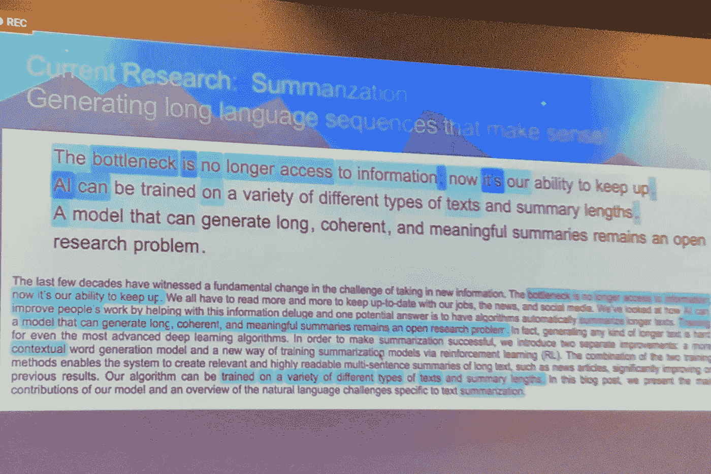

# 我们需要谈谈！关于人工智能和新闻伦理

> 原文：<https://medium.datadriveninvestor.com/we-need-to-talk-about-artificial-intelligence-and-ethics-in-journalism-e2d52e5cd45f?source=collection_archive---------5----------------------->

2018-人工智能年:埃隆·马斯克在奥斯汀警告自主武器系统的危险-几个月后，剑桥分析公司的丑闻震惊了世界。有人说人工智能的不道德使用是对人类的真正威胁。

> 人工智能就是将人类的知识和能力数字化。许多人没有意识到的是:媒体公司已经在以许多不同的方式使用人工智能。

《华盛顿邮报》多年来一直试图找出自动化在新闻业中的有用程度。例如，他们的机器人 Heliograf 分析数据，记录趋势，然后丰富模板，最终创建短篇故事。这对于体育、金融和选举报道非常有效——换句话说，它已经在有足够的结构化数据可用的领域中使用。洛杉矶时报的机器人 Quakebot 以类似的方式工作，根据数据和文本模板几乎实时地生成关于地区地震的报告。

其他媒体也越来越多地使用人工智能:例如，美联社已经自动化了盈利故事的制作，美国消费者新闻与商业频道和其他许多新闻编辑室正在使用 Wochit to 等半自动视频制作平台来制作引人入胜的社交视频，而[半岛电视台正在考虑让记者机器人在现场报道战区的情况。](http://www.niemanlab.org/2018/03/how-digital-leaders-from-the-bbc-and-al-jazeera-are-planning-for-the-ethics-of-ai/)

**人工智能在新闻业的进一步应用:**

-基于视频和其他内容的用户移动数据的推荐部件(例如 BBC)

-用于语音助手的智能文本到语音转换功能(例如 DW)

-新闻内容的主动和被动个性化(华盛顿邮报，FAZ)，基于概率模型的付费内容购买报价(SZ)和基于使用模式/特征的广告(Outbrain 和其他广告营销商)

-社交倾听:借助倾听工具(如在线倾听中心 RP、Crowdtangle)及早发现网络和社交平台上的趋势和新闻

-通过机器学习(如 SZ/Paradise Papers)对复杂的非结构化数据进行信息提取、聚类和可视化

**学习相互交谈**

Photo by [Andy Kelly](https://unsplash.com/photos/0E_vhMVqL9g?utm_source=unsplash&utm_medium=referral&utm_content=creditCopyText) on [Unsplash](https://unsplash.com/search/photos/robot?utm_source=unsplash&utm_medium=referral&utm_content=creditCopyText)

真正让我着迷的是自然语言处理，简称 NLP。我在德国之声的一些同事已经研究这项技术很长时间了。NLP 的目标是使人和机器能够在视觉水平上相互交流。聊天机器人或数字语言助理的工作方式就是基于这一原理。今年，NLP 真的取得了很大的进步:工具 [news.bridge](http://newsbridge.eu) 的原型允许编辑使用语音到文本技术在几秒钟内转录视频。在下一步中，该工具将脚本(质量仍然非常不同)翻译成所有可能的目标语言(例如，通过 API 到 Google Translate ),最后使用合成语音生成进行新的配音。

我今年在旧金山的 Salesforce 目睹的一个演示也同样神奇:一台几乎可以实时总结复杂文本的机器——首席科学家理查德·索彻本人表示，直到最近他才想到这是可能的。

Photo by Ellen Schuster

尽管人类和自动作者之间的界限越来越模糊，但机器生成的文本(目前)还不会获得普利策奖。

但媒体渠道的许多优势仍然非常明显:自动化节省了时间，并使不同平台的新闻产品能够“重新包装”——考虑到近年来必须同时提供特定服务的渠道和平台的数量增长如此之快，这是迫切需要的。

**自动化带来页面浏览量**

在某种程度上，自动化创造了在不同平台和不同语言上快速、经济地发布类似内容的新机会，从而提高了新闻业可扩展性的可能性。或者，说得不那么复杂:如果进展顺利，自动化会带来更高的参与度、更长的保留时间和更多的页面浏览量。在许多媒体公司的商业模式仍然基于影响力的时代，这对于生存至关重要。[“现在，自动化新闻是关于生产量的。俄勒冈大学专门研究人工智能的新闻学教授塞斯·刘易斯说:“最终，媒体公司将不得不找出如何超越页面浏览量的方法。](https://digiday.com/media/washington-post-puts-price-data-privacy-gdpr-response-tests-requirements/)

但是，即使是那些关注影响力而不是覆盖范围的人也确实看到了使用人工智能的竞争优势:已经有证据表明，一旦内容个性化，观众的参与度就会显著增加。当媒体内容适合他们的兴趣时，用户会很感激。根据埃森哲 2017 年的一项研究，大约 77%的数字新闻用户期望某种形式的个性化。也许是因为这让他们更容易处理外面过多的信息。或许是因为他们习惯了脸书等社交网络的类似个性化形式。

**没有数据就没有个性化**

然而，没有数据就没有个性化。脸书已经指明了道路。该公司收集了如此之多的数据——甚至远远超出了它自己的平台——以至于它几乎了解其用户的一切。媒体机构仍然落后，但也在跟踪其用户的行为，正如《华盛顿邮报》隐私政策(日期为 2018 年 5 月 24 日)的简短摘录所表明的那样:

> “我们可能会以各种方式收集用户的个人信息。例如，我们可能会收集您向我们提供的信息、我们通过您使用服务收集的信息以及我们从公开来源或第三方收集的信息。”

没有多少用户意识到这样一个事实，即老牌媒体公司现在正试图像科技公司一样密集地收集数据，为此，科技公司一再受到记者的批评——这是理所当然的。这都是关于匿名数据和更有价值的个人数据。

然而，新闻机构正在努力获得用户的同意来跟踪他们的数据——特别是在欧洲，GDPR 的目标是让个人完全控制他们的个人数据。虽然大型平台从一开始就要求注册，并将个人数据的大量传输与此联系起来，但媒体用户在阅读文章或观看视频时几乎不会透露任何关于自己的信息。只有当用户被说服订阅时事通讯、加入读者俱乐部甚至使用付费内容时，这种情况才会改变。《纽约时报》的 Natasha Singer 写道:[“许多其他公司，包括像《纽约时报》这样的新闻机构，出于营销目的挖掘用户信息。如果说脸书因为这种做法而被挑出来，那是因为它是市场领导者，其个人数据的储存是其 406 亿美元年度业务的核心。”](https://www.nytimes.com/2018/04/11/technology/facebook-privacy-hearings.html)

**我们需要谈谈信任！**

Photo by [Bernard Hermant](https://unsplash.com/photos/OLLtavHHBKg?utm_source=unsplash&utm_medium=referral&utm_content=creditCopyText) on [Unsplash](https://unsplash.com/search/photos/trust?utm_source=unsplash&utm_medium=referral&utm_content=creditCopyText)

对你来说是一样的吗？在这一点上，我有一种预感，我们需要谈谈:关于我们——媒体——收集用户数据的方式，最重要的是关于我们如何处理这些数据。最终，没有什么比媒体公司最重要的资产更依赖于它:我们用户的信任。

我在我的个人环境中做了一个完全没有代表性的调查:没有一个人同意在没有他们明确同意的情况下接收个性化内容。之前没有一个人认为他们信任的信息提供商理论上可以将个人数据传递给营销合作伙伴——特别是如果那个人之前购买了数字订阅。简而言之，尽管我的许多德国朋友对社交网络深表怀疑，但他们都相信老牌媒体提供商会对他们的私人数据更加负责。我们媒体在这种信任中茁壮成长。人们在我们的产品上花费金钱和时间是因为他们信任我们。因为他们认为新闻业是为社会服务的——不管它是由私人还是公共资助的。

仍然有 70%的美国公民“非常信任”或“一定信任”新闻机构。在德国，75%的受访者今年继续信任媒体(2017 年:75%)。公共媒体是最受信任的，其次是全国性日报。

毕竟，48%的德国受访者明确表示不希望媒体传递他们的数据，而大约 40%的人认为这没什么问题，比如，如果他们可以继续获得免费服务。我个人认为，人们对其数据价值的敏感度在未来会增长——这也是由于对社交网络越来越不信任造成的，社交网络的声誉近年来受到了很大影响。

Photo by [Markus Spiske](https://unsplash.com/photos/Skf7HxARcoc?utm_source=unsplash&utm_medium=referral&utm_content=creditCopyText) on [Unsplash](https://unsplash.com/license?utm_source=unsplash&utm_medium=referral&utm_content=creditCopyText)

**那么需要做些什么呢？**

1.  **我们需要就新闻业中人工智能的伦理维度展开一场辩论。**到目前为止，我还没能找到一个包含在新闻业中道德使用人工智能原则的单一行为准则。此外，对于哪些伦理原则可以构成这种自我施加的规则的基础，没有公开的辩论。还有一件事:与传统的行为准则相反，关于在媒体中使用人工智能的协议不是记者可以在他们自己之间辩论的事情。需要有一个全面的辩论，包括技术和业务方面。
2.  产品开发中应包含道德因素。越来越多的媒体公司正在部署敏捷产品开发，以使创新产品更快上市。人工智能是这些产品中越来越常见的组成部分。[这意味着在产品开发中也必须有道德辩论的空间:](https://medium.com/womeninai/why-product-managers-need-to-think-about-ai-ethics-6f0633765100)例如，如果我们个性化新闻内容(关键词:过滤气泡)，会有什么后果？什么样的产品能让用户广泛获取信息，同时又有足够的吸引力延长他们的停留时间，并让媒体将高质量的内容货币化？
3.  **我们记者需要变得更有能力，不能把人工智能仅仅留给数据科学家和软件工程师。** [代码永远不会脱离价值观，](https://sloanreview.mit.edu/article/ethics-and-the-algorithm/)因为它最终是由追求特定目标的人编写(或委托)的。机器学习也是在人们选择的数据的帮助下完成的。那么，我们如何防止它可能包含的偏见和成见进入我们的报道，从而变得根深蒂固？
4.  **我们需要从用户的角度来看待这场辩论。**他们需要什么来继续信任媒体？他们需要我们做什么来保持新闻服务于社会的信念？

自从收购了杰夫·贝索斯，华盛顿邮报自豪地称自己为“媒体和技术公司”。只有这种策略才使报纸盈利——并使致力于公共利益的社会相关新闻的出现成为可能。2018 年 9 月，Salesforce 的创始人兼首席执行官马克·贝尼奥夫(Marc Benioff)和他的妻子林恩(Lynne)收购了《时代》杂志。贝尼奥夫不仅仅拥有庞大的人工智能专业知识(这对正在与发行量和广告收缩做斗争的报纸来说可能是个好消息)。他也是一位致力于公共利益的首席执行官，在谈到他新收购的新闻业时说:“我觉得我们的价值观是一致的。信任是我的最高价值，也是时间的最高价值。”

因此，他为我们现在必须推进的辩论定下了基调。人工智能本身没有好坏之分。但如果新闻业要继续致力于社会，我们需要讨论我们为什么以及在哪里使用人工智能——以及我们如何同时保持用户的信任。

或者，正如贝尼奥夫所说:

> “你致力于世界的状态吗？并致力于改善世界状况？还是没有？你必须做出选择。你必须做出选择。”

## 注意:

我也曾用德语发表过这篇文章[。](https://medium.com/@ellen_sch/https-medium-com-ellen-sch-medienethik-und-ki-c953c2d70fba)