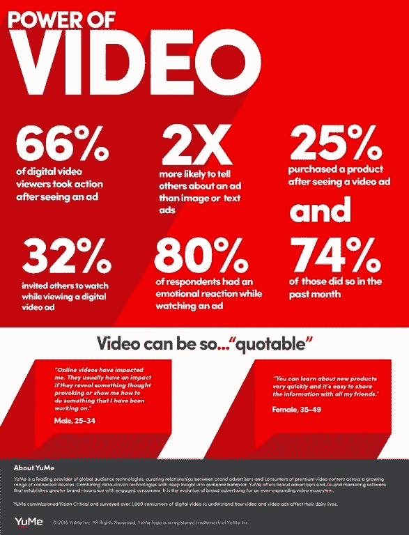

# 我们讲述自己最精彩的故事

> 原文：<https://medium.datadriveninvestor.com/we-tell-our-own-best-stories-8a07ec5ab760?source=collection_archive---------2----------------------->

## 讲故事用吸引人的个性建立你的品牌

Jay Shetty thrives on telling stories that connect.

ay Shetty 相信“我们成为自己讲述的故事”，他也讲过很多故事。这位屡获殊荣的主持人、讲故事者和病毒式内容创作者是互联网上访问量最大的人之一。

几乎是出于本能，[谢蒂](https://twitter.com/JayShettyIW/)可以创造一个相关的品牌故事，并将其融入整体营销战略。

 [## 不开玩笑:营销是为了搞笑——数据驱动的投资者

### 当你把幽默和营销结合在一起时，这是一件有趣的事情。当然，马克·安德森希望如此。别叫他雪莉。相反…

www.datadriveninvestor.com](https://www.datadriveninvestor.com/2019/02/25/no-fooling-marketing-goes-for-laughs/) 

他与[切尔西·克罗斯特](http://chelseakrost.com/meet-chelsea/)谈论了他的病毒式精通，切尔西·克罗斯特是千禧一代的主要影响者，也是 LinkedIn 排名前 20 的千禧一代营销和品牌策略师。

从根本上说，讲故事能吸引人们对你的品牌的注意，赋予它个性。这有助于你与客户建立联系，让他们有理由委托你来满足他们的需求。

“故事可以改变我们生活的方向，改变思维方式，甚至改善健康，”谢蒂说。“故事是最强大的变革推动者。

“你不能成为你看不见的人，”他说。“如果你从未听过独特的故事，你就无法想象任何超出你当前现实的东西。讲故事赋予了一切意义。没有它，一切都只是事实和统计。”

他引用了穆里尔·鲁凯泽的话:“宇宙是由故事组成的，而不是由原子组成的。”

# **随遇而安**

谢蒂说，当故事感人、新颖且令人难忘时，故事就会起作用。

“讲故事比以往任何时候都重要，”克罗斯特说。“这是与我们的观众和消费者沟通的最受欢迎、最真实、最相关的方式。

“我们每天都被如此多的广告轰炸，”她说。"我们对广告越来越不敏感，或者说已经厌倦了广告，以至于开始使用广告拦截器."

随着干扰的消除，故事就出现了。

“你的故事不仅能改变你的生活，也能改变别人的生活，”克罗斯特说。

如果你觉得你的故事没意思，那就和热心的客户聊聊。找出他们喜欢你什么。他们甚至可以为你讲述你的故事。这为你的品牌赢得了更多的参与度。

“活出你想讲述的故事，”谢蒂说。“去体验真正的、真实的、真实的经历，让你分享感悟，而不仅仅是回忆。

“列出你一生中最重要的时刻，”他说。"我们经常忽略它们，因为对我们来说，它们只是普通的东西."

这就是外部意见对摘录故事的价值所在。正如谢蒂所说，“我们都有故事。我们大多数人只是还不知道。”

# **坐下来谈**

他提出了一种方法。

“想想你一生中做过的最好的决定，”谢蒂说。“和你认为能讲述鼓舞人心的故事的人坐在一起。让那个人帮你更深刻地反思自己的人生，提炼和放大故事。”

克罗斯特说，这是与那些了解你的人合作的时候了。

她说:“在你认输说你的故事没意思之前，与亲密的朋友和家人分享你的故事，以获得建设性的反馈。”

Krost 说:“用你能创造并与你的观众分享的图像和视频来激发创造力。”“我们的大脑天生喜欢图像——我们大脑的近 60%参与产生视觉。”

在讲故事的过程中，人们可能会说得太多，说了所有要说的话，然后又说了一些。学会讲述一个故事，但不是整个故事，让你的顾客想要更多。这是一个自我约束的问题。

“我们经常过多地谈论自己，”谢蒂说。“外面有太多美丽的故事，我们需要与世界分享。不要陷在你的泡沫里。”

记住你要通知和招待谁。

谢蒂说:“我们不考虑这个故事与观众有多大关联，也不考虑它是否会与观众产生联系。”。“我们讲述它只是因为它感动了我们，但我们忘记了思考它如何能感动他人。语境为王。

“我们没有实践、生活或应用这个故事，”他说。“我们像鹦鹉一样重复它。这没有影响，因为它不是来自一个很深的地方。你只能把人们带到你内部参观过的地方。”

# **冲突没事**

当接受别人的观点时，不要害怕不同意见。

“避免故事中的冲突可能会让你听到蟋蟀的声音，”克罗斯特说。“冲突是推动故事发展的燃料，也是构建情节的基础。

“想想你是如何把消极变成积极的，最终让你走上了现在的道路，”她说。“每一次突破都是从崩溃开始的。”

品牌故事的关键要素是人。他们可能是你、你的团队、你热情的顾客或者以上所有人。人们喜欢看到和听到其他人的声音。

情感也很重要。谢蒂建议让故事动人。

“这个故事必须有一个英雄，一个恶棍和一个原因，”他说。“我们喜爱的所有超级英雄电影都有相同的元素。英雄是好的。恶棍是被战胜的人。原因是这一切存在的更深层次的原因。

“故事也必须是相关的，”谢蒂说。“它们必须与人们的需求、梦想和担忧相关联。你必须深刻理解人类面临的挑战，以及如何服务和支持人们。”

# **关键要素**

他补充说，好的故事应该是鼓舞人心的，鼓舞人心的，变革的和教育的。

对于 Krost 来说，如果出纳员这样做，故事将会激增:

*   了解你的核心信息。
*   了解你的目标受众。
*   保持有目的的个人化。
*   建立情感联系——变得脆弱。
*   分享空白以及你是如何创造解决方案的。

通常，我们是自己最糟糕的批评家。我们努力走出去，说出自己的故事。

企业家不一定会讲故事，但在他们的关系网中，他们认识会讲故事的人。和他们谈谈为什么他们认为你的品牌好。让他们用文字和一个好故事来表达他们的信息。

“观察人们开始时做什么，而不是现在做什么，”谢蒂说。“今天，我们中有太多的人被人们的生活所吸引，以至于忘记了自己从哪里来。”

# **真实**

一下子追求完美是不现实的。

“练习，练习，练习，”谢蒂说。“人们第一次讲述他们的故事几乎不是他们最大的努力。但是我们都必须从某个地方开始。不要小看这个。

“接受训练，”他说。“我们经常跳过这一步，希望努力和坚持会奏效。然而，讲故事是一项需要投入的技能，如果你想在这方面做得很好的话。”

Krost 说，如果企业家害怕在公共场合说话或在社交媒体上分享，他们也会犹豫不决地讲述自己的故事。她认为这源于人们没有做好准备，感觉不真实，对“它”没有热情，缺乏经验。

“思考:你可以做些什么来克服这些障碍，打破恐惧之墙，这样你就可以自信地讲述你的故事了。”克罗斯特说。“当人们感受到你声音中的情感时，他们会感到与你有更大的联系。”

视频是分享品牌故事的热门媒体。有了内置的高科技，你的启动装置就在你的手中:你的手机。

“如果你不喜欢对着摄像机说话，那就做一段画外音视频，”谢蒂说。“如今，每个平台都在优先考虑视频。它让你能够以最具创意的方式真实地表达你的故事。”

# **尝试替代品**

根据 Krost 的说法，传达故事的方式不止一种。

“以各种形式分享你的故事——博客、视频短片、社交帖子的微视频、直播，”她说。“没必要限制自己。想想你想在什么平台和什么受众上分享你的故事。使用最能传达你的信息的正确格式。”

说到为你的个人品牌和小企业创造一个故事，真的有区别吗？毕竟，你对你的个人品牌有最终的发言权。一切都是关于你的——工作中和工作之外。你一直都是品牌。做你自己——不要放松警惕。

谢蒂并不认为个人和商业方法有什么不同。

“基本面是一样的，”他说。“人们能理解吗？你能改变人们的生活吗？你值得信任吗？

“对双方来说，这都是信任的问题，”谢蒂说。“人们听你的，因为他们信任你。不要利用这种信任，而是通过这种信任赋予他人力量。”

Krost 推荐了一篇[福布斯](https://twitter.com/Forbes/)的文章由 [Shelcy V. Joseph](https://twitter.com/Seashell__) 、[先打造一个品牌。然后你就进入了商业](https://www.forbes.com/sites/shelcyvjoseph/2017/12/11/first-build-a-brand-then-youre-in-business/#4ab09df12598)。

“一些个人品牌也在努力销售，”克罗斯特说。“影响者就是一个很好的例子。他们利用自己的个人品牌来推广业务或产品。”

营销策略应该从一开始就包含所有的策略，包括讲故事。这样你就能确保连贯的陈述，尤其是你的关键信息。

# **没有解释**

“你不应该解释它，”谢蒂说。“制作能反映你的精神特质的内容，但不要告诉人们这是什么。避免解释。注重表达。”

他说他的关于草率评判他人的 YouTube 视频“分享了我对名声、成功和人际关系的感受，但我并没有真正谈论这些。

“内容承载能量，”谢蒂说。“有人看你的视频有什么感觉？你认为这种感觉符合你的品牌吗？什么事？没有？”

克罗斯特说，顾客第一。

“内容营销在整体营销战略中至关重要，”她说。“你的故事是至关重要的一部分。与你的观众分享你的故事是消费者旅程的第一步。”

克罗斯特列举了她认为未来讲故事的方式:

*   数据驱动的讲故事。
*   借助增强现实、虚拟现实和人工智能，讲故事将比以往任何时候都更加身临其境。
*   消费者将成为最有影响力的故事讲述者。
*   减少传统广告，增加消费者导向的原生内容。

“使用虚拟现实以数字方式运送人们将有更深入、更丰富的体验，”谢蒂说。"不仅仅是为了娱乐，也是为了同情、怜悯和真正的改变."

例如，他转向他的 YouTube 视频，“[站在别人的立场上——技术对人类](https://www.youtube.com/watch?v=WVBdh3EMh3A&feature=youtu.be)”

“提升、教育和启发，”谢蒂说。“这是伟大的故事讲述的永恒结果，随着对负面故事的关注增加，这种结果已经消失了。”

**关于作者**

吉姆·卡扎曼是拉戈金融服务公司的经理，曾在空军和联邦政府的公共事务部门工作。你可以在[推特](https://twitter.com/JKatzaman)、[脸书](https://www.facebook.com/jim.katzaman)和[领英](https://www.linkedin.com/in/jim-katzaman-33641b21/)上和他联系。