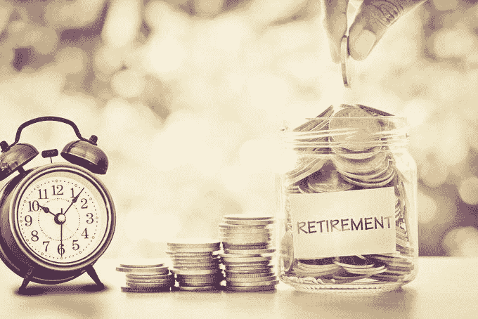
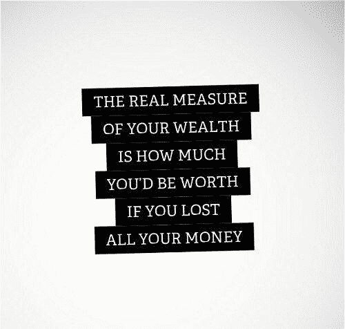
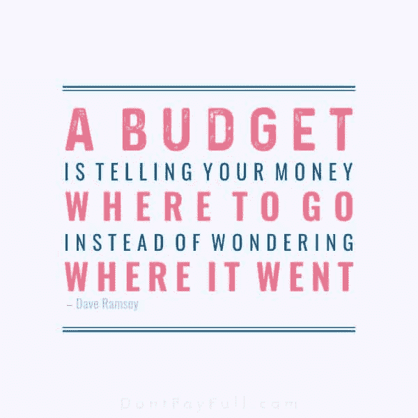
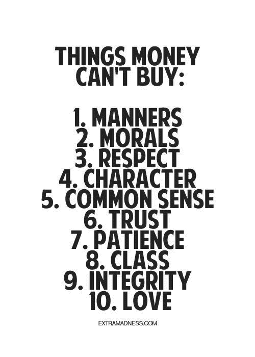

# 财富的创造源于目标

> 原文：<https://medium.datadriveninvestor.com/wealth-creation-grows-from-purpose-7e375b4963c9?source=collection_archive---------5----------------------->

## 安全的未来始于了解金钱如何为你工作

oney maven[Patrice c . Washington](https://twitter.com/SeekWisdomPCW)希望人们能够分清轻重缓急。她敦促每个人都要追逐目的，*而不是*金钱。

“活出你的人生目标，找到满足感，不追逐金钱而赚更多，”她说，重新定义了对财富的普遍看法。

华盛顿加入了千禧一代营销策略师、教练和 LinkedIn 讲师[切尔西·克罗斯特](https://twitter.com/ChelseaKrost)谈论金钱、心态以及“让你的钱为你工作”的技巧和诀窍。

一个常见的金钱误称是，你必须牺牲生活方式来为退休储蓄。有了好的计划，你就可以[省吃俭用](https://www.datadriveninvestor.com/2018/09/28/defy-the-myths-that-kill-your-retirement/)。

“最大的误解是，金钱行为是基于逻辑的，”华盛顿说。“就像，‘如果我知道得更多，我会做得更好。’那不是真的，因为大多数人不会做他们知道的事情。这是感性的，而不是理性的。

 [## 在创业之旅中，拥抱学习|数据驱动的投资者

### 好像建立一个数百万美元的公司还不够困难，企业家必须额外照顾他们的…

www.datadriveninvestor.com](https://www.datadriveninvestor.com/2018/10/16/on-the-entrepreneurial-trek-embrace-the-learning/) 

“我成年后 90%的时间都是自己创业，并且一直为退休存钱，”她说。"这实际上是防止我的生意在经济衰退期间更快倒闭的原因."

克罗斯特也认为拖延症被用作经济支柱。

“我总是听到这句话:开始存钱永远不会太晚，”她说。“*但是*，事实是越早开始存钱越好。在 20 多岁和 30 多岁的时候，很难考虑退休之类的事情，但这应该是优先考虑的事情。”

心态在很多方面影响金钱。

克罗斯特说:“无论你有很多钱还是很少钱，你的心态都可以决定这笔钱会增加还是减少。”。

“重要的是，在银行有一些钱的人要明智地使用这些钱，不要动用他们的现金流，”她说。"不幸的是，人们会变得挥霍无度，从而导致债务和其他财务困难."

# 愿望不是计划

另一方面，仅仅希望不会使财务上的成功成为现实。

“没有很多钱，却希望有？”克罗斯特说。“你的心态可以改变这一点。问问你自己:我能做什么来赚更多的钱？保持乐观，努力工作[增加你的收入](https://www.datadriveninvestor.com/2018/11/02/income-streams-start-from-drips/)。

 [## 收入流始于滴滴

### 兼职和自由职业可以减轻你的经济负担

medium.com](https://medium.com/datadriveninvestor/income-streams-start-from-drips-7ec21e042a59) 

华盛顿倾向于从一开始就迈出大步。

“这是我的首选方法，”她说。“是的，你可以花几个小时剪优惠券——我不是在批评你——*但是*你也可以用同样的精神力量去思考如何赚更多的钱，这是无限的。

“心态就是一切*，可悲的是，我们大多数人甚至不知道为什么我们会在金钱上做出选择，尽管他们说‘今年是我的财运年’"*

**

*就像旧衣服一样，金钱特征是旧衣服。*

*“我们中的许多人都直接或间接地继承了父母的思维模式，”华盛顿说。“无论是通过言语影响、建模还是我们童年时大脑无法理解的特定事件，我们都会给财务赋予特定的含义。*

*“口头影响包括诸如‘每个人都有债务’或‘钱不会长在树上’之类的东西，”她说。“如果这是你潜意识中根深蒂固的想法，你当然会做出与你所说的相反的选择。我们的大脑帮助我们自我破坏。”*

*这些是华盛顿带给她生意的经验。*

*“我总是问我的客户，他们是否会把钱包交给他们 8 岁的孩子来管理账单，”她说。“当他们说，‘不！’我提醒他们，如果这些童年故事得不到检查，他们每次发工资都会这么做。"*

*克罗斯特和华盛顿对金融有着共同的态度。*

*“我以尊重和欣赏的态度对待我的钱，”克罗斯特说。“我为我的钱努力工作，我对它负责是正确的。这包括按时支付我的账单，存一些钱，制定预算，进行明智的投资。”*

# *金融是关于关系的*

*华盛顿确保了解情况。*

*“我相信我们与金钱的关系，”她说。“你培养的任何关系都会成长。你带着钱入住。寻求明智的建议。永远记住你的数字。*

*“我听说很多千禧一代用可爱的借口来掩饰他们在财务方面缺乏纪律，”她说。“打着‘我是个创意者’或‘不是我的菜’的旗号忽视金钱，以后会对你不利。”*

* [## 通过几个简单的步骤来管理你的钱

### 最难的部分是进入正确的心态

medium.com](https://medium.com/financial-strategy/take-charge-of-your-money-through-a-few-easy-steps-2ab642841684) 

Krost 有让钱为你工作的简单步骤:赚钱，用这些钱赚更多的钱，考虑短期投资和长期投资，然后重复。

“一方面，我认为这是关于进行合理的投资，”华盛顿说。“另一方面，我认为让我的钱为我所用也是一种授权的形式——付钱给其他人——去做那些不值得我花时间去做的个人或专业的任务。”

让钱为你工作有几种形式。

“在社交媒体和创业的世界里，许多企业主正在投资建设自动驾驶的在线课程，”克罗斯特说。“这都是关于被动收入。

“让你的钱为你工作的其他方式是通过投资机会，如房地产、股票和共同基金，”她说。

良好的财务实践靠自身发展。

“金钱帮助我雇用高效的团队成员来支持我，所以我可以赚更多，付出更多，并真正专注于追求我的目标，”华盛顿说。

她说:“其他途径包括为退休后的 SEP 个人退休帐户提供资金，为我女儿的大学储蓄提供 529 计划，投资多单元公寓楼，以及为我现在拥有的各种商业中心提供资金。”

# 带着答案前进

投资新的项目和机会是诱人的，但是要睁大眼睛。Krost 建议先问这些问题:

*   我目前的金钱状况如何？
*   我有什么收入？
*   有什么机会能激起我的兴趣吗？
*   我有足够的存款吗？
*   目前的经济状况如何？

 [## 知情人需要知道更多

### 继续教育对你事业的成功至关重要

medium.com](https://medium.com/datadriveninvestor/those-in-the-know-need-to-know-more-829d8ab77031) 

“与你已经在做的事情保持一致，”华盛顿说。“你能做的最糟糕的事情就是从一件事情跳到另一件事情，而不优化你面前已经有的东西。

“企业家开设课程是一种趋势，”她说。“杀人的是创业，对结果感到不安，然后放弃，从头开始另一件事。你应该发射，测量，调整，再发射。不要退出。”

随着经验而来的是自信。

华盛顿说:“一旦你最大限度地发挥了当前项目或机会的潜力，它就可以自动运行，而无需你徘徊在它之上，然后继续下一步。”

Krost 指出了这些积累财富的关键基础:

华盛顿给出了自己的建议:

*   理解财富不仅仅是金钱和物质财富。
*   脆弱到需要寻求帮助。
*   迈出第一步，始终如一。

“你正在建立的是一块肌肉，”华盛顿说。“量力而行，不要被别人吓倒。”

# 财富意味着什么

克罗斯特补充说，“金钱固然重要，但做一个好人也很重要。”这促使华盛顿解释了她重新定义财富的六大支柱:

*   适合:成为最好的自己。为退休储蓄需要伟大的远见，但如果你不打算保护在精神上和身体上实现这一远见所需的血管，那么这一切是为了什么？
*   人:创造重要的关系。开始把自己放在那些让这些对话成为常态的人身边。只有当你周围有人也说金钱语言时，你才能说得流利。
*   空间:建立你的生活来支持你。如果你相信“时间就是金钱”，那么你必须停止浪费时间，运用组织技巧，清理杂物，委派任务。
*   信仰:相信更伟大的东西。大多数人放弃得太早，从来没有意识到他们的潜力。我相信信念能增强韧性。所以，不管你相信什么，都要花时间去实践它，这样你就能在生活发生时做好准备。
*   工作:活出你的人生目标。当你没有目标时，你会努力设定优先顺序。缺乏成就感是导致财务管理不善的最主要原因。
*   金钱:明智地管理你所拥有的金钱。一旦你对其他支柱有了清晰和平静的认识，你就获得了精神上的能力去继续你以前听说过的，但是感觉被卡住了，不能把你的手指放在上面的事情。

 [## 从金钱的混乱中寻找快乐

### 极简主义如何帮助你的精神状态，以及你的财务状况

medium.com](https://medium.com/financial-strategy/cut-through-money-clutter-for-the-joy-of-it-72bfa0053b42) 

“我不是你传统的‘金融专家’，但我一次又一次地看到，人们会清理其中一个领域，然后他们的财务状况也‘神奇地’开始改善，”华盛顿说。

她接着补充了这些要点:

*   每个人都应该有一个家。
*   让你的家无纸化，扫描后粉碎文件。
*   每天晚上整理一下，这样你就可以醒来开始新的生活。

任何行业的人际关系网也有财务影响。

“想要成长和学习？”克罗斯特说。"和在那个领域有经验的人在一起。"

一些障碍和挑战经常阻碍人们赚更多的钱。

“恐惧是一个重要因素，”克罗斯特说。“当你把钱投资到不能保证成功的东西上时，可能会很可怕，但你必须权衡风险。

“时间是另一个大障碍，”她说。"许多人发现，当他们已经在做全职工作时，很难抽出时间来做兼职。"

华盛顿和克罗斯特一致认为，克服恐惧和缺乏时间的感觉——以及有一个目标——将使财富成为现实。

**关于作者**

吉姆·卡扎曼是[拉戈金融服务公司](http://largofinancialservices.com/?source=post_page---------------------------)的经理，曾在空军和联邦政府的公共事务部门工作。你可以在[推特](https://twitter.com/JKatzaman?source=post_page---------------------------)、[脸书](https://www.facebook.com/jim.katzaman?source=post_page---------------------------)和 [LinkedIn](https://www.linkedin.com/in/jim-katzaman-33641b21/?source=post_page---------------------------) 上和他联系。

*原载于 2019 年 8 月 18 日*[*【https://www.datadriveninvestor.com】*](https://www.datadriveninvestor.com/2019/08/18/wealth-creation-grows-from-purpose/)*。**