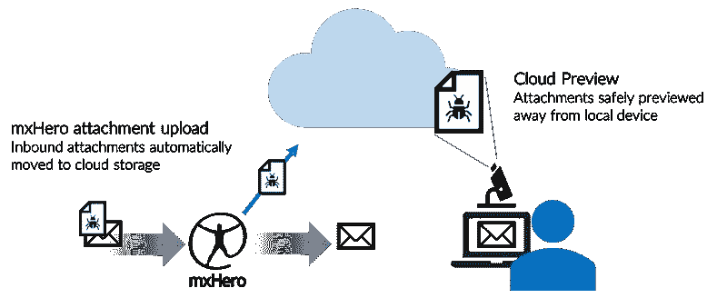
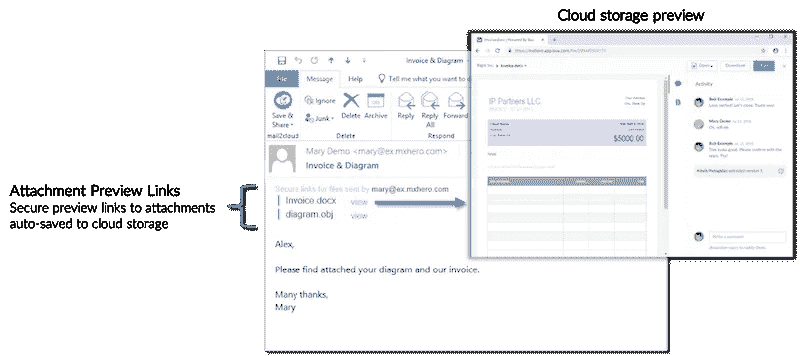

# 武器化的电子邮件附件——未来企业的解决方案

> 原文：<https://medium.datadriveninvestor.com/weaponized-email-attachments-a-solution-for-the-enterprises-of-tomorrow-380ff9926c93?source=collection_archive---------11----------------------->

*尽管在防御技术上进行了大量投资，电子邮件仍然是主要的安全威胁。云存储技术的创造性集成可以利用人类的思维来实现迄今为止最有效的防御之一。*

在过去的几周里，我们一直被提醒电子邮件的危险。尽管部署了大量的防病毒、防数据丢失和其他防御系统，电子邮件仍然是黑客们在 T2 的头号攻击载体。正如我们在之前发布的[一样，电子邮件之外的内容比里面的内容更安全。](https://medium.com/@alex_6067/infidelity-cyber-crime-and-a-happy-ending-de3bbe586119)

恶意行为者经常使用电子邮件和电子邮件附件有效负载来发送“武器化”文件，或者为了感染收件人的设备而修改的文件。在最近的一个[案例](https://www.netskope.com/blog/targeted-attacks-abusing-google-cloud-platform-open-redirection)中，攻击媒介是一个嵌入 URL 的 PDF 附件，通过谷歌的基础设施进行路由，在[最近的](https://gbhackers.com/attackers-compromise-android-png-image/)例子中，像 png 和 jpeg 这样作为电子邮件附件发送的图像文件被用来危害 Android 设备。

这些不怀好意的利用策略，本质上是利用人类的倾向。像所有人一样，电子邮件用户是习惯性动物，经常会分心。每天用户平均 120 封邮件中的一个电子邮件附件，就是黑客在组织中获得立足之地的全部条件。

只要内容可以直接与最终用户交互，黑客就可以打开他们的陷阱。当用户在本地打开内容时，例如在他们的笔记本电脑、移动电话等上。黑客有机会在公司的防御系统后面执行代码。

如果黑客可以利用我们的人性来穿透我们的虚拟墙，是否会有一种反制策略使用同样的人性来加强我们的防御？

虽然黑客擅长在文件中嵌入恶意代码，但他们无法大规模设计对接收者有意义的内容。换句话说，如果用户能够安全地主动检查附加的文档，他们就可以很容易地确定文档是否可疑。一张来自未知供应商的未知产品的发票给一个不存在的员工是可疑的，特别是当它是由一个与公司采购无关的客户经理收到的时候。换句话说，如果我们可以让人脑做它擅长的模式识别和语境化，我们就可以更有效地击败这种类型的攻击。

现代云内容管理平台，如 Egnyte、Box 和微软的 OneDrive，结合 mxHero 等技术，提供了一种现成的方法来确保电子邮件附件在下载和本地打开之前，可以首先由用户在远离用户设备的地方安全地检查。通过一个自动化的软件支持流程来自动提取电子邮件附件有效负载，以支持到现代云和基于混合的内容管理平台的安全和基于协作的链接，用户可以自然地防御武器化的内容附件。

Letting users open files safely away from their devices

重要的是，该过程可以集中部署和控制，不需要接收者或发送者提供任何软件或培训。因此，用户采用不是问题。此外，它可以在所有设备和所有电子邮件系统中统一工作。

Attachments automatically moved to cloud storage for safe preview before download

通过创新地结合利用人类优势的技术，我们可以更好地抵御那些利用人类弱点的恶意内容武器化努力。在“人工智能”风靡一时的时候，让我们不要忘记，“真正的人类智能”和常识，在今天可用技术的使用下，可能是最好的解决方案之一。

## 来自 DDI 的相关故事:

 [## 用 7 个步骤解释深度学习——数据驱动投资者

### 在深度学习的帮助下，自动驾驶汽车、Alexa、医学成像-小工具正在我们周围变得超级智能…

www.datadriveninvestor.com](https://www.datadriveninvestor.com/2019/01/23/deep-learning-explained-in-7-steps/)  [## 成为数据科学家所需的 8 项技能——数据驱动型投资者

### 数字吓不倒你？没有什么比一张漂亮的 excel 表更令人满意的了？你会说几种语言…

www.datadriveninvestor.com](https://www.datadriveninvestor.com/2019/02/07/8-skills-you-need-to-become-a-data-scientist/)