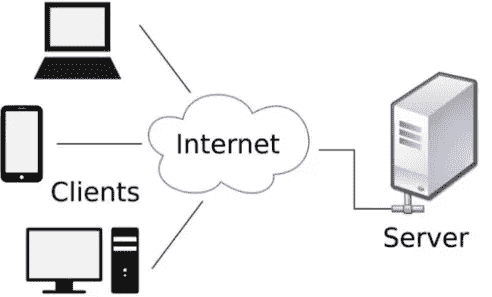
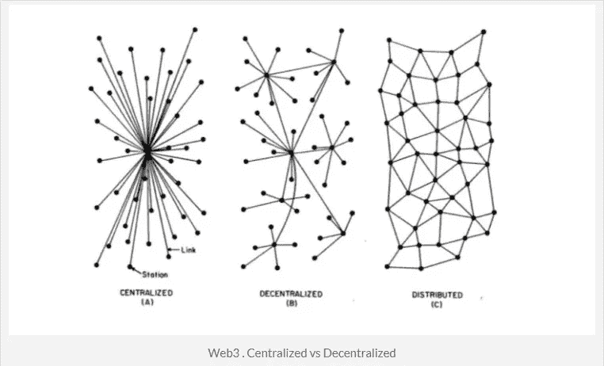

# Web 3.0 和信任保证

> 原文：<https://medium.datadriveninvestor.com/web-3-0-and-trust-guarantees-e560d036f65f?source=collection_archive---------12----------------------->

90 年代早期，万维网彻底改变了我们分享信息的方式，为更多的机会打开了大门。仅仅 10 年后，Web 2.0 出现了社交媒体和电子商务平台，并在全球范围内增加了更多的 P2P 互动。我们重新设计了商业模式，将中间人转变为拥有我们数据的更复杂的平台。比如脸书、Airbnb、优步……以及许多其他的例子。

看来这些变化已经带来了很多好处。嗯，这还没完，我们还得除掉中间人。这就是区块链或去中心化网络出现的时候，它允许我们在没有中间人的情况下进行交易。

这怎么可能？数据结构已经改变

当我们第一次开始通过互联网协议连接计算机时，我们通常将数据保存在光盘上，并提供给任何需要数据的人，对吗？因此，数据存储在一个物理设备上，这个过程必须一遍又一遍地重复，以制作副本并将其存储在多个设备上。尽管如此，互联网使得拷贝的传递变得更快，并降低了交易成本。尽管数据易于传输，但仍集中存储在设备上的云中…

这就是信任和安全问题出现的原因，因为数据是集中的，这让我们质疑我们的数据是否被安全地存储，如果数据结构出现故障点，或者参与存储数据的各方是否正确使用了数据，会发生什么情况。

从客户机-服务器到分散式 web 的过渡将会逐渐发生，因为分散式 web 堆栈仍然需要成熟。虽然分散式架构容错性和抗攻击性更强，但它们仍然很慢。此外，我们还可以考虑其他一些好处，比如降低网络生态系统准入门槛的去中心化潜力，以及工具和高质量产品的快速迭代。这就是为什么本质上是交易的一切，无论是金融还是非金融，都可以添加到区块链上，以保证信任并提高交易效率。

我们仍然想知道区块链在 [Gartner 的](https://www.smartinsights.com/managing-digital-marketing/managing-marketing-technology/gartner-hype-cycle-2018-most-emerging-technologies-are-5-10-years-away/)著名的“炒作周期”中的位置，然而它的用途是重要的和破坏性的，并且最终将在未来被证明更加多样化。这种强大的技术可能性不仅代表了建筑方面的转变，而且它是在对机构缺乏信任的背景下发展起来的。

信任被定义为[不稳定平衡](http://www.eief.it/files/2009/11/wp-09_10-equilibrium-trust.pdf)，这意味着当两个人相互信任时，只要其中一个人产生怀疑，另一个人也会开始怀疑。这将最终导致一种相互不信任的状态。因此，为了保持信任，我们需要能量，我们需要信息来维持这种能量。区块链基于一种基于社区的信任模型，这种模型是可扩展的，能够处理参与方之间日益增加的交互。但这还不是全部，区块链模型甚至更好，因为为了产生信任，交易是可靠的，这些可以由所有参与者审计，并在达成共识后分发。此外，为了消除对充当中央权威的可信第三方的需要，区块链做出了五个承诺:

1.  分布式信任。
2.  交易系统。
3.  由一个大家庭担保。
4.  没有可信的第三方。
5.  操作复杂协议的能力。

区块链是真正的创新，为了实现这一变化，它使用了 5 个关键组件:

1.  通过验证链，它几乎不可能伪造
2.  识别交易的公钥和私钥必须得到参与者的批准
3.  对等文件分发协议
4.  共识验证协议:工作证明

区块链技术广泛应用于金融、医疗保健、政治、媒体、分类广告和交通等领域。但是，在机会的多样性和开发一个独特的、世界范围的基础设施以保证社区比潜在攻击者更大的需求之间仍然存在矛盾。此外，使用区块链创建“信任即服务”模式，从小型实体到大型参与者都可以提供相同的透明度、可持续性和其他与信任相关的特性保证，而这正是体制结构应该提供的。