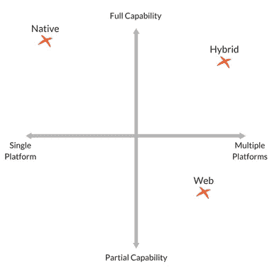
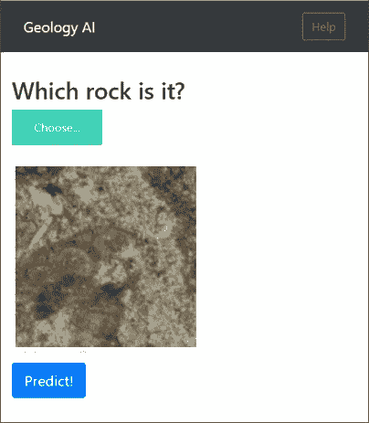

# Web 应用与本地应用:数据科学家的最佳选择是什么？

> 原文：<https://medium.datadriveninvestor.com/web-apps-vs-native-apps-what-is-the-best-choice-for-a-data-scientist-3d31169d2335?source=collection_archive---------2----------------------->

作为一名数据科学家，你清理数据，开发机器学习和人工智能模型，从数据中提取信息或在数据中寻找模式(更多信息请查看本文[文章](https://www.datadriveninvestor.com/2019/08/07/what-does-a-data-scientist-do/))。然而，在某个时刻，你将不得不部署你的人工智能或人工智能模型，以便提供服务或与他人分享。最好的选择是开发一个 App。

这让我们想到了本文的主题:数据科学家必须选择什么？Web App 还是原生 App？每个选项的利弊是什么？选好选项后，我应该使用什么样的工具来开发应用程序？

 [## 2019 年移动应用开发之路|数据驱动的投资者

### 任何在移动应用程序开发行业工作的人，无论他们是专注于在伦敦开发 iOS 应用程序还是…

www.datadriveninvestor.com](https://www.datadriveninvestor.com/2019/01/15/the-path-of-mobile-app-development-in-2019/) 

# **原生应用 vs 网页应用**

一款**原生应用**是一款本质上为特定移动设备开发的应用，直接安装在设备本身上。

另一方面,**网络应用**是一个支持互联网的应用，可以通过手机的网络浏览器访问。这种应用程序不需要下载到用户的移动设备上就可以访问。

为了更好地了解每种产品的功能，您必须对它们进行比较。

## **用户界面**

从移动设备用户的角度来看，一些本地和网络应用程序看起来和工作方式非常相似，它们之间几乎没有区别。因为我们的选择在这方面并不重要，我们需要一些正式和简单的东西。

## **App 开发**

这两类应用的应用开发过程是它们相互区别的地方。

对于原生应用，每个移动平台都使用不同的原生编程语言。比如 iOS 用 Objective-C，Android 用 Java，Windows Mobile 用 C++。相比之下，web 应用根据开发者的偏好使用 JavaScript、HTML 5、CSS3 等语言或其他 Web 应用框架。

每个移动平台都为开发人员提供了广泛的开发工具和其他用户界面元素，他们可以使用这些工具和元素以更直接的方式开发自己的原生应用。在 Web 应用程序的情况下，没有这样的标准化，开发人员无法访问 SDK 或任何类型的工具。

## **可访问性**

本机应用程序完全兼容设备的硬件和本机功能(加速度计、摄像头……)。另一方面，网络应用程序只能访问有限的设备原生功能。

原生应用程序作为一个独立的实体工作，问题是无论何时发生变化，用户都必须不断下载更新。另一方面，Web 应用程序无需用户干预就能自我更新。

## **混合应用**

混合应用程序可以将 Web 应用程序嵌入到本地“外壳”中，允许它像本地应用程序一样跨平台工作。这个本地应用程序容器允许 Web 应用程序访问和利用本地平台功能和设备硬件。就像本机一样，混合应用程序也安装在移动设备上。简而言之，混合应用被认为是结合了本地应用和网络应用最好和最差的元素。

# **每个选项的利弊是什么？**

## **网络应用**

优点:

他们看上去和感觉上都是本地应用

更容易开发

更易于维护和支持

相对便宜

为所有平台构建的一款应用

不要占用用户设备的存储空间。

缺点:

无法访问移动设备上的所有本机功能

他们需要浏览器来运行

性能通常较慢

与原生应用程序相比，通常缺乏交互性和直观性。

## **原生应用**

优点:

一般来说，外观和性能最好

它们是为在特定平台上运行而构建的，这使得它们更快、反应更灵敏

通常设计得更轻，具有最佳性能

分布在应用商店中——在用户搜索时随时可用

能够访问其给定平台的全部原生特性和功能集。

缺点:

本地应用程序的开发成本更高

他们需要更多的资源、技能和时间来发展

他们必须为应用程序开发的每个操作系统通过不同的审批流程

它们需要为每个平台分别设计和开发。

我们也提到了混合应用。这种应用程序是上述两者的混合体。混合应用具有潜力，因为不必为单独的本机平台构建和维护应用是有好处的。另一方面，对于混合应用程序，您必须应对来自本地和 Web 系统的问题。不仅如此，用户体验通常会受到混合应用程序的影响，因为与 Web 应用程序类似，您无法基于设备平台定制应用程序。

Image 1\. [Source](http://: https://liquid-state.com/web-apps-vs-native-apps-which-is-best/)

# **数据科学家必须选择什么？**

考虑到上面提到的一切，数据科学家的最佳选择是 Web 应用程序。

主要原因如下:

它更容易建造

你会赢得时间

你需要一些容易修理的东西

我们不追求美观，而是追求可靠性和功能性

容易展示，你需要的只是一个浏览器。它将兼容平板电脑、手机和电脑。

作为数据科学家，我们寻求专注于模型，并展示它做什么或它从数据中提取的信息。我们对应用程序的外观不感兴趣(如果你感兴趣，那么尝试 Web 或应用程序开发)。然而，这并不意味着你的应用会很糟糕或者不专业。

Image 2: Example of a Web App I made. It predicts the type of Rock you upload with a Convolutional Neural Network.

在图 2 中，你可以看到一个 Web 应用程序的例子。它简单而优雅。

我个人的看法是，你得自己判断。尝试我提到的所有选项。然后你将能够明智地选择。尽管如此，如果你想避免“试错”体验，跳到网络应用程序世界，你不会后悔的。

# 选择好选项后，我应该使用什么样的工具来开发应用程序？

在这里，我将给出适合数据科学家技能的工具，帮助你开发任何你想要的网络应用。在这些工具中，您会遇到 Python 和 JavaScript 框架。也建议具备 HTML 和 CSS 知识。

我们将从你的应用后端开始。

[Flask](http://flask.pocoo.org/) 是一个基于 Werkzeug 的 Python 框架。它用于 web 和应用程序开发。它带有内置的开发服务器和调试器、集成的单元测试支持、RESTful 请求调度等等。

LinkedIn、Pinterest 等大公司都在用。

[Django](https://www.djangoproject.com/) 是一个全栈的高级 Python web 框架，允许开发者快速高效地创建复杂的应用。Django 不依赖于其他 Python 库。其设计理念基于框架各层之间的松散耦合、尽可能少的代码、快速开发和尽可能少的冗余。

现在让我们跳到前端。

Bootstrap 是一个框架，它将帮助你把你的应用程序展示给公众。

React 是一个 JS 框架，可以帮助你设计你的应用程序。然而，React 有更多的应用程序，而不是给你的应用程序一个好的外观。尽管如此，它还是有用的。

构建您的应用程序。您可以使用不同的云服务来部署它。Heroku 和 Google Cloud 是一个很好的起点。

请注意，这不是一个关于如何为 ML 项目开发 Web 应用程序的教程，而是一个给不知从何开始的迷失的数据科学家的指南。

最后，我想提一下引起我注意的一个框架**:Exaptive Studio。**面向数据科学家和部分堆栈开发人员。您可以使用它为使用数据的最终用户(如研究人员、分析师和决策者)构建数据应用程序。检查他们的[站点](https://www.exaptive.com/studio)。

# **结论**

我希望这篇文章对你有用。记住，功能性和可靠性比美观更重要。保持简单，制作你将来可以重复使用的应用程序来赢得时间。

# 参考

[https://liquid-state . com/we B- apps-vs-native-apps-哪个最好/](https://liquid-state.com/web-apps-vs-native-apps-which-is-best/)

[https://www.lifewire.com/native-apps-vs-web-apps-2373133](https://www.lifewire.com/native-apps-vs-web-apps-2373133)

[https://learning actors . com/best-python-frameworks-for-web-development-and-data-science/](https://learningactors.com/best-python-frameworks-for-web-development-and-data-science/)