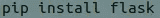
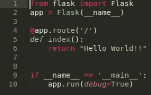
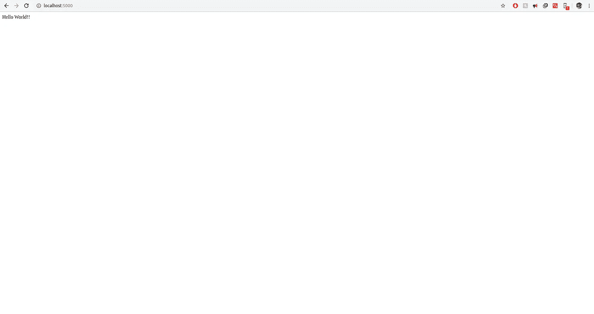
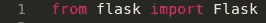
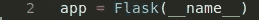
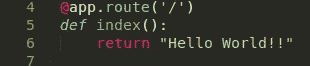
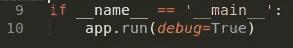

# 使用 Python 的虚拟主机

> 原文：<https://medium.datadriveninvestor.com/web-hosting-using-python-3dbb00abdcba?source=collection_archive---------0----------------------->

Python 是一种通用的高级编程语言，受众越来越多，在数据科学领域最受欢迎，因为它的包可用于机器学习和深度学习，但是 Python 有一些包在 web 开发领域非常有用。Flask 就是这样一个用于托管网站的 Python 包。

【Flask 能做什么？？？

1.  在本地服务器上承载一组 html 模板。
2.  用 CSS/JS 和数据库整合你的网站。

**什么烧瓶不能做？？？**

1.  给你写网站。

虽然使用 Python 基本上可以做任何事情，但开发网站最常见的方式仍然是 HTML/CSS 和 JS。Flask 只能在 Python 应用程序中呈现 HTML 代码，它不能让你使用 Python 创建网站(至少传统上是这样)。

 [## 数据驱动的投资者|微软比 Chrome 有“优势”

### 简史我从来不是浏览器的粉丝，确切地说，我只是一个浏览器的粉丝，Chrome。这是我的…

www.datadriveninvestor.com](https://www.datadriveninvestor.com/2020/03/29/microsoft-having-an-edge-over-chrome/) 

在对 Flask 有了一个简单的概念之后，让我们通过创建一个 Hello World 页面并使用 Flask 托管它来开始使用 Flask。

**安装依赖项**

首先，我们将安装使我们能够在本地计算机上运行 flask 的依赖项。

1.  您需要在系统上安装 Python 和 Pip。要安装 Python，请在您的终端上写下:

2.安装 Python 之后，需要获取 pip。Pip 是一个包管理器，可以让我们安装 Flask。要安装 pip，请转到您的终端并键入。

3.在我们的系统上安装了 Python 和 Pip 之后，我们需要得到 Flask。为此，请转到终端并执行命令

**开始编码吧！！！！**

一旦我们设置好了所有的依赖项，我们就可以开始制作我们的第一个 flask 应用程序了。我们将从制作一个真正基本的应用程序开始，它将在主页上用“Hello World”来迎接我们。

这 10 行代码足以让您开始使用您的第一个 Hello World Flask 应用程序。在本文的后面，我们将详细查看代码。现在让我们运行应用程序。

**运行烧瓶应用程序**

1.  要运行应用程序，请通过终端转到包含 Python 文件的文件夹，并执行:

注意:这里，我的文件名是 1.py。你的文件名可以和我的不同。

2.一旦您执行了这个命令，您的终端应该看起来像这样:

3.这告诉我们 flask 应用程序正在成功运行。flask 的默认端口是 5000。所以要查看网站，你需要去

本地主机:5000。在浏览器选项卡中键入 localhost:5000，您将看到您的应用程序正在运行。

恭喜你，你已经成功地创建了你的第一个 flask 应用程序。

**我们来详细看看代码。**

1.

这用于导入我们之前在 Python 文件中下载的 Flask 模块。

2.

这一行将 app 定义为 flask 应用程序。Flask 中的 __name__ 参数用于帮助确定 Flask 文件的路径。

3.

@app.route 用于确定 web 应用程序的结构，即如何在 web 应用程序中构建不同的链接。这里('/')用于确定我们的 web 应用程序的主页。具有多个页面的 web 应用程序将有多个不同的路径。

**第 5 行**是当用户到达@app.route 中提到的页面(在我们的例子中是主页)时执行的功能。

**第 6 行**是指标函数的内容。它是我们的 web 页面的主体，并通过 return 语句反映出来。

4.

**第 9 行**就像 Flask 中的依赖项，如果应用程序在你的服务器上本地运行，它总是包含在每个 Flask 应用程序中。这一行代码确保只有当这个应用程序直接运行并且不使用任何导入语句时，服务器才运行。

第 10 行实际上是在应用程序创建后运行它，因此这两行总是在页面底部。 **debug** 是 app.run 的一个参数。这使我们能够对 HTML/CSS 或 Flask 应用程序进行更改，而无需重新启动服务器来查看结果。这通常在开发阶段使用，以使开发人员的工作更容易。

**感谢阅读**

在接下来的出版物中，我们将介绍如何将 CSS/HTML/JS 添加到 flask 应用程序中，以及如何将我们的应用程序连接到 SQL 数据库。

请在评论框中评论您对该出版物的看法。