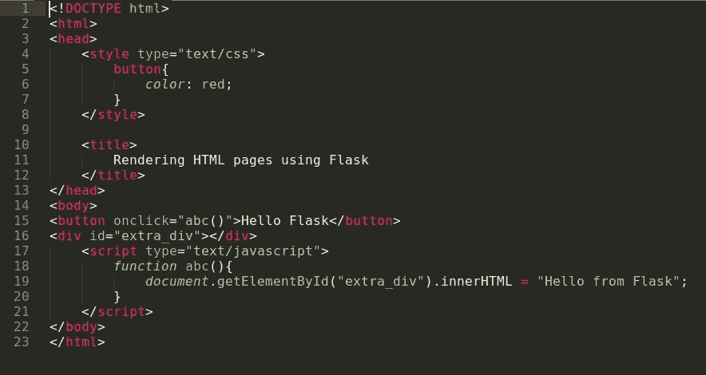
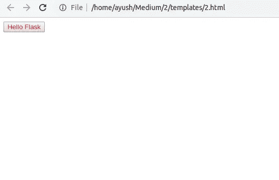
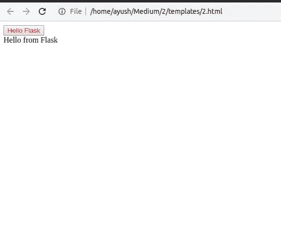
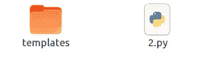
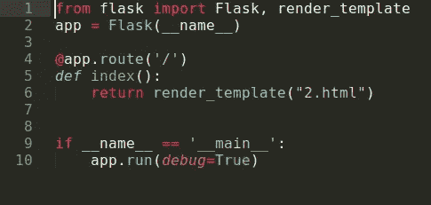
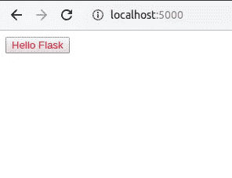
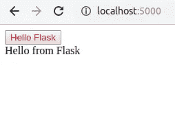

# 使用 Python 的虚拟主机第 2 部分

> 原文：<https://medium.datadriveninvestor.com/web-hosting-using-python-part-2-ec081e48631e?source=collection_archive---------7----------------------->

在本教程的前一部分，我们看到了如何使用 Flask 在服务器上运行一个基本的网页。教程可以在这里找到[。现在我们可以看看如何呈现一个已经存在的 HTML 页面，这个页面本身也可以包含 CSS。](https://medium.com/@akalla/web-hosting-using-python-3dbb00abdcba)

**创建 HTML 文件**

下面是一个基本的 HTML 文件，它也包含 CSS(在样式标签之间)和一些 JavaScript(在脚本标签之间)。这是一个动态页面，当点击按钮时，其输出会发生变化。

上述代码的输出如下所示

Output Before Button Click

Output After Button Click

这个 HTML 文件可以在机器上顺利运行(不需要任何服务器)，但是要在 Flask 服务器上运行这个文件，我们需要在 return 语句中为文件添加完整的 HTML 代码，这实际上是不可行的。让我们看看在 Flask 中更简单的方法。

 [## 数据驱动的投资者|微软比 Chrome 有“优势”

### 简史我从来不是浏览器的粉丝，确切地说，我只是一个浏览器的粉丝，Chrome。这是我的…

www.datadriveninvestor.com](https://www.datadriveninvestor.com/2020/03/29/microsoft-having-an-edge-over-chrome/) 

**Flask 服务器的文件结构**

所有的 HTML 文件都存储在一个名为 templates 的文件夹中，该文件夹可以与 Flask 应用程序位于同一个目录中。因此，为了在应用程序中包含 HTML 文件，我们在与 Flask 应用程序相同的目录中创建一个文件夹，并将其命名为 templates。现在我们需要将烧瓶文件添加到这个模板文件夹中。

File Structure

HTML 文件包含在 templates 文件夹中。

**更改烧瓶应用**

对 Flask 应用程序进行更改相当简单。我们只需要指定要从中呈现 HTML 代码的 HTML 文件的名称。默认情况下，Flask 会查看 templates 文件夹来搜索 HTML 模板。

Code For Flask Application

这个 Flask 应用程序中唯一的更改是在第 1 行和第 6 行。在第 1 行，我们导入渲染模板模块，在第 6 行，我们通过传递 HTML 文件的名称将它包含在返回语句中。

在本地服务器上运行应用程序的过程与第一篇教程中讨论的过程相同。让我们看看本地服务器上应用程序的输出。

Output Before Button Click

Output After Button Click

如我们所见，我们的 Flask 应用程序现在在服务器上运行得非常好。

**感谢阅读**

在接下来的出版物中，我们将看到如何呈现 CSS 和 JavaScript，它们作为单独的文件存在，而不包含在同一个 HTML 文档中。

请在评论框中评论您对该出版物的看法。