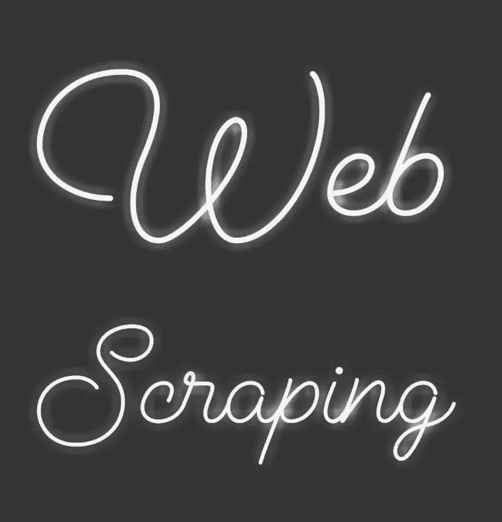
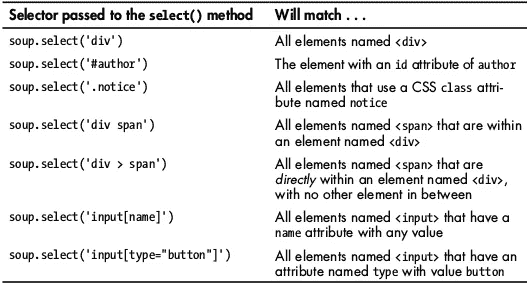
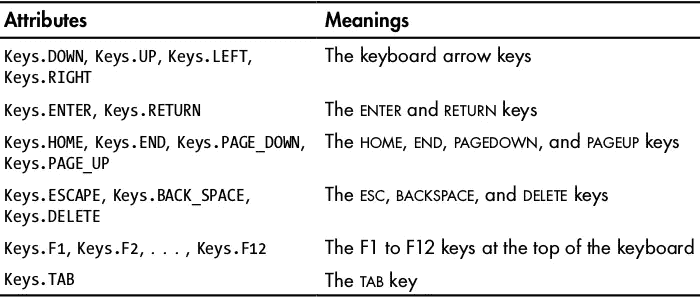

# 网页抓取

> 原文：<https://medium.datadriveninvestor.com/web-scraping-17b6891f9da4?source=collection_archive---------5----------------------->

[](http://www.track.datadriveninvestor.com/1B9E)

网络抓取是一种在网络空间冲浪的技术。如果我们看看维基的定义，我们可以说网络抓取是用来从各种网站提取大量数据的。

在互联网上看看，有各种各样的方法和技巧给一个网站抓取。

在这里我要告诉你一些我最近学到的基本方法。

我们将在本博客中讨论的模块有:

1.  [网络浏览器](https://docs.python.org/2/library/webbrowser.html)
2.  [请求](https://requests.readthedocs.io/en/master/)
3.  [美丽的风景](https://www.crummy.com/software/BeautifulSoup/bs4/doc/)
4.  [硒](https://selenium-python.readthedocs.io/)

# “网络浏览器”模块

webbrowser.open()函数启动一个新的浏览器到一个特定的 url:

```
>>> import webbrowser
>>> webbrowser.open('http://google.com/')
```

上述代码将首先导入 webbrowser 模块，然后 webbrowser.open()将打开“google.com”。它会打开系统的默认浏览器

现在，假设您需要在谷歌地图上查找一个地址，您可以通过编写一个包含此模块的简单脚本来轻松完成，如下所示:

```
>>>import webbrowser, sys, pyperclip# Get address from command line.
>>>if len(sys.argv) > 1:
       address = ' '.join(sys.argv[1:])  
# Get address from clipboard.
...else:
       address = pyperclip.paste()>>>webbrowser.open('[https://www.google.com/maps/place/'](https://www.google.com/maps/place/') + address)
```

这里，将使用第一个命令行参数，如果没有命令行参数，那么它将假定剪贴板有该地址。因此，要获取剪贴板内容，我们可以使用 *pyperclip.paste()* ，然后调用 *webbrowser.open()* 来启动带有地图的 webbrowser。

这是上面显示的模块的一个用途，你可以通过浏览它的文档[https://docs.python.org/2/library/webbrowser.html](https://docs.python.org/2/library/webbrowser.html#)了解更多细节。

# “请求”模块

*请求*模块用于从网络上下载文件。这非常简单，我们不需要担心网络错误和连接问题。

这是一个第三方模块，所以您必须首先安装它，并且总是建议在 virtual env 中运行第三方模块。要安装请求模块类型:

```
pip install requests
```

要检查模块是否正确安装，请运行以下命令:

```
import requests
```

如果没有弹出错误信息，说明您已经成功安装了该模块。现在下载网页类型:

```
import requests
page = requests.get(‘http://www.automatetheboringstuff.com’)
```

*Requests.get()* 是用于下载完整网页的函数。它获取页面的完整 URL。然后*类型(页面)*会给你来自网络服务器的响应。

```
>>> type(page)
<class 'requests.models.Response'>
```

如果请求成功，下载的网页将作为字符串存储在响应对象的文本变量中。您可以调用 *len(page.text)* 来检查存储的文本长度。

```
>>> len(page.text)
14139
>>> print(page.text)
```

一旦您调用 print 语句，您将会看到页面下载的完整文本。它可以是完整的源代码，也可以是任何特定的内容，这取决于您的请求。

您可以将整个文本保存到您的驱动器中，也可以根据需要设置限制。

你可能想知道为什么你需要从网上下载整个文本材料，尽管只是在网上冲浪很容易？

答案是，有些情况下，我们需要浏览网页，但网络问题不允许我们这样做，或者在另一种情况下，我们可能找到了一本书，我们想要它的副本，所以我们可以在这两种情况下使用这种方法下载它。有更多的情况下，你卡住了，很容易通过这种方法脱身。

要阅读有关请求模块的更多信息，请查看文档[https://requests.readthedocs.io/en/master/](https://requests.readthedocs.io/en/master/)。

# “美丽的汤”

Beautiful Soup 是用于从 HTML 页面中提取信息的模块。是一个名为 *bs4* 的第三方模块，也就是美汤，版本 4。

要安装模块:

```
pip install beautifulsoup4
```

基本上，我们使用 beautiful soup 解析 HTML 文件。在使用本模块时，我们还将使用“网络浏览器”和“请求”模块。

在使用它之前，你应该了解 HTML 及其标签。不要担心，您只需要了解一些基础知识就可以进入本模块。你可以去 W3schools.com[学习基础 HTML。](http://www.w3schools.com)

我们用 bs4。BeautifulSoup()解析 HTML，它将返回 BeautifulSoup 对象。现在我们可以应用它的方法来查找 HTML 文档的特定部分。

接下来，您需要知道的是一个解析文档所需的*解析器*。本文中使用的就是 HTML 解析器。通常，我们使用 HTML 和 XML 两种解析器，你可以在网上搜索更多关于不同解析器的信息。

```
>>> import requests, bs4
>>> res = requests.get('[http://nostarch.com'](http://nostarch.com'))
>>> res.raise_for_status()
>>> noStarchSoup = bs4.BeautifulSoup(res.text, 'html.parser')
>>> type(noStarchSoup)
<class 'bs4.BeautifulSoup'>
```

这里我们可以看到 requests.get()用于从 No starch press 网站下载主页面，文本通过 BeautifulSoup 对象进行解析，HTML 解析器用于解析文本。

**选择()方法:**

Select()方法用于从 BeautifulSoup 对象中检索 web 元素。我们为要寻找的元素传递 CSS 选择器的字符串。

选择器是需要理解的完全不同的东西，这里我们介绍一些选择器:



CSS Selectors

这个模块中的所有东西都围绕 CSS 选择器移动。您需要学习本模块的一些选择器，以及如何在本模块中使用它们。

你可以通过 [Moondra](https://www.youtube.com/channel/UC0bkqrWNBKxGZi-4gIfaCpg) 的 Youtube 视频了解一些 CSS 选择器以及它们在 BeautifulSoup 中的使用方法。这个 youtube 频道有一个名为“[网络抓取简介](https://www.youtube.com/playlist?list=PLGKQkV4guDKEKZXAyeLQZjE6fulXHW11y)的播放列表，我发现它对学习 CSS 选择器及其用法非常有帮助。

现在假设我们想搜索一个像“鞋子”这样的主题。然后，我们首先需要打开浏览器，然后搜索鞋子，之后，我们将逐一打开不同的链接。

如果我们只需要在终端/命令行上键入项目名称，然后计算机自动打开浏览器并显示顶部搜索结果，那就太好了。让我们看看如何在本模块的帮助下做到这一点:

```
import requests, sys, webbrowser                            #1
from bs4 import BeautifulSoupprint('Googling...')
res = requests.get('[http://google.com/search?q='](http://google.com/search?q=') + ' '.join(sys.argv[1:]))                                       #2
res.raise_for_status()soup = BeautifulSoup(res.text, 'html.parser')               #3linkElems = soup.select('.r a')                             #4numOpen = min(5, len(linkElems))                            
for i in range(numOpen):                                    #5
    webbrowser.open('[http://google.com'](http://google.com') + linkElems[i].get('href'))
```

如你所见，1 号，我们首先导入所有我们想要的库。然后要求谷歌主页和#2，在这里““”。join(sys.argv[1:])"用于从终端或命令行获取输入。#3，这里你可以看到 BeautifulSoup 对象，我们通过它传递“html.parser”来解析文本。#4，然后 soup.select()方法用于“r”标签，您可以在上面建议的视频中找到它。#5，我们使用 for 循环来告诉“webbrowser”只打开 5 个标签。

如果 google home 的 HTML 页面是相同的，那么你可以使用这个代码，并在你的终端/命令行中传递一个项目名称。你可以看到它将打开 5 个标签的顶部搜索你传递的项目名称。

要了解更多关于美丽 T4 的信息，你应该去看看它在 https://www.crummy.com/software/BeautifulSoup/bs4/doc/的文档。

# “硒”模块

如果您搜索 selenium 模块，您会发现它是专门用于测试应用程序的。但是 selenium 在 web 抓取中的作用非常大，因为它有助于自动化浏览器。然后就看你能在多大程度上利用这个模块的能力了。

Selenium 允许您以更高级的方式与网页交互。它启动一个网络浏览器，所以它比请求慢一点，如果你只是需要下载一些文件，它也很漂亮。

Selenium 是一个第三方模块，你需要 geckodriver 来运行这个模块。你可以使用火狐浏览器搜索并下载它，也可以从[这里](https://github.com/bansalshivam/send_email_from_terminal-command_line/blob/master/geckodriver.log)下载。

Geckodriver 是 selenium 和 Firefox 浏览器之间的纽带，不同的浏览器有不同的驱动程序。

为 Selenium 导入模块有点棘手。为此，您需要运行:

```
>>> from selenium import webdriver                            #1
>>> browser = webdriver.Firefox()                             #2
>>> type(browser)
<class 'selenium.webdriver.firefox.webdriver.WebDriver'>      #3
```

#1 这是如何在 selenium 中导入模块。#2 Firefox 在 webdriver 时启动。调用 Firefox()。#3 这里 type()讲述了 Webdriver 数据类型。

## 元素查找:

Webdriver 对象有几种不同的方法来查找页面上的元素。“find_element_*”和“find_elements_*”是两种方法。“fine_element_*”方法返回单个，而“fine_elements_*”返回页面上所有匹配元素的 Webelement 对象列表。

显示了在 webdriver 上查找元素的一些示例:


Selenium’s WebDriver Methods for Finding Elements

正如你所看到的，CSS 选择器的角色在这里也是至关重要的，就像 BeautifulSoup 一样。

## 鼠标和键盘功能

在模拟一些键盘和鼠标功能的模块中有不同的方法。有些键盘按键很难输入字符串值。

像 *click()* 和 *submit()* 这样的功能很容易访问。这些函数用于选择单选按钮和提交表单。

```
>>>from selenium import webdriver
>>>browser = webdriver.Firefox()
>>>browser.get('[http://gmail.com'](http://gmail.com'))
>>>emailElem = browser.find_element_by_id('Email')
>>>emailElem.send_keys('[not_my_real_email@gmail.com](mailto:not_my_real_email@gmail.com)')
>>>passwordElem = browser.find_element_by_id('Passwd')
>>>passwordElem.send_keys('12345')
>>>passwordElem.submit()
```

要将击键发送到文本字段，您需要找到<textarea>或<input/>元素，然后调用上面代码所示的<em class="nh"> send_keys() </em>方法。代码只是为了便于理解，因为 Gmail 可能已经更改了用户名和密码文本字段的 id。</textarea>

键盘按键存储在*selenium . web driver . common . keys*模块中。在程序顶部输入 selenium.webdriver
中的*，common.keys 导入密钥*来运行这个模块。常用的关键变量有:



Commonly Used Variables in the selenium.webdriver.common.keys Module

## 浏览器按钮

Selenium 还模拟各种浏览器按钮，例如:

1.  要点击后退按钮，请使用 ***browser.back()。***
2.  点击**前进按钮 *browser.forward()。***
3.  点击**刷新/重新加载按钮 *browser.refresh()。***
4.  关闭**窗口按钮 *browser.quit()。***

Selenium 可以执行比这里解释更多的任务。它可以截屏，修改 cookies 和更多的能力都存储在这个模块中。要了解更多关于 [Selenium](https://selenium-python.readthedocs.io/) 的特性，你可以去它的文档[https://selenium-python.readthedocs.io/.](https://selenium-python.readthedocs.io/.)

## 项目

这是一个简单的项目，你必须写一个脚本，直接从终端/命令行发送电子邮件。这些步骤包括:

第一步。加载 web 浏览器

第二步。登录您的详细信息

第三步。转到邮件部分

第四步。构成

第五步。输入收件人的邮件 id

第六步。输入消息

第七步。发送

你可以在我的 GitHub 库[send _ email _ from _ terminal-command _ line](https://github.com/bansalshivam/send_email_from_terminal-command_line)中找到该项目的代码。

有一本书“[把枯燥的东西](https://automatetheboringstuff.com/)自动化”。它有上面解释的所有不同的网页抓取方法的项目。你应该在这本书里查找各种不同主题的项目。这个博客也受到了这本书的启发。

你也可以通过关于 udemy.com 的[一书的视频教程来学习 python。](http://udemy.com)