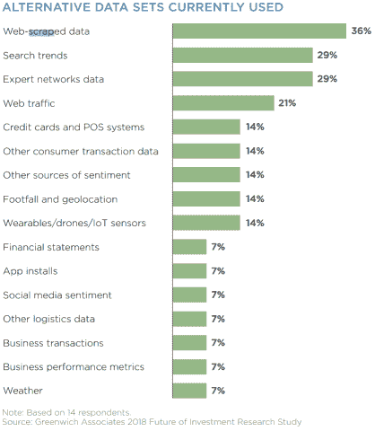
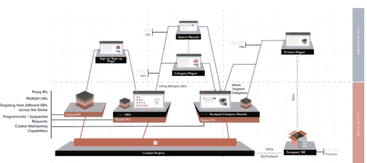

# 网络抓取和对冲基金的另类数据策略

> 原文：<https://medium.datadriveninvestor.com/web-scraping-and-hedge-funds-alternative-data-strategy-4ab5b3e6dcc6?source=collection_archive---------2----------------------->

曾经隐藏在众目睽睽之下的数据再也隐藏不住了。有了复杂的软件，新的数据不断从越来越多的在线来源中被提取出来。加上更深入的分析，对冲基金现在正在利用一个新的、越来越重要的阿尔法来源。

今年早些时候，Greenwich Associates 和 Thomson Reuters 发布了一项联合研究，对投资研究领域正在发生的巨大变化提供了有趣的见解。

题为“[投资研究的未来](https://www.thomsonreuters.ru/content/dam/openweb/documents/pdf/russia/report/thomson-reuters-and-greenwich-associates.pdf)”的研究涵盖了支撑这一转变的一些促成因素，并包含一些关于替代数据的特别有说服力的观察结果。

我们之前已经讨论过诸如[卫星图像](http://www.datadriveninvestor.com/2018/09/18/looking-to-the-skies-for-alpha/)和[地理位置数据](http://www.datadriveninvestor.com/2018/10/17/your-mobile-phone-as-a-gold-mine-for-hedge-funds/)等替代数据集对对冲基金的重要性。这些数据集为那些愿意花钱采购的机构提供了大量未开发的 alpha 值，从而使他们能够利用这一关键的信息优势超越其市场同行。

事实上，格林威治/汤森路透的研究表明，一般投资公司每年在替代数据上的支出约为 90 万美元，而其对替代数据的年度行业预算估计目前为 3 亿美元。这几乎是一年前的两倍。显然，在这些替代数据中，投资专业人士最常用的形式是*网络搜集的*数据。

[来源](https://www.thomsonreuters.ru/content/dam/openweb/documents/pdf/russia/report/thomson-reuters-and-greenwich-associates.pdf)

网络抓取(也称为“自动数据收集”、“数据抓取”和“蜘蛛搜索”)指的是使用软件从网站中获取潜在有价值的数据的过程。对对冲基金而言，付钱给公司以获取此类数据，可以帮助它们在市场其他人赶上之前，做出更明智、更明智的投资决策。

Quandl 就是这样一家公司，它现在明确地处于替代数据革命的前沿和中心。这家加拿大公司经常通过抓取网页或与领域专家合作来汇编数据集，然后将数据出售给对冲基金和其他感兴趣的客户。

格林威治报告称，网络搜集的数据本身有多种形式，包括“产品定价、搜索趋势、专家网络的见解和网络流量数据”。

比如从 Alexa 抓取网页流量。高盛资产管理公司发现 HomeDepot.com 网站的访问量急剧上升。这使得资产管理公司可以在公司提高预期和股票最终升值之前买入股票。

与此同时，在其众多策略中，著名的资产管理替代数据公司 [Eagle Alpha](https://eaglealpha.com/our-story/) 从大型零售商那里收集定价数据，这些数据“被证明在为消费品销售提供方向指标方面很有价值”例如，从美国电子网站收集数据使该公司能够观察到对 GoPro 产品的需求不断减少，从而正确地得出结论，这家动作相机制造商将无法实现 2015 年第三季度的目标。尽管在 GoPro 最终宣布其表现不佳的前两天，“[超过 68%的股票推荐是购买](https://www.forbes.com/sites/freddiedawson/2016/03/25/twitter-your-hedge-fund-better/#40e85901385e)。

此外还有社交媒体，它被证明在确定什么是当前的“趋势”，什么不是非常有效。特别是 Twitter，它已经成为非常受欢迎的有意义信息的来源，投资者分析数百万条推文和转发，以便及时交易股票。

正如彭博[最近宣称的](https://www.bloomberg.com/professional/blog/trading-twitter-evolving-market/)，“访问 Twitter 流为寻找阿尔法的研究人员提供了最大和最有营养的替代数据集之一”，[刚刚将 Twitter 流整合到其新闻服务](https://www.bloomberg.com/company/announcements/bloomberg-launches-twitter-feed-optimized-trading/)中，该服务扫描有新闻价值的推文以进行发布。甚至有[一份备受尊敬的研究论文](https://arxiv.org/pdf/1010.3003v1.pdf)发现“从大规模推特反馈中得出的集体情绪状态”可以以惊人的 87.6%的准确率预测道琼斯的走势。

【2017 年 11 月的一项调查发现，超过四分之一的对冲基金正在或计划在未来 6-12 个月的投资策略中使用社交媒体数据。从 Twitter、脸书和 YouTube 等网站获取数据通常是直接通过提供商自己或第三方平台完成的。

但在抓取了 Twitter 和 Amazon 等更受欢迎、更容易访问的网站后，对冲基金必须不断寻找新的独特数据源，以挖掘出更准确的交易信号，并在竞争中保持领先地位。在这一点上，公司能够——并且确实——钻研的深度似乎是没有止境的。它甚至可能包括[黑暗网](https://www.fnlondon.com/articles/hedge-funds-gain-an-edge-from-the-dark-web-20170802)。

它还可能涉及个人/客户的数据，这些数据可以从各种来源收集，如选民登记册、电话簿、犯罪记录和飞行日志。鉴于今年爆发的围绕个人数据问题的争议，特别是在脸书剑桥分析公司(Cambridge Analytica)丑闻之后，信息搜集者似乎与倡导更严格的数据隐私法的人发生了冲突。

Quandl 创始人兼首席执行官 Tammer Kamel 曾承认公司中存在一种“健康的偏执狂”,以确保在他的公司出售其替代数据集之前删除个人信息，一个失误可能会对在这一领域运营的基金产生可怕的后果。但在现阶段，对个人的充分监管保护仍难以实现。对冲基金获取的数据类型在个人信息方面不一定是匿名的。这意味着在没有足够的监管的情况下，你的很多信息都可以被收集。

正如对冲基金法律报告[去年承认的](https://www.hflawreport.com/article/3428)，“尽管电子商务相对成熟，但自动数据收集的合法性仍未确定。虽然有许多案例根据各种州和联邦法令审查了刮擦纠纷，但法律并不统一，过去的判决本质上是针对具体事实的。事实上，一些复杂的法律案件对刮刮乐的*有利…*

在美国,《联邦计算机欺诈和滥用法案》( CFAA)是一项法规，规定任何“未经授权而故意访问计算机，或超出授权访问范围，从而从任何受保护的计算机获取…信息”的人都要承担责任因此，公司引用它来试图阻止第三方收集数据。但在 2017 年的 [HiQ Labs(一家劳动力分析公司)诉 LinkedIn](https://cases.justia.com/federal/district-courts/california/candce/3:2017cv03301/312704/63/0.pdf?ts=1502781895) 一案中，后者利用 CFAA 辩称，前者使用机器人从公共用户档案中收集数据，违反了其使用条款。然而，最终，LinkedIn 被依法下令删除阻止 hiQ Labs 抓取的技术，理由是访问公开的个人资料页面不需要授权。

还应该注意到，诚实的行为者并不总是使用网络抓取。网络罪犯可以用它来破坏公司的声誉，比如说，通过窃取有版权的内容。此外，由于网页抓取机器人在意图上彼此难以区分，因此也不可能区分出哪些是恶意的，哪些是好的。

网络抓取机器人变得越复杂，它们就越容易进入 API 和网络应用程序——例如，通过使用代理 IP——恶意攻击就越有可能成功。

*解剖一次发作(* [*来源*](https://securityboulevard.com/2018/10/how-scraping-attacks-can-compromise-web-security-and-impact-business-continuity/) *)*

但这些日益增长的担忧不太可能阻止对冲基金采用网络抓取，特别是如果它继续被证明对释放新的有利可图的投资机会至关重要，并且对该领域的监管仍在进行中。事实上，一项估计表明网络抓取机器人占据了互联网流量的 46%。即使从表面上看，在网上搜索某家公司的名字也能让对冲基金对其前景和客户认知有一个更清晰的了解。

随着越来越多的证据表明网络抓取对对冲基金行业的整体应用有多么重要，无论是否符合道德规范，网络世界现在似乎将受到比以往任何时候都更频繁、更密切的分析。

*原载于 2018 年 11 月 12 日*[*www.datadriveninvestor.com*](https://www.datadriveninvestor.com/2018/11/12/web-scraping-hedge-fund-strategy/)*。*