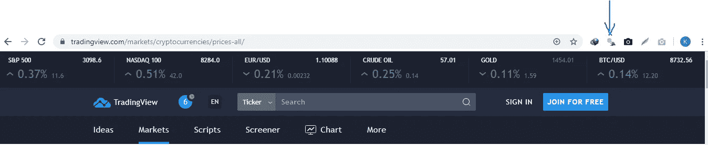
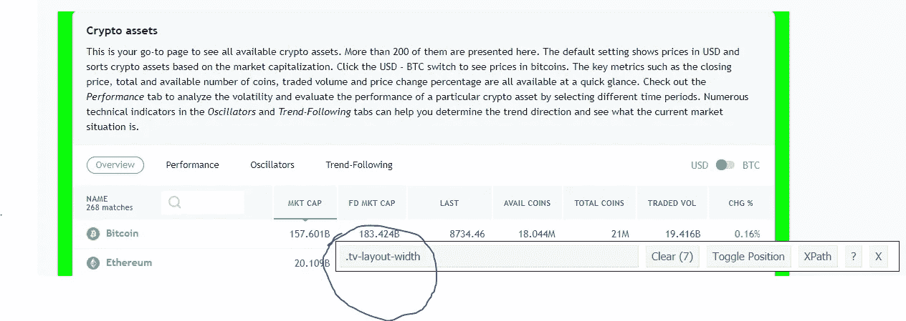
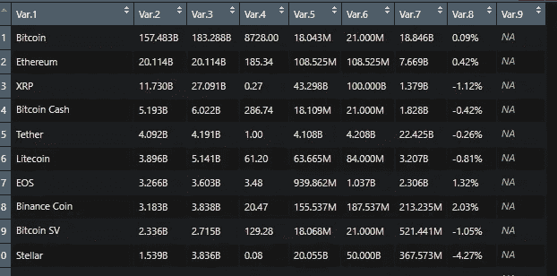
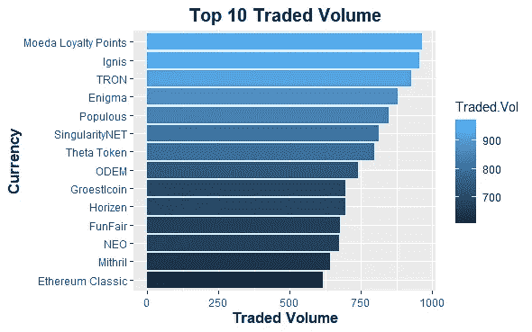
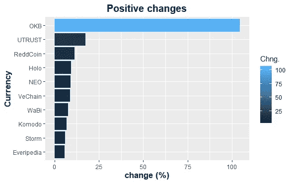

# R 加密货币的网络抓取

> 原文：<https://medium.datadriveninvestor.com/web-scraping-crytocurrencies-with-r-a7ff07f135db?source=collection_archive---------1----------------------->

## 一个简单的网页抓取和使用 EDA 的见解和明智的决策指南。


Scraping a pumpki

21 世纪的经济被称为以知识为基础的*经济，在这种经济中，商品和服务是通过创新地使用知识来生产的。*

*在 21 世纪，你需要 ***杠杆，***20 世纪使用的那种杠杆要达到最大产量需要某种重型机械。在农业时代，财富来自对土壤的自然耕作，即自然；在工业时代，人类通过机器驾驭自然，这成为新的财富来源——机器。在 21 世纪/数字时代，杠杆是 ***数据和知识。****

*最好的创新者是那些能够利用数据的力量，从这些数据中获取知识的人，从而为明智的决策和行动提供平台。*

*[](https://www.datadriveninvestor.com/2019/03/10/swiss-based-etp-enters-the-crypto-trading-market/) [## 总部位于瑞士的 ETP 进入加密交易市场|数据驱动的投资者

### 虽然金融市场几乎没有沉闷的时刻，特别是在引入…

www.datadriveninvestor.com](https://www.datadriveninvestor.com/2019/03/10/swiss-based-etp-enters-the-crypto-trading-market/) 

**网页抓取？**简单来说，就是从网站中提取大量文本数据，并存储在某种数据库或存储系统中的过程。了解更多，本文[见解](https://medium.com/velotio-perspectives/web-scraping-introduction-best-practices-caveats-9cbf4acc8d0f)。* 

*直接进入正题，让我们探索如何使用 R 编程进行 web 抓取。我们将刮[***trading view***](https://www.tradingview.com/markets/cryptocurrencies/prices-all/)加密货币价格列表页面。*

*你需要为你的 chrome 浏览器下载一个 css 选择器，这是用来指定要在网页上抓取的文本的 css 属性的。点击 [***这里***](https://chrome.google.com/webstore/detail/css-selector-helper-for-c/gddgceinofapfodcekopkjjelkbjodin?hl=en)*下载。**

****

**css selector location on chrome browser**

**安装选择器后，点击它，如上图所示，然后你可以在不同的文本之间切换，以在网页中找到它们的 css 属性。下图显示了我们使用预先安装的选择器高亮显示的文本的路径。**

****

**Path to capture text**

**让我们装入所需的 R 包**

```
**#Packages
library(rvest)
library(tidyverse)
library(stringr)**
```

**第一步是将要抓取的页面的 URL 路径加载到 R**

```
**#Crytocurrency page path
crpyto_url <- read_html("[https://www.tradingview.com/markets/cryptocurrencies/prices-all/](https://www.tradingview.com/markets/cryptocurrencies/prices-all/)")**
```

**因为我们对表格感兴趣，所以我们使用 css 选择器来指定我们在网页中寻找什么，这种情况就是表格。**

```
**#get cryptocurrency table from cryto_url we loaded earlier
cryp_table <- html_nodes(crpyto_url, css = "table")#Note that the result is still a list, that is because we have not specified what should be done, so we must explicitly convert the result to a table or dataframe. #Convert to table
crypt_table <- html_table(cryp_table, fill = T) %>% 
  as.data.frame()**
```

****

**Obtained dataframe**

**我们发现一些表格有一些特殊的字符和度量单位，但是我们希望删除它们，因为我们将把这些数据作为数值来分析。**

```
**#Clean dataframe and remove unwanted values/symbols
crypt_table <- 
apply(crypt_table[,2:9], 2, gsub, pattern = "[B M % K]",
 replacement = "") %>% 
  cbind.data.frame(crypt_table$Var.1) %>% #We attach their currency names which are characters
  select(9, 1:7)**
```

**我们已经删除了特殊字符，让我们调整名称以便于将列转换为数字。**

```
**#create vector of names
x <- c("Currency","Mkt Cap", "Fd Mkt Cap", "Last", "Avail coins", 
"Total coins", "Traded Vol", "Chng%")#Attach names to crypt_table
names(crypt_table) <- x#Convert columns except currency column to numeric data type
crypt_table1 <- 
  data.frame(apply(crypt_table[2:8],2, as.numeric)) %>% 
  cbind(currency = crypt_table$Currency) %>% 
  select(8,1:7)**
```

**表准备好了，我们可以对数据进行一些探索性的数据分析。**

```
**#Perform some eda on the data
#Top 10 traded vol
crypt_table1 %>% 
  select(currency, Traded.Vol) %>% 
  filter(Traded.Vol > 600) %>% 
  ggplot(., aes(reorder(currency, Traded.Vol), Traded.Vol )) +
  geom_bar(stat = "identity", aes(fill = Traded.Vol)) + coord_flip() +
  ggtitle("Top 10 Traded Volume") +
  xlab("Currency") + ylab("Traded Volume") + 
  theme(plot.title = element_text(hjust = 0.5, face = "bold", size = 15),
        axis.title.x = element_text(face = "bold", size =  13),
        axis.title.y = element_text(face = "bold", size = 13))**
```

****

**Simple EDA of Traded Volume**

```
**#Examine currency with positive change
#Examine currency with positive change
crypt_table1 %>% 
  select(currency, Chng.) %>% 
  filter(Chng. > 2.00) %>% 
  top_n(10) %>% 
  ggplot(., aes(reorder(currency, Chng.), Chng.)) +
  geom_bar(stat = "identity", aes(fill = Chng.)) + coord_flip() +
  ggtitle("Positive changes Top 10") +
  xlab("Currency") + ylab("change (%)")+ 
  theme(plot.title = element_text(hjust = 0.5, face = "bold", size = 15),
        axis.title.x = element_text(face = "bold", size =  13),
        axis.title.y = element_text(face = "bold", size = 13))**
```

****

**Top 10 positive changes**

## **结论**

**我们已经尝试了简单的网页抓取基础，你可以在其他感兴趣的网页上尝试，以提高你的网页抓取技能。**