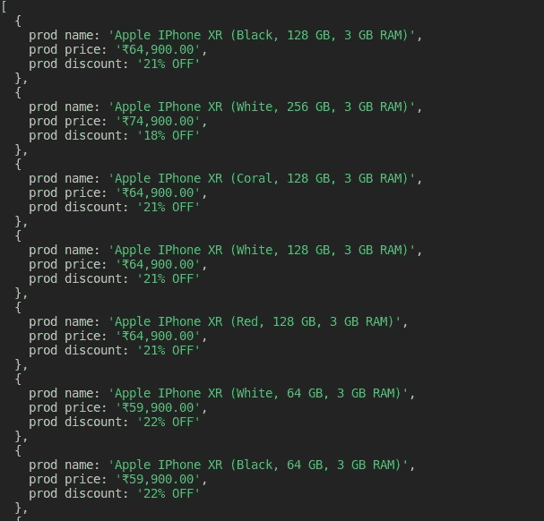

# 无头浏览器的网络抓取:木偶师教程

> 原文：<https://medium.datadriveninvestor.com/web-scraping-with-a-headless-browser-a-puppeteer-tutorial-b95fbe344ff2?source=collection_archive---------6----------------------->


在过去的十年中，Web 开发以惊人的速度前进，出现了许多用于后端和前端开发的框架。网站变得越来越智能，开发网站的底层框架也变得越来越智能。web 开发中的所有这些进步也导致了浏览器本身的发展。大多数浏览器现在都有“无头”版本，用户可以在没有任何用户界面的情况下与网站进行互动。你也可以在这些 ***无头浏览器*** 上使用像 ***木偶*** 和 nodeJS 这样的包来抓取网站。

Web 开发严重依赖于测试机制，以便在我们将它们推向生产环境之前进行质量检查。一个复杂的网站在我们部署之前需要一个复杂的测试套件结构。 ***无头浏览器*******由于没有任何 UI 的开销*，大大减少了 web 开发中的测试时间** *。这些浏览器让我们能够在更短的时间内处理更多的网页。**

*[](https://www.datadriveninvestor.com/2019/03/25/a-programmers-guide-to-creating-an-eclectic-bookshelf/) [## 创建折衷书架的程序员指南|数据驱动的投资者

### 每个开发者都应该有一个书架。他的内阁中可能的文本集合是无数的，但不是每一个集合…

www.datadriveninvestor.com](https://www.datadriveninvestor.com/2019/03/25/a-programmers-guide-to-creating-an-eclectic-bookshelf/) 

在这篇博客中，我们将学习使用 nodeJS 和[异步编程](https://blog.datahut.co/asynchronous-web-scraping-using-python/)在这些 ***无头浏览器*** 上抓取网站。在我们开始抓取网站之前，让我们更详细地了解一下无头浏览器。此外，如果你担心抓取的[合法性，你可以清除你关于网页抓取](https://blog.datahut.co/is-web-data-scraping-legal/)的[神话。](https://blog.datahut.co/busting-8-myths-about-web-scraping/)

# 什么是无头浏览器

***无头浏览器*** *在执行基于 web 的自动化测试* *等任务时更加* ***灵活、快速、优化。由于没有任何 UI 的开销，* ***无头*** *浏览器适用于* ***自动化压力测试和网页抓取，因为这些任务可以更快地运行*** 。虽然像 PhantomJS、HtmlUnit 这样的供应商已经在市场上提供无头浏览器功能很长时间了，但 chrome 和 firefox 这样的浏览器玩家现在也在提供他们浏览器的“无头”版本。因此，不需要为无头功能安装额外的浏览器。**

# 对无头浏览器的需求

随着 web 开发框架的进步，浏览器也变得更加智能，可以加载所有的 javascript 库。随着 web 开发技术的发展，网站的测试也在发展，并且已经成为 web 开发行业的基本要素之一。**无头浏览器**的发展允许我们执行以下应用

1.  端到端测试是一种用于测试应用程序的流程是否从头到尾都按照设计执行的方法。执行端到端测试的目的是识别系统依赖性，并确保正确的信息在各种系统组件和系统之间传递。**web 应用的测试自动化** ***无头浏览器*** 就是为了迎合这种用例而设计的，因为它们支持使用 CLI 进行更快的 web 测试。
2.  ***无头浏览器*** 能够更快地抓取网站，因为它们不必处理打开任何 UI 的开销。有了 ***无头浏览器*** ，人们可以简单地自动化废弃机制，并以更加优化的方式提取数据。
3.  无头浏览器 可能不提供任何 GUI 体验，但它们确实允许用户拍摄他们正在渲染的网站的快照。这当然有助于执行自动化测试，并希望在网站上可视化代码效果，并以截图的形式存储结果。使用 ***无头浏览器*** 拍摄大量没有任何实际 UI 的截图是小菜一碟。
4.  成功提供卓越客户体验的公司总是比竞争对手做得更好。**绘制跨网站的用户旅程图
    *无头浏览器*** 允许我们运行绘制客户旅程测试案例的程序，以优化用户在网站决策过程中的体验。

# 什么是木偶师

***puppeter 是一个 API 库，用 DevTools 协议来控制 Chrome 或者 Chrome****。它通常是无头的，但可以设置为操作 Chrome 或整个 Chrome(非无头的)*。此外，Puppeteer 是一个节点库，我们可以使用它来监控 Chrome 实例，而无需 heads (UI)。

# 使用木偶师进行网页抓取

在本文中，我们将使用**木偶师**从网站中抓取产品列表。 ***木偶师会使用无头 chrome 浏览器打开网页，查询回所有结果*** 。在我们开始实际实现用于 web 抓取的 puppeteer 之前，我们将研究一下它的设置和安装。

之后，我们将实现一个简单的用例，在这个用例中，我们将访问一个[电子商务网站，搜索一个产品并抓取所有结果](https://blog.datahut.co/scraping-yahoo-finance-data-using-python/)。所有上述任务都将通过使用**木偶师**库以编程方式处理。此外，我们将使用 nodeJS 语言来完成上面定义的任务。

# 安装木偶师

下面的代码片段将帮助您安装 node js

```
## Updating the system libraries ## sudo apt-get update ## Installing node js in the system ## sudo apt-get install nodejs
```

你可以使用下面的命令来安装**木偶师**包

```
npm install --save puppeteer
```

既然我们现在已经安装了所有的依赖项，我们可以开始使用**木偶师**实现我们的抓取用例。我们将使用由**木偶师**包驱动的 node JS 程序来控制网站上的动作。

# 使用木偶师抓取产品列表

**第一步:访问页面并搜索产品**

```
const puppeteer = require('puppeteer'); const browser = await puppeteer.launch(); const page = await browser.newPage(); var args = process.argv[2] await page.goto("https://www.croma.com/"); await page.click('button.mobile__nav__row--btn-search') await page.type('input#js-site-search-input', args) await page.keyboard.press('Enter'); await page.screenshot({path: 'sample.png'})
```

**第二步:抓取项目列表**

在这一节中，我们将收集搜索给定产品后得到的产品列表。HTML 选择器被用来获取网页内容。所有废弃的结果被整理在一起形成数据集。querySelector 函数允许我们使用 HTML 选择器从 web 页面中提取内容。querySelectorAll 函数获取用特定选择器标记的所有内容，而 querySelector 函数只返回第一个匹配的元素。

```
let urls = await page.evaluate(() = { let results = []; let items = document.querySelectorAll('li.product__list--item'); items.forEach((item) = { let name = item.querySelector('a.product__list--name').innerText let price = item.querySelector('span.pdpPrice').innerText let discount = item.querySelector('div.listingDiscnt').innerText results.push({ prod_name: name, prod_price: price, prod_discount: discount }); }); return results; })
```

# 完整代码

这是实现的完整工作示例。我们已经在运行函数中包装了整个登录，并在控制台中记录废弃的结果。

```
const puppeteer = require('puppeteer'); function run () { return new Promise(async (resolve, reject) ={ try { const browser = await puppeteer.launch(); const page = await browser.newPage(); var args = process.argv[2] await page.goto("https://www.croma.com/"); await page.click('button.mobile__nav__row--btn-search') await page.type('input#js-site-search-input', args) await page.keyboard.press('Enter'); await page.screenshot({path: 'sample.png'}) let urls = await page.evaluate(() = { let results = []; let items = document.querySelectorAll('li.product__list--item'); items.forEach((item) = { let name = item.querySelector('a.product__list--name').innerText let price = item.querySelector('span.pdpPrice').innerText let discount = item.querySelector('div.listingDiscnt').innerText results.push({ prod_name: name, prod_price: price, prod_discount: discount }); }); return results; }) browser.close(); return resolve(urls); } catch (e) { return reject(e); } }) } run().then(console.log).catch(console.error);
```

您可以使用下面的命令，通过一个**无头浏览器**运行上面的**木偶师**脚本。我们将使用 nodejs 来运行我们的代码。你只需要提到关键字节点和文件名，然后是产品名称，你需要在给定的网站上搜索其数据并抓取结果。

在这个例子中，我们在 Croma 网站上搜索 iPhones，然后删除产品列表。

```
node headlessScrape.js iphones
```

上述代码的输出可以这样可视化



*通过无头浏览器抓取后的产品列表*

我们学会了使用 nodeJS 中的*包从***无头浏览器*** 中抓取数据。我们还执行了一些自动化任务，以便在最终删除内容之前自动完成网站上的一些操作。无头浏览器仍处于萌芽状态，但在自动网页抓取和网页测试领域显示出很大的前景。通过 ***无头浏览器*** 进行更快的网页抓取将有助于你在服务器成本方面比市场上的其他玩家更有竞争力。**