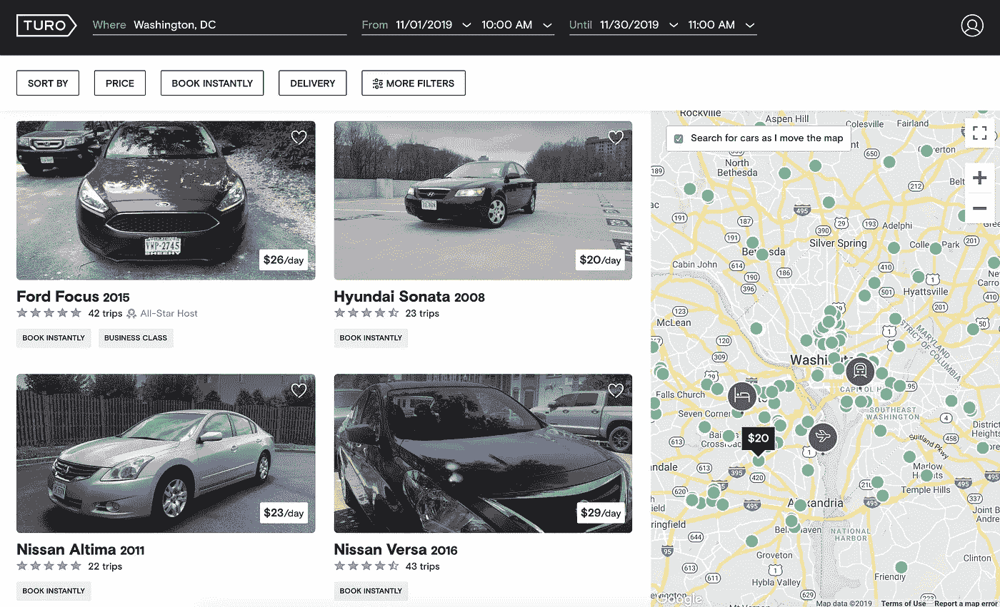
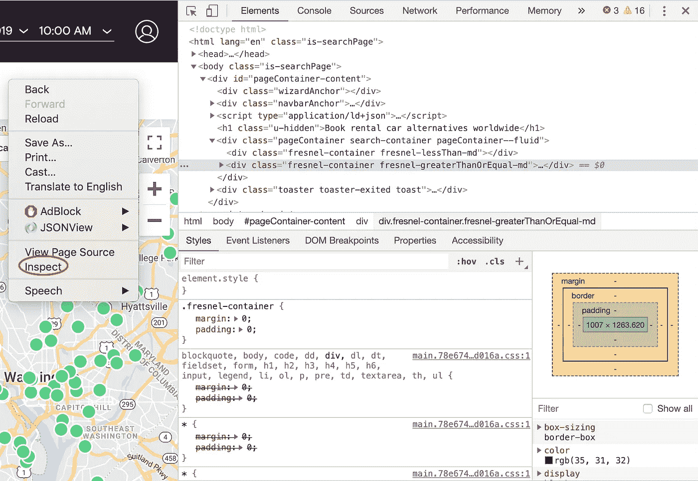
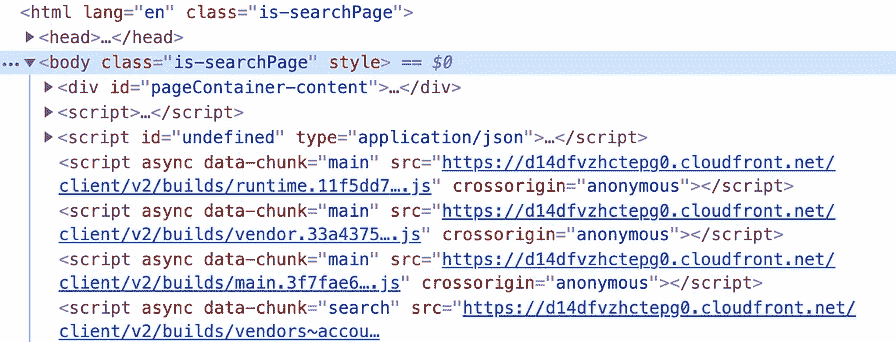
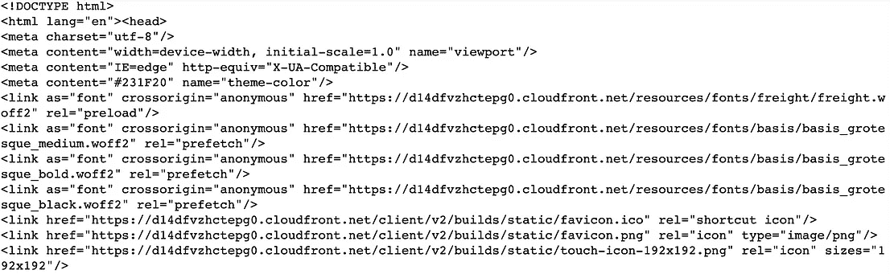
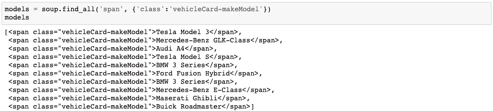
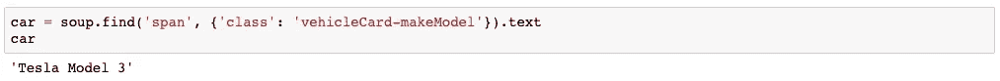
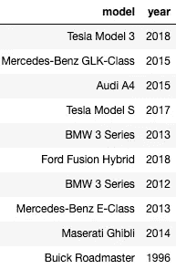

# 使用 Selenium 通过 Python 进行 Web 抓取

> 原文：<https://medium.datadriveninvestor.com/web-scraping-with-python-using-selenium-9a08b85b718a?source=collection_archive---------0----------------------->


Photo by [Luca Bravo](https://unsplash.com/@lucabravo?utm_source=medium&utm_medium=referral) on [Unsplash](https://unsplash.com?utm_source=medium&utm_medium=referral)

# **什么是网页抓取？**

Web 抓取是一种从网站中提取大量非结构化数据并以结构化形式存储的方法。

*   提示:在网址末尾加上`/robots.txt`，查看网站是否允许抓取。比如，[turo.com/robots.txt](http://turo.com/robots.txt)。

[](https://www.datadriveninvestor.com/2019/02/07/8-skills-you-need-to-become-a-data-scientist/) [## 成为数据科学家所需的 8 项技能|数据驱动型投资者

### 数字吓不倒你？没有什么比一张漂亮的 excel 表更令人满意的了？你会说几种语言…

www.datadriveninvestor.com](https://www.datadriveninvestor.com/2019/02/07/8-skills-you-need-to-become-a-data-scientist/) 

*警告:小心哪些网站和/或数据以及你试图抓取的速度，因为你可能会被网站禁止(是的，我以前也遇到过)。

# **美汤**

Python 中最常用的 web 抓取包之一是 [Beautiful Soup](https://www.crummy.com/software/BeautifulSoup/bs4/doc/) ，它解析 HTML 和 XML 文档。然而，有一些网站——比如 turo.com——漂亮的汤不足以检索数据。

Turo 是一家汽车共享公司，允许私家车主在线或通过移动应用程序出租车辆。我想测试各大城市(如华盛顿特区、纽约市、洛杉矶、芝加哥)之间汽车价格分布的显著差异，并分析汽车的具体特征(价格、汽车型号、汽车年份、汽车类型等)是否符合要求。)显著影响其成功(由高次数的旅行定义)。



Photo on [Turo](https://turo.com/en-us/search?)

我开始按照下面的步骤用美丽的汤刮网站。

*开始之前，请确保您已经安装了美丽的汤。

```
#in terminal
pip install beautifulsoup4#in Jupyter Notebook
!pip install beautifulsoup4
```

## 使用美汤的基本步骤:

1.导入所有必需的包。

```
import requests
from bs4 import BeautifulSoup
```

2.找到你要抓取的网站的 URL，发出 get 请求，拉取页面的 HTML。

```
page = requests.get(URL)
```

3.将 HTML 内容传递给 Beautiful Soup 进行解析。

```
soup = BeautifulSoup(page.content, "html.parser")
```

4.决定您想要提取的特定数据，并使用“Inspect Element”(Safari)或“Inspect”(Google Chrome)功能来查找 HTML 代码。



turo.com

这一步是当我面临的问题，使用美丽的汤对 turo.com。我从 get 请求中获取的 HTML 代码与 Inspect 特性中的代码完全不同(如下所示)。我试图从 Turo 收集数据，这让我找到了 Selenium。



Left: Inspect feature from turo.com, Right: HTML code from Beautiful Soup get request

# 硒


Photo on Selenium Documentation

对于科学家或医学专业人士来说，硒可能被称为一种化学元素(Se ),一种在新陈代谢中起关键作用的矿物质。对于数据科学家来说，selenium 是另一个用 Python 抓取网站的工具。Selenium 是一个自动化浏览器活动的 web 测试库。

*注:具体数据还是会用美汤切片。Selenium 用于检索整个页面的 HTML 内容。

## 安装 Selenium

就像您需要安装漂亮的汤库一样，您也需要在开始之前安装 Selenium。不过，这样做还需要更多的步骤，并且这些步骤会因您使用的浏览器而有所不同。

1.`pip install selenium`或`!pip install selenium`

2.安装 web 驱动程序。
Firefox:[geckodriver](https://github.com/mozilla/geckodriver/releases)Chrome:[Chrome driver](https://sites.google.com/a/chromium.org/chromedriver/downloads)Safari:[Safari driver](https://webkit.org/blog/6900/webdriver-support-in-safari-10/)

3.确保 webdriver 保存在与运行代码的文件相同的路径中。你可以通过命令
`echo $PATH`来检查这个目录。

运筹学

在路径中包含保存 web 驱动程序的目录。

```
export PATH="your path"#example: export PATH="User/Documents/chromedriver"
```

## 使用硒的基本步骤:

1.导入必要的包。

```
import pandas as pd
from bs4 import BeautifulSoup
from selenium import webdriver
```

2.启动驱动程序。根据您的浏览器从下面选择一个。

```
#Chrome
driver = webdriver.Chrome()#Mozilla Firefox
driver = webdriver.Firefox()#Safari
driver = webdriver.Safari()
```

2.对页面发出 get 请求。

```
driver.get(URL)
```

运行这段代码应该会打开一个给定网站的新窗口。

3.将 HTML 内容传递给 Beautiful Soup 进行解析。

```
soup = BeautifulSoup(driver.page_source)
```

4.使用命令`.findAll()`和/或`.find()`仅选择所需信息。

`.find_all()`选择给定标签下的所有元素。您可以通过包含类名来进一步导航。



`.find()`选择给定标签下的第一个元素。


使用一个元素，您可以使用诸如`.text`之类的命令来提取特定的信息，如下所示。



下面，你可以看到一个数据框，上面有我用 Selenium 从 turo.com 获取的前 10 款车型和年份的信息。



创建这个数据帧的完整代码可以在下面找到。

## 下一步？

为了继续我对 Turo 汽车的分析，我将检索汽车的各种特征的数据——包括价格、汽车型号、汽车年份、汽车类型(运动型、SUV、轿车等)。)，出行次数。我还将从各大城市获取汽车价格数据，如华盛顿特区、纽约市、洛杉矶、芝加哥。