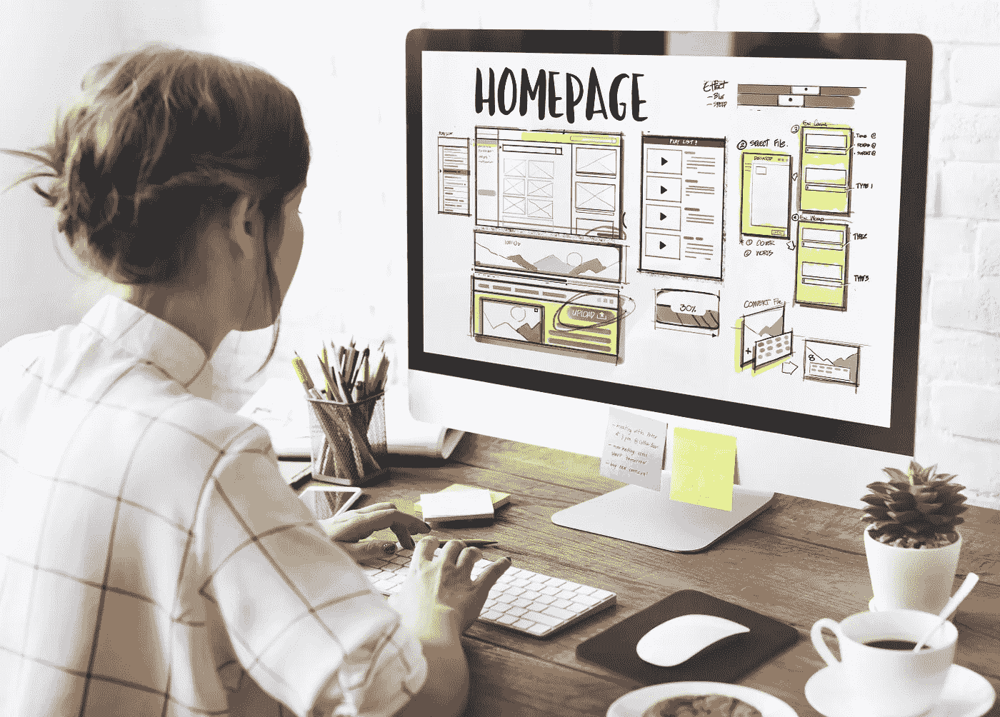

# 为企业和用户重新设计网站:好处和如何克服异议

> 原文：<https://medium.datadriveninvestor.com/website-redesign-for-business-and-users-the-benefits-and-how-to-overcome-objections-95cdc1b491c3?source=collection_archive---------21----------------------->

所有好的投资都需要积极的管理，网站也不例外。您的网站需要的不仅仅是新内容，还需要确保与您的网站相关的所有技术和设计都是最新的，并且满足您和您的客户的业务需求。大多数专家认为，你应该每两年重新设计你的网站，每五年彻底检查整个网站。

网站重新设计的过程不必是漫长而艰巨的。在很多情况下，只需要做一些调整就可以让你的网站看起来清新现代。让我们来看看商业领袖考虑重新设计网站的一些原因:

*   该网站似乎过时了
*   贵公司的业务方向不明确
*   它在移动设备上不好看
*   很难有效地导航和查找信息
*   销售和潜在客户转化并不存在
*   长加载时间

尝试通过谷歌分析寻找一些显示需要升级的数据。寻找像低回访率、高于平常的跳出率和低于网站平均停留时间这样的东西。您也可以尝试检查技术数据，以评估您的网站在各种浏览器和移动设备上的性能。当重新设计一个网站时，考虑它在移动设备上的性能是很重要的，因为用户更有可能通过手机和平板电脑访问你的网站，而不是台式电脑。

基本上，重新设计过程应该是这样的:

1.  从分析你现在拥有的开始
2.  设定你的优先事项
3.  定义你的目标受众
4.  创建一个你不满意的事情的清单
5.  设定新目标

# 为什么要重新设计网站

网站重新设计的好处之一是，它使你的网站看起来新鲜和最新的，它向用户传递一个信息，即你的业务是动态增长的。非常重要的一点是，你要向你的客户展示你能够与时俱进，你关心他们在旧版本网站上遇到的困难。在公司和客户之间建立这种相互理解是[商务网站开发](https://skywell.software/web-development/)的全部内容。

你努力工作来建立你的网站，它也应该努力工作来回报你。这是通过社交媒体整合、博客、电子商务、论坛等形式实现的。一个建立在过时技术上的网站将无法处理当今网站所需的所有高级功能。现在的用户要求所有的过程都要快速完成，否则他们就会离开你的网站。这意味着你必须让他们容易在社交媒体上分享你的网站，购买产品，订阅时事通讯和其他一切。

# 网站重新设计的缺点

企业不重新设计网站的主要原因之一是因为这可能会让用户感到困惑，因为他们已经习惯了你的网站的某种外观。为了克服这一点，您必须考虑用户的目标、需求和体验。想出网站重新设计的步骤，让用户在三次或更少的点击中完成他们需要的。请记住，新的网页设计不需要一夜之间完成。你可以和你的设计师一起想出一个计划，随着时间的推移来实现所有提议的改变。这将代表您的客户消除许多困惑。如果你正在努力想出一个如何逐步重新设计网站的计划，网上有很多信息可以帮助你。

当重新设计您的网站时，URL 可能会改变，这可能会损害您的 SEO 工作。这可以通过你的搜索引擎优化专家告诉搜索引擎你的旧网址的新位置来克服，这将通过保存你表现最好的页面来最小化任何负面的搜索引擎优化效果。尝试向搜索引擎提交一个站点地图，这样你的站点会被更好地索引。

我们希望所有这些关于为什么你应该重新设计网站的信息能够激励你对你的网站进行必要的更新。你越早完成它们，你就能越早开始享受网站重新设计的好处。

*最初发表于*[*sky well . software*](https://skywell.software/blog/website-redesign-for-business-and-users/)*。*