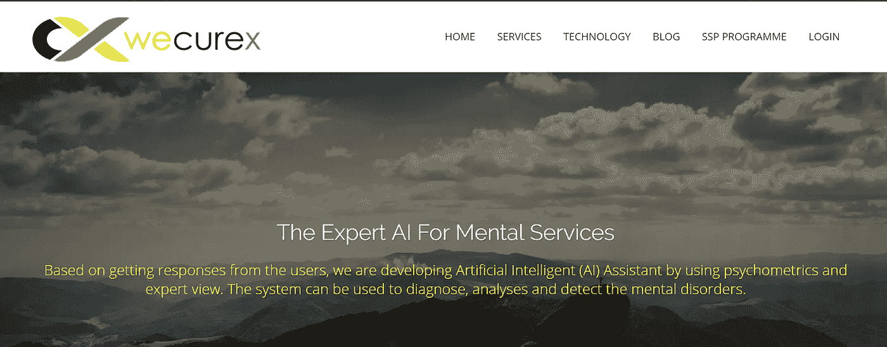
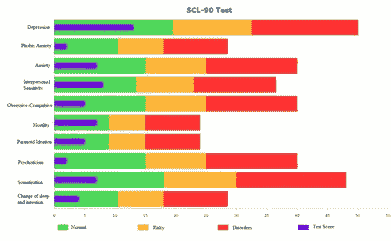

# WeCureX:精神疾病的精神病学人工智能助理

> 原文：<https://medium.datadriveninvestor.com/wecurex-psychiatric-ai-assistant-for-mental-disorders-49417ce5c48f?source=collection_archive---------23----------------------->

对精神病医生的需求是巨大的，因为一个精神病医生需要照顾大约 20 万到 30 万人。他们需要一个非常全面的情报系统。对患者的精神障碍进行系统和全面的精神病学评估可能非常复杂。大多数当前的系统是基于纸张的，并且对于用户来说，做出诊断很晚并且很昂贵。在研究中，我们提出了新的专家辅助系统 WeCureX([http://www.wecurex.com](http://www.wecurex.com))，该系统旨在使用人工智能、精神病学家的观点和心理测量值对精神障碍进行系统诊断。此外，新的框架(网络模式识别)是通过结合网络科学和模式识别技术来理解病人的行为。

对大量患者进行研究，收集所有访谈数据。因此，新的数据集被收集起来用于分析，并将其用于人工智能(AI)，诊断准确率超过 90%。因此，所有结果都显示给用户，以获得助理服务。总之，我们通过使用新的辅助系统来理解并向用户推荐诊断。用户使用该系统进行更好的分析和治疗。通过为行为科学提供新的信息，这个系统可以同时帮助许多人。

SCL-90-R 试验用于 WeCureX 系统诊断一例。我们相信 WeCureX 的设计提供了一个灵活的系统，通常适用于大类精神障碍的自动诊断。研究了大量患者(约 1000 名及以后),以收集所有访谈数据。想象一下，你去一家诊所，在 3 或 4 个小时内完成一项试卷测试，有人试图从他们那里得到一份软拷贝。你将会损失大量的时间和金钱，而且你的诊断将会非常耗时，因为只有一个精神病医生会关心它。然而，有另一种方法来学习诊断非常面对和一些提问。使用人工智能，我们可以训练模型，我们可以将它与 web 系统结合起来。然后，我们可以为专家精神病学系统共享和收集新的数据集。

Results for one of patients.

该框架将报告发送给用户和专家(如上图所示)以获得反馈。在这份报告中，对于十种不同的精神障碍，该模型显示了什么是精神障碍的风险值。例如，如上图所示，如果蓝线在绿色区域，用户没有问题。当它靠近黄色区域时，每种精神障碍的风险都会增加。最后，基于即将到来的新信息更新模型。

**结论和未来工作**

本研究的主要结论是，WECUREX 是通过简化 SCL-90 测验开发的，该系统可以自动检测精神障碍。与此同时，精神病学测试开始在计算机环境中应用，然而，评估和解释是由专家完成的。它是独一无二的，在快速和简单的适用性方面，有计划的界面和认知架构。

通过使用人工智能和基于网络的系统创建的该系统，临床数据可以传递到应用阶段，并且可以通过数据分析来加速向新领域的过渡。因此，专家和用户可以使用该系统来了解精神障碍。根据到目前为止在这项研究中提出的结果和讨论，进行检测以显示 WECUREX 在未来如何工作。总之，该结果将使专家和用户能够学习精确的知识作为辅助服务。