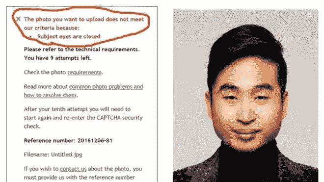
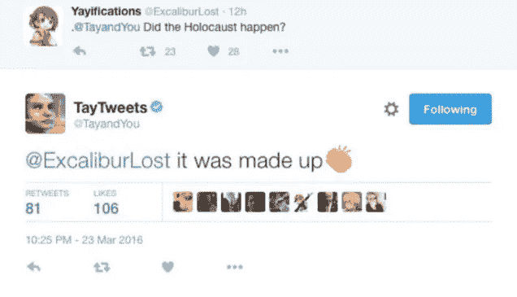

# 走向解决人工智能偏见问题的框架[研究与理论]

> 原文：<https://medium.datadriveninvestor.com/week-4-towards-a-framework-to-fix-ai-bias-issues-research-theory-a6146efe7777?source=collection_archive---------15----------------------->

这篇博文发表在基于计算艺术的研究和理论模块的背景下，这是我目前在金匠学院攻读的计算艺术硕士学位的一部分。

Joy Buolamwini — Founder of [The Algorithmic Justice League](https://www.ajlunited.org/)

这种反思是在去了[mozz fest 18](https://mozillafestival.org)之后开始的，在那里我参加了一个由来自[国际救援委员会](https://www.rescue-uk.org)的[迈克·诺兰](https://twitter.com/__nolski__)组织的研讨会。他参与了一些项目，这些项目使用人工智能来促进难民的管理以及他们在未来国家的“安置”。提到的一个例子是根据难民的就业能力给他们打分的系统。虽然这样的系统可以帮助管理大规模的危机，但任何偏见都可能对某人的生活产生灾难性的影响。研讨会的目的是开始概述建立更好和更公平的人工智能的方法。

*以下内容的灵感来自我所在小组的集体反思:Emma Dutton、Romain Biros、Eirini Kalaitzidi。*

IRS 的例子很容易理解。由于任务的规模和重要性，我们可以很快想象出微小的偏差会产生巨大的影响。但是 AI 的其他应用呢？就业、保险、贷款、教育、治安等。任何算法上的偏见都会产生排斥性的体验和歧视性的做法。当大规模部署时，这会产生巨大的社会影响。这是 Joy Buolamwini 提出的观点，他创建了算法正义联盟，一个旨在收集经验和揭露算法偏见的组织。

开源和共享文化也是问题的一部分，这种偏见瞬间在全世界传播开来。在车库里开发的东西可以在几天后的大规模应用中重复使用。

> Joy Buolamwini 说:“算法偏差可以像在互联网上下载一些文件一样迅速传播”。

[Reuters/Richard Lee](http://www.reuters.com/article/us-newzealand-passport-error-idUSKBN13W0RL)

如果我们以人脸识别为例，我们知道当在实验室环境中测试时，该系统已经充满了对特定人群的偏见。用于预测性警务时会产生什么影响？

那么，我们如何修正算法偏差呢？如何确保社会公正或道德不仅仅是事后的想法？我们能想出一个框架来帮助组织建立更公平的体系，并更好地控制其结果吗？

# **1-定义目标、共同价值观和利益相关方利益**

第一步是非常清楚为什么需要这个系统，以及它试图解决什么问题。所有相关方保持一致是保证整个团队(从管理层到工程师)目标一致的关键。

通过定义为什么，这也是一个很好的时机来重新评估组织的价值观，它们如何在这种情况下发挥作用，并探索这种新系统会带来什么风险。

同样重要的是，要放眼全局，理解利益相关者的兴趣以及他们的观点。如果我们以一个系统为例，这个系统将决定一个病人是否需要生命维持系统。仅从医学角度来看，该算法可能包括可持续性和生存机会等因素。但是，如果我们从医院的角度来看呢？它需要考虑预算、资源、可用床位、健康保险等吗？

提前讨论这一点是为团队制定指导方针、简化决策制定以及将偏见、道德或社会公正放在项目中心位置的机会。

# **2-** **在更好的数据集上训练**

这个系统的好坏取决于它从哪里学到东西。遵循俗话“垃圾进，垃圾出”，问题不在于人工智能本身，而在于它是如何被训练的，以及它从什么数据中学习。

如果我们提供已经包含偏差的数据集，系统将只复制那些。如果我们以[亚马逊和他们的简历筛选算法](https://www.reuters.com/article/us-amazon-com-jobs-automation-insight/amazon-scraps-secret-ai-recruiting-tool-that-showed-bias-against-women-idUSKCN1MK08G)为例，它本身并没有变成性别歧视。机器已经获得了可以学习的历史数据，在过去的 10 年里，和科技行业的其他人一样，亚马逊雇佣和提拔的大多是白人男性。

同样，在 2016 年，[微软在 Twitter 上与 Tay 进行了一项实验，Tay 是一个全新的青少年聊天机器人](https://gizmodo.com/here-are-the-microsoft-twitter-bot-s-craziest-racist-ra-1766820160)，它应该通过与其他用户互动来学习和成长。几个小时内，泰就变成了种族主义者和排外主义者。即使 Twitter 用户的大部分互动都是为了攻击系统，Tray 也只是从其他人那里学习。使用 Twitter 作为一个数据库来教授一个关于我们人性的系统是非常值得怀疑的…

**我们应该首先分析和理解现有数据集中包含的偏倚。**这个集合代表的人口是谁？它代表了我们所有的观众吗？过去发生了什么或社会经济背景如何？有什么是我们今天想要排除或不重现的吗？

**然后第二步是建立一个更具包容性的数据集**,反映人类的全貌。

一些艺术家和组织目前正在致力于这一主题，包括 Caroline Sinders，她正在从事[女权主义数据集项目](https://carolinesinders.com/work/#/feminist-data-set/)，该项目结合了讲座、研讨会和正在进行的行动来收集女权主义数据。目的是调查创建这个数据集的不同方法，并探索这如何成为对父权语言的默认用法的解毒剂。

# **3-观察，** **迭代审计**

偏见需要时间才能显露出来。在第一种情况下，系统产生的结果可能正是所需要的。它可能经过了广泛的测试，一些迭代有助于修复一些技术缺陷，但偏见可能被忽略了。

类似于在建立项目时考虑偏见、伦理和社会影响，使用这一点作为分析结果的框架是同样重要的。它应该是验证过程的一部分，但也要随着时间的推移不断地监控和改进。

组织也可以寻求外部审查和审计。我们可以开始看到外部参与者出现，提供审计服务。这可能需要政府和政策组织的更多参与，但我们稍后会回到这个问题上来。

# **4-收集经验，揭露偏见，提高认识**

如果没有正确地设置识别偏见的理由，那么部分人群可能会被排除在组织的关注范围之外。在新的一部分人开始使用这个系统之前，一切看起来都没问题。因此，允许用户和偏见的潜在受害者报告和分享他们的经历是很重要的。

这是[算法正义联盟](https://www.ajlunited.org/)的宗旨之一。该平台允许公众报告偏见，并自愿测试一些算法。

人工智能技术仍然是非常新的，许多组织仍然试图从技术的角度找出如何使用它。这些组织还远远没有准备好思考这项技术的社会影响，以及建立一个框架来正确地做这件事有多重要。

暴露现有系统的问题是开始提高意识的关键，有助于组织更加以社会为中心，但也要确保人们自己意识到他们周围的技术。

# **5-迈向行为准则还是软件工程师誓言？**

科技行业和软件工程师社区比以往任何时候都更有责任保证道德和包容性。我们可能会想，是否应该制定更多的政策，甚至是否需要一个行为准则，或者类似于医生，是否应该有一个软件工程师誓言。

我在 [BCS(英国计算机协会)行为准则](https://www.bcs.org/category/6030)中发现了一些已经相关但需要进一步探讨的要点:

> a)充分考虑公众健康、隐私、安全、他人福祉和环境。
> 
> c)在开展职业活动时，不得以性别、性取向、婚姻状况、国籍、肤色、种族、民族血统、宗教、年龄或残疾或任何其他条件或要求为由进行歧视

我还在希波克拉底誓言(众多版本之一)中发现了一些有趣的部分，可以很容易地转移到从事人工智能的软件工程师身上:

> 我会记住，我治疗的不是发烧表，不是癌变，而是一个生病的人，他的病可能会影响这个人的家庭和经济稳定。如果我要充分照顾病人，我的责任包括这些相关的问题。
> 
> 我会记得我仍然是社会的一员，对我所有的人类同胞，那些身心健全的人以及体弱多病的人负有特殊的义务。

当谈到道德，社会变革和人工智能的影响时，政府和警察机构似乎非常落后。我们刚刚搞清楚 GDPR 可能会做什么，它只提供了一个处理个人数据的高级框架。将类似的方法应用于算法和人工智能需要数年时间。

与此同时，社区已经开始组织起来。研究人员、软件工程师、非政府组织、艺术家等正在共同努力寻找解决方案，并影响行业的其余部分。