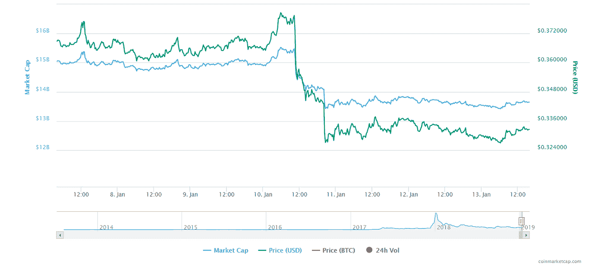
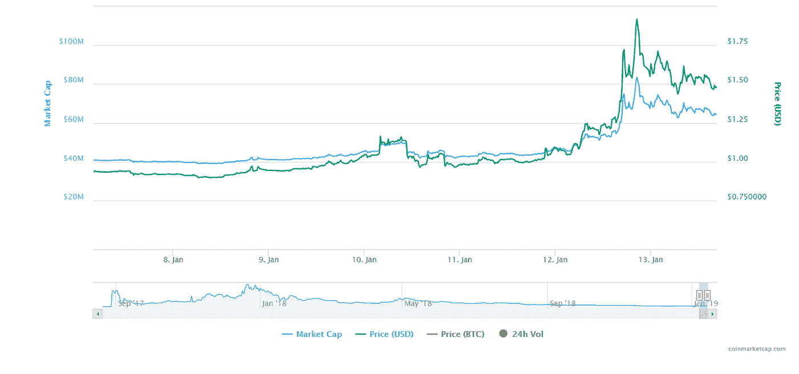
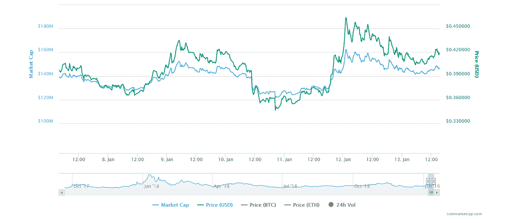

# 加密市场每周回顾:Ripple 重新获得第二名，HyperCash，Chainlink。

> 原文：<https://medium.datadriveninvestor.com/weekly-recap-of-the-crypto-market-ripple-got-its-2nd-rank-back-hypercash-chainlink-b1d3f1209775?source=collection_archive---------22----------------------->

2019 年的第一周对加密市场来说非常棒。我们看到许多硬币的价格上涨，比特币和以太币经历了最好的一周，我们认为市场崩溃终于结束了。然而，这一周是灾难性的，大多数加密货币都受到了这次崩溃的影响，因此市场价值和许多硬币的价格都有所下降。在本周的回顾中，我们将包括那些或多或少没有受到这次危机影响的硬币。

**涟漪(XRP)**
虽然涟漪受到这次崩盘的影响。值得一提的是，Ripple 仅在一周内就重返市值第二的位置。截至今天(2019 年 1 月 13 日)，Ripple 的市值为 13，647，555，091 美元，价格为 0.332 美元。这意味着 Ripple 的价格和市值都暴跌了约 9%。因为这次崩溃，以太坊的价格下降了 20%，所以瑞波又上升了一个等级。

**HyperCash (HC)**
HC 或 HyperCash 是为数不多的未受市场崩盘影响的加密货币之一。它以 0.935 美元的价格开始了它的一周，市值为 40，716，493 美元。直到 1 月 11 日，HC 有一个上升的图形，然后在那之后，它变得有点低，但它又找到了上升的方向。1 月 12 日，它达到了本周的最高价(1.92 美元)，然而，1 月 12 日之后，它的价格有所下降，截至今天，HyperCash 的估计价格为 1.46 美元，市值为 63，760，835 美元，比本周初增长了 56%。

chain Link(Link)
chain Link 实际上受到了市场崩盘的影响，但也已经从中恢复过来。Link 本周有一个很好的开始，两天内它上涨了 9%,使其价格达到 0.4343 美元。但和其他硬币一样，1 月 10 日，它的价格也开始下跌，本周的最低价也是在这一天(0.3465 美元)。Chainlink 在崩溃后不久开始复苏，截至 1 月 12 日，它的价格达到了本周的最高价，为 0.463 美元。本周收盘价为 0.41 美元，市值为 146，660，841 美元。

*如果你想了解更多，请访问 BIDITEX 页面并提出你的问题，关注我们的* [*推特*](https://twitter.com/biditex_com) *，* [*脸书*](https://www.facebook.com/biditex/) *，* [*中型*](https://medium.com/@biditex) *，* [*电报*](https://t.me/biditex%20%28edited%29) *，*[*LinkedIn*](https://www.linkedin.com/company/biditex)*。投标变更用* [*投标变更用*](https://medium.com/@biditex/biditex.com) *。*