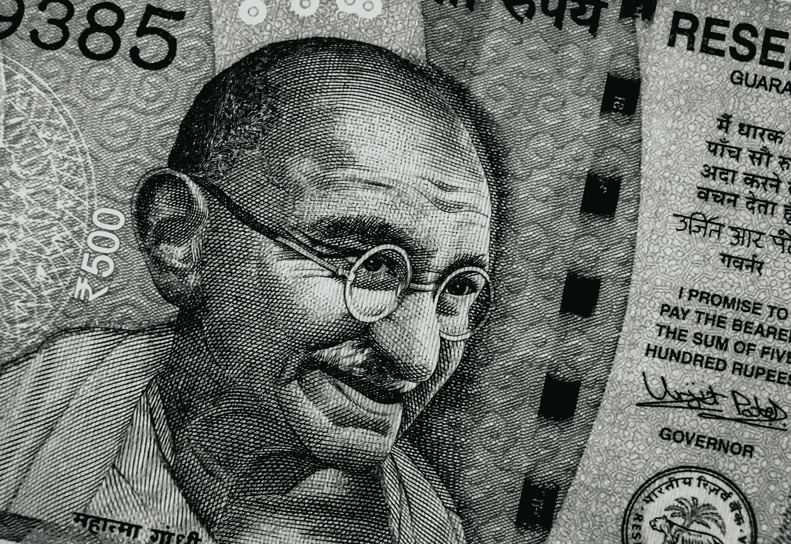

# 每周评论神秘的金钱机器组

> 原文：<https://medium.datadriveninvestor.com/weekly-review-mystical-money-machine-group-66b7c6b46a03?source=collection_archive---------40----------------------->

Image source:
Photo by [Ishant Mishra](https://unsplash.com/photos/Ha4GZKWINdw?utm_source=unsplash&utm_medium=referral&utm_content=creditCopyText) on [Unsplash](https://unsplash.com/search/photos/money-review?utm_source=unsplash&utm_medium=referral&utm_content=creditCopyText)

下面是我在脸书上创建的神秘货币机器群中的一个帖子。

在这个每周回顾中，我将回顾过去两周我自己的投资之旅和金钱内幕。

建立这个小组，把我的作品放在那里，这无疑带来了一些内心的骚动。

“这太诡异了！投资和占星，你疯了吗？人家会觉得你疯了！”

可能吧。

我不得不处理这件事。

迄今为止，没有人告诉我，我疯了。

即使他们会，这真的会改变什么吗？

大概不会。我几乎总是乐于接受建设性的批评，只要它确实是建设性的。

因为不理解某件事就说某人疯了，这是没有建设性的。

所以，这更像是精神上的性交。

此外，作为人类，我们本能地希望属于一个部落，当你被妖魔化或被集体排斥时，它会带来对生存的恐惧。

我确实感觉到，几乎每次我推出一些“不同”或挑战现状的作品时。

尤其是在同一个句子里谈论占星术和金钱。或者投资。

因此，通过做这项工作，我实际上不得不审视我对死亡的恐惧和对爱的丧失的感知。

事情发生了有趣的转变。

我不会想到，在谈论投资和占星术时，我会做一些紧张的内心工作。

这些事情怎么办？

好吧，最好的建议(但实际上更难做到)是让自己在这些恐惧中燃烧。允许你自己去感受它，体验它，然后继续前进。

钱的部分呢？

如果你看了上周的占星视频，你可能已经看到/听到我谈到了木星进入人马座。

木星是代表幸运和美好事物的行星。

通常，当一颗行星改变星座时，它会在实际转换前 2 周和转换后 2 周带来更多实质性的结果。

在这段时间里，我有意识地努力去冒更多的风险。在很大程度上，它们被证明是有利可图的。

但是木星的问题是，它也会带来更多的一厢情愿，冒更多不必要的风险。对一切都想得太多，过于乐观。

**因此，这段时期的不利之处在于承担太多风险，抱太大希望。**

我真的做到了。幸运的是，这笔钱很少。风险和回报比率还不错。我损失了一点钱。那是常有的事。

**我想说的是，一枚硬币总是有两面，甚至更多。**

我们必须从平衡的角度看待事物。尤其是用钱。

在实际搬迁或投资决策期间，我想到的另一件事是一笔相对较少的钱。我可以承受失去它。

**冒着很小的风险去赢得大胜利。**

这一次它没有像我希望的那样成功。这没关系。

如果我们想成为投资者，或者想生活在资本主义社会，我们就必须学会承担风险。我们负担得起的地方。 很重要的一件事要明白。尤其是在木星的强烈影响下。

伊恩·阿尔托萨尔

*点击* [*此处*](https://www.facebook.com/groups/532315657241148/) *加入神秘摇钱机群。一个旨在通过神秘的转折赋予人们理财能力的组织！*

*如果你对短剂量的智慧感兴趣，* [*点击*](https://twitter.com/IanAltosaar) *这里，在 Twitter 上关注我。我在那里发关于金钱、财务、生活、精神、成长和更多的微博。*