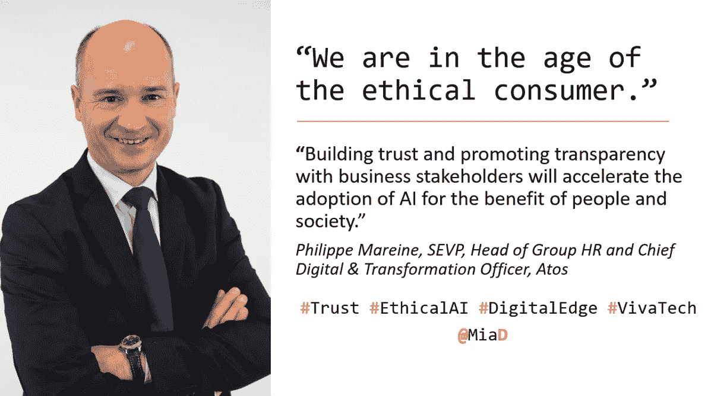
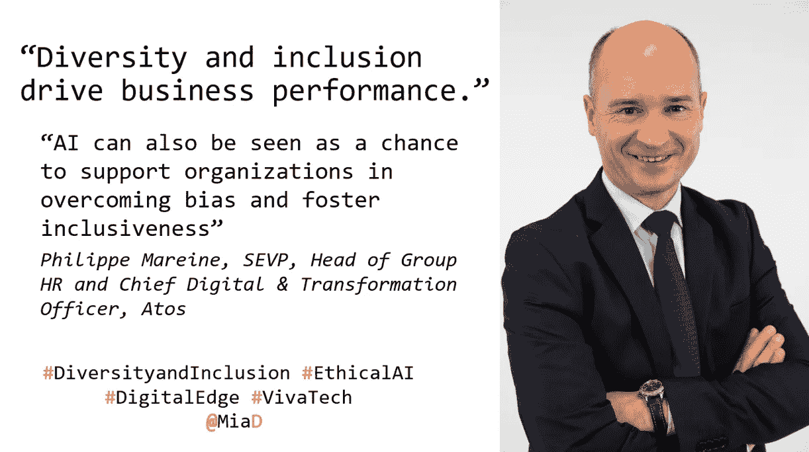

# 欢迎来到道德消费者的时代

> 原文：<https://medium.datadriveninvestor.com/welcome-to-the-age-of-the-ethical-consumer-68b735728d53?source=collection_archive---------7----------------------->

Source: Atos

在我以前的帖子中，我已经[阐述了](https://becominghuman.ai/coeforethicalai-81f6476cb282)为什么大公司为了跟上人工智能创新的步伐而采取大胆的方法来实现道德人工智能是一项战略要务。这是一系列关于企业人工智能(AI)的帖子中的第一篇，这些帖子仔细研究了全球公司目前如何将道德整合到他们的人工智能项目、流程、产品、基础设施甚至文化中。

我受邀参加了在巴黎举办的[源讯科技日](https://atos.net/en/events/atos-technology-days-2019?)，与 [VivaTech](https://vivatechnology.com/) 同在一处，这是法国创业和创新的顶级展会。我借此机会向 Atos 的集团人力资源主管兼首席数字转型官 SEVP 询问了 Philippe Mareine **关于他的公司在道德人工智能方面的做法。**

 [## 人工智能与创意:作为创意引擎的 BigGAN |数据驱动的投资者

### 的确，2018 年可以被视为人工智能创造的创造力全盛时期的开始。当然可以…

www.datadriveninvestor.com](https://www.datadriveninvestor.com/2019/02/13/ai-creativity-biggan-as-a-creative-engine/) 

Mariene 分享了 Atos 如何有意确保他们的人工智能解决方案和向客户提出的解决方案符合道德规范，并遵循 Atos 为值得信赖的人工智能制定的原则。Atos 的方法侧重于人工智能系统的透明度、可信度、包容性和公平性、问责制和安全性。

如果你的公司对采用人工智能的道德框架持观望态度，那么听从 Mareine 的建议并“去做吧”是值得的。他坚信，做正确的事情会得到回报，会赢得客户的长期信任。你可以在下面阅读更多 Mariene 的见解。

Mia Dand:伦理人工智能(对你，对 Atos)意味着什么？

**Philippe Mareine:** 道德人工智能意味着充分利用人工智能的潜力，同时确保你牢记人类的价值和需求，并负责任地运营。AI 应该总是增强人的作用。人工智能在工作场所有很大的潜力，可以将人们从更卑微的任务中解放出来，让他们探索自己的潜力。

**MD:Atos 是否制定和/或采用了任何特定的道德人工智能原则或政策？**

**PM:** 随着数字世界和现实世界越来越紧密地交织在一起，“我们能不能/应该不能”的问题变得越来越相关，定义可信人工智能的使用原则非常重要。这是我们在开发人工智能解决方案时总是会考虑的问题。这是我们的信念，也是我们如何看待我们股东刚刚投票通过的 Atos 宗旨声明:
*“[……]在世界各地，我们让我们的客户、员工和合作者以及社会成员能够在信息技术领域可持续、自信地生活、工作和发展。”*

在 Atos，我们认为我们的人工智能解决方案需要

1)透明、可信

2)增强包容性和公平性

3)负责任

4)确保安全——重点关注网络安全和隐私原则

MD:Atos 人工智能的道德框架包括什么？在 Atos，我们正在准备一项新的“设计道德”政策，该政策将成为我们运营的框架。该政策建立在现有法规的基础上，如欧盟通用数据保护法规。通过在我们的科学界提供思想领导，分享道德的人工智能最佳实践以及与我们的合作伙伴合作和接触，我们将继续推动道德。

**MD :(人工智能中的)多样性和包容性在商业成功中扮演什么角色？**

**PM:** 多元化和包容性在商业成功中发挥着关键作用。如果你向不同的人群提供服务，那么你的解决方案和服务必须反映这种多样性。这只有通过多元化的员工队伍才能实现，他们将自己的知识和想法用于设计和创造可持续的解决方案。在人工智能中，尤其重要的是不要在解决方案中建立偏见，以获得不同的观点和挑战。我们深信，多元化和包容性推动着企业绩效，当然，对成功组织的调查也证明了这一点。但人工智能也可以被视为支持组织克服偏见和促进包容性的机会，因为我们在 Atos 的全球无障碍实践中发展:例如，增强的写作平台支持性别中立的语言，并改善性别平衡的招聘。

MD:人类如何保持与(人工智能)机器的竞争力？

PM: 从我的角度来看，机器提供了互补的技能，充分增强了人类个体的内在技能，如创造力、设计和批判性思维。我们有一个积极的学习和发展计划，以便我们的员工获得适当的能力来充分利用人工智能。总会有机器做不到的事情，这些是我们培养的技能。

你对其他想在组织中采用道德人工智能的公司有什么建议？

**PM:** 动手吧！人工智能采用的道德框架将在未来带来进一步的商业成功，与商业利益相关者建立信任并促进透明度，以加速采用，造福人类和社会。想想任何商业应用对人和社会的影响。我们正处于道德消费者的时代！

就这样了。请继续关注，我将继续穿过所有的宣传和行话，为您带来企业公司如何确保人工智能在他们的组织中得到道德部署的内幕消息。给我发推特 [@MiaD](https://twitter.com/miad) 或者在下面留下评论，因为我很想听听你们的人工智能试验和磨难！

**关于作者:**

Mia Dand 是一名战略数字营销领导者和热情的技术多样性倡导者，在为谷歌、惠普、易贝、赛门铁克等全球公司构建以客户为中心的项目方面拥有丰富的经验。Mia 的独特专长是在业务、数据、治理和技术的关键交叉领域领导复杂的跨职能项目。作为 Lighthouse3 的首席执行官，lighthouse 3 是一家位于加利福尼亚州奥克兰的新兴技术研究和咨询公司，Mia 擅长识别关键的行业趋势，并指导 5000 强公司负责任地采用新的&新兴技术，如人工智能，以取得成功的业务成果。Mia 还是《人工智能伦理中的 100 位杰出女性》 *的作者，这是一份权威指南，旨在帮助全球组织招募更多有才华的女性，并在这一领域赋予更多不同的声音。你可以在*[***Twitter***](https://twitter.com/MiaD)*或者*[***LinkedIn***](https://www.linkedin.com/in/miadand/)*上和她联系。*