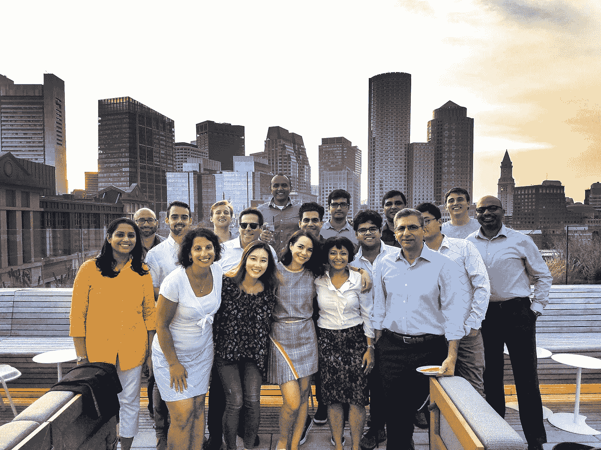

# 欢迎来到营销的未来 Glasswing 投资 Zylotech 的原因

> 原文：<https://medium.datadriveninvestor.com/welcome-to-the-future-of-marketing-why-glasswing-invested-in-zylotech-b984af7826f?source=collection_archive---------43----------------------->

The Zylotech Team

多年来，企业已经认识到数据驱动的方法可以增加客户参与度和收入。但事实证明，要实现这一点并不容易。客户数据分散在企业系统中，并由部门和不同的团队隔离。还有大量丰富的客户数据被困在第三方平台中。持续消耗所有这些数据来提供个性化的客户体验给人们带来了困境，但这是一个人工智能平台可以解决的问题-自动聚合和分析所有第一方和第三方数据，并提供可行的建议，营销人员可以随时使用这些建议来增加收入。

2017 年，Zylotech 推出了人工智能驱动的客户智能平台来实现这一目标。当我在 Zylotech 创始人 Abhi 和 Iqbal 以及他们的 rockstar 团队成立后不久见到他们时，我对他们的企业“营销大脑”的愿景印象深刻。该团队了解客户关系的未来是天生智能的，他们在客户分析、机器学习和工程方面的深厚专业知识令人印象深刻，对于 Zylotech 交付自学式客户数据平台(CDP)至关重要。

在了解 Zylotech 团队一年多并看到他们的执行力之后，今天，我很自豪地宣布 Glasswing Ventures 领导了 Zylotech 的种子投资轮。我们很高兴能够帮助该团队在他们与世界上一些最大的科技公司的早期成功的基础上，在公司和垂直行业中推广他们独特的人工智能客户智能平台的采用。

我们不再仅仅处于一个数据驱动营销的时代。从现在开始，客户关系必须是智能驱动的。Zylotech 正在让这一切成为现实，我们非常高兴能够帮助他们实现这一愿景。

要了解关于我们最新投资组合成员的更多信息，请阅读今天的公告: [Zylotech 获得 550 万美元用于加速人工智能营销、客户数据平台技术](https://www.zylotech.com/funding-announcement)

阅读 Abhi 的博客文章，点击[这里](https://www.zylotech.com/blog/zylotech-raises-5.5m-to-help-drive-the-customertech-revolution)

*最初发布于:*[*http://glass wing . VC/welcome-to-the-future-of-marketing-why-glass wing-invested-in-zylotech . html*](http://glasswing.vc/welcome-to-the-future-of-marketing-why-glasswing-invested-in-zylotech.html)