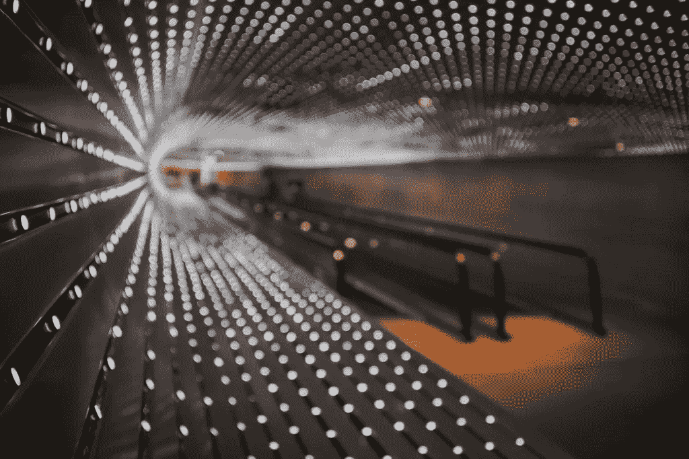

# 欢迎来到机器前，营销人员

> 原文：<https://medium.datadriveninvestor.com/welcome-to-the-machine-marketers-12fa4fb88a77?source=collection_archive---------0----------------------->

营销人员应该庆祝人工智能运动(业内称之为“AI”)。别担心。人工智能是一个被夸大的硅谷术语，在其当前的迭代中，它更多地代表了技术的自然进步——机器学习——而不是有意识生物的诞生。

在营销技术领域，人工智能试图取代许多[琐碎的营销任务](https://contentmarketinginstitute.com/2017/08/marketers-use-artificial-intelligence/)。这使得更多有创造力的头脑和战略思考者能够专注于他们热爱的工作，而不是让他们发疯的“vulcanesque”数据丰富的任务。

当然，机器学习营销的发展带来了一些警告:

1)首先，战略营销人员必须在宏观层面上理解机器学习，以及如何使用这些系统来制定战略和领导日常战术练习。
其次，一些更具战术性的营销角色将被算法机器人取代或冲击。

2)机器人执行任务的想法让人们感到害怕。但不应该。营销人员发现他们业务中一些最耗时的任务已经自动化，特别是那些围绕数据点的任务。我认识的几乎每个营销人员都抱怨不得不在 1 倍的空间里做 3 倍的工作。这大大减轻了压力。

尽管如此，不理解机器学习工具会使一个人的技能变得过时。为了保持相关性，[营销人员需要拥抱像人工智能](https://www.fullmontyshow.com/2018/07/july-23.html)这样的新技术，并看看它们如何被整合。算法和机器人是没有知觉的。他们需要指导来成功地与人类互动。

# 受机器学习影响的 5 种营销功能

有没有注意到科技行业是如何将人工智能定位为效率的英雄救世主的？然而大多数人害怕它。

以下是我认为未来三年最有可能受到机器学习影响的五个营销职能:

# 1)社区管理

无法扩展对社交媒体造成了最大的冲击。在互联网上部署团队来回复、参与和建立各种社交网络上的社区仍然是只有最大的品牌才有的奢侈。通过 Hootsuite 和 Buffer 的自动化的进一步早期迭代收到了来自对话纯粹主义者的低分，他们发现这些产品不人道且没有吸引力。

像 Instagram 的 [Social Drift](https://socialdrift.com/) 这样的当前迭代使竞技场变得平坦。新的机器人和算法让社区管理者参与到真正的对话中，同时将关注、喜欢和不关注这些平凡的任务搁置一旁。此外，这些新机器人在识别和锁定影响者方面发挥了关键作用，减少了研究时间。

社区管理者应该会发现他们的任务更有趣，更少疯狂。如果他们采用最新的工具，他们将有许多工具使他们的工作更加富有成效和成功。未能适应的社区经理可能会发现自己因绩效而半途而废。

# 2)内容营销

内容营销人员将大大受益于机器学习。从寻找有竞争力的内容和相关源材料到优化信息和交付偏好，算法程序将极大地帮助研究和内容创作。

Scoop.it 是一个具有互联网搜索能力的内容研究示例。虽然非常有用，但 Scoop.it 结果需要大量的除草工作。这在机器学习应用中很常见。早期的结果不是很好。越好的机器人，其算法会根据人类输入进行优化。

在短期内，人工智能不太可能取代内容营销人员，只是让他们变得更好、更高效。然而，像社区经理一样，内容营销人员必须保持最新的机器学习工具，以便在工作中保持相关性和功能性。

# 3)客户服务

**客服机器人会让联系公司的体验更好还是更差？**

从聊天机器人和智能服务台寻找解决方案到实际的人工智能机器人接听电话，当然还有 Alexa、Cortana、谷歌和支持 Siri 的应用程序。是的，将会需要真正的现场声音，但只是针对最困难的问题。

你知道公司可以[将亚马逊 Alexa 集成到他们的应用](https://www.wired.com/story/inside-amazon-alexa-prize/)中来回答问题和帮助你吗？

不幸的是，这是机器学习会造成大量失业的领域之一，特别是在呼叫中心。预计在未来三年内，客户服务成本和工作岗位将大幅减少。

# 4)数据分析师

数据分析师，也就是梳理报告以发现有预见性的数据点，然后为管理层提供报告的人，可能会在不久的将来看到他们的任务自动化。越来越多的报告将由算法提供，当这些算法被引导和定制到一个独特的业务时，将消除许多每周的仪表板测试。

强大的机器学习也将在人类之前识别出紧急趋势。Lead scoring system [Infer](http://www.ignitetech.com/solutions/marketing/infer) 提供了一个卓越数据分析的绝佳例子，它在大多数营销自动化系统使用的人工引导线索评分算法之前就识别出了 SQL 机会。

仍然需要引导机器学习来获取正确的质量数据点，并确保算法继续发展，以满足客户和商业模式的变化。越大的企业需要越多的战略数据科学家。

在小型企业中，营销主管需要更深入地了解数据科学，以保持相关性和功能性。本质上，需要有人指导并确保数据分析机器人是正确的，并至少提供有用的预测信息。

# 5)数字广告

数字广告正在成为机器人的游戏。这并不奇怪，因为这就是钱的所在。谷歌凭借其日益复杂的基于机器学习的[谷歌广告解决方案](https://www.blog.google/outreach-initiatives/small-business/google-ads-helping-businesses/)引领人工智能广告市场，该解决方案交叉传播多渠道以接触客户，甚至是在他们的智能手机上。

随着基于机器学习的广告平台与自动化系统和 CRM 数据库相结合，营销人员与这些系统的互动将越来越多地围绕管理进行。广告机器人将接受输入的支出、目标受众和初始创意，然后提供机器学习建议。剑桥分析丑闻证明，这里非常需要道德规范。

在许多方面，数字广告经理将简单地批准或纠正这些建议，然后根据需要分配资源来实现它们。在短期内，数字广告公司可以通过掌握最新的机器人和算法在客户中占据优势。

这些只是人工智能在未来几年将影响的几个营销角色。现在有一个机器人可以帮助几乎所有可用的营销功能。

但是，担心工作或角色替换是解决这个问题的最好方法吗？或者我们应该一头扎进去，拥抱提供给我们的工具？

[最初发表于我的营销博客](https://livingstoncampaigns.com/2018/07/10/welcome-to-the-machine/)。