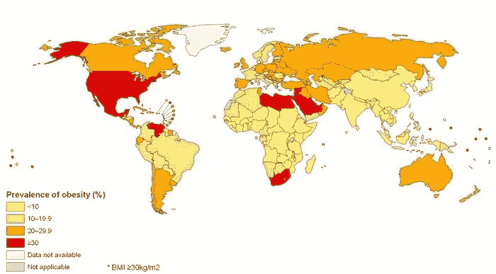
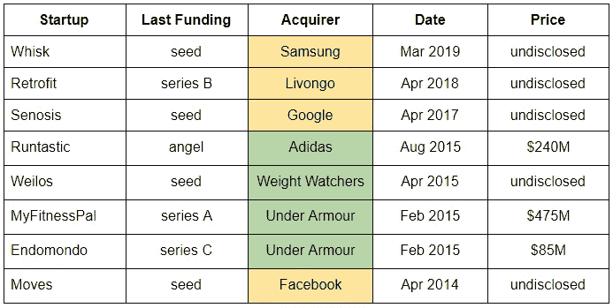
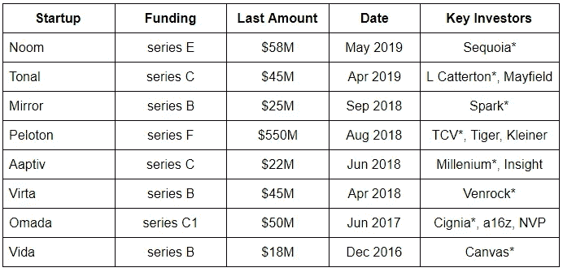

# 健康创业——牛市

> 原文：<https://medium.datadriveninvestor.com/wellness-startups-a-bull-market-4d717e331dff?source=collection_archive---------4----------------------->

全球肥胖状况并不乐观——不久前，肥胖还是繁荣的象征，现在却困扰着越来越多的新兴国家:

肥胖与许多常见疾病并存，从糖尿病到心脏病。根据美国医学协会 2013 年的命名，这是一种正式的疾病。这个问题确实是全球性的，在日本(如 FiNC)和印度(如 HealthifyMe)等不同国家出现了本地解决方案。本文将关注西方初创公司在这一领域的两个宏观趋势。

 [## 风险投资家在给创业公司播种时会考虑什么标准？-数据驱动型投资者

### 2017 年，风险投资资金攀升至十年来的最高水平。你的创业公司目前吸引风险投资的机会是…

www.datadriveninvestor.com](https://www.datadriveninvestor.com/2018/04/20/what-criteria-do-venture-capitalists-consider-when-seeding-a-startup/) 

**1)收购——双峰分布**

下表总结了这一领域引人注目的收购，黄色部分表示四家软件公司的收购，绿色部分表示四家传统公司的收购:

数据显示两个主要模式支持真正的双峰 M&A 分布。

第一，软件公司还没有披露价格，但使用最后一笔资金作为代理，可以肯定地说它们是较小的收购。这是有道理的，因为软件公司正在寻求建立自己的产品并尽早收购，而传统公司正在购买完全成熟的产品来扩大他们的数字产品组合。

第二，传统玩家在 2015 年的 6 个月内非常活跃，这可能是由 FOMO 推动的。显然，可能会出现复苏，但目前主要是大型科技公司在这个领域提供流动性。

**2)基金——期望的游戏**

下表显示了过去几年的部分筹资活动(*表示最新一轮的领先情况):

数据还显示，围绕这些加薪背后的预期，存在两种主要模式。

第一，这些公司正朝着大规模退出的方向发展。例如，MyFitnessPal (MFP)在 2013 年进行了一轮融资，两年后以 4.75 亿美元的价格被收购，在此之前，该公司依靠自身发展，有机增长了 8 年。对于这一批新的创业公司来说，仅他们的最后一轮融资就比 MFP 筹集的 1800 万美元融资总额大得多。你可能会部分地认为，MFP 2013 年的加薪是一个不同的时期，但这是一个巨大的差异，不能仅靠时机来证明。

第二，这几轮融资由顶级基金牵头——Canvas 和 Venrock 的融资额不到 5 亿美元，所有其他融资额都是 1B+。大多数已经存在 30 多年了。事实上，正是大基金在大量小投资者身上加倍下注，因为市场认为这有很大的资金优势。鉴于健康(没有双关语)的融资引擎，难怪新的创业公司正在出现，从 Enara(以医学为重点的减肥)到 Naked Labs(你身体的 3D 地图)。

这些是专注于实践见解的短文(我称之为 GL；dr —良好的长度；确实读过)。如果它们能让人们对某个话题产生足够的兴趣，从而进行更深入的探索，我会感到非常兴奋。这里表达的所有观点都是我自己的。如果这篇文章有对你有用的见解，请给个赞，任何想法请留言。