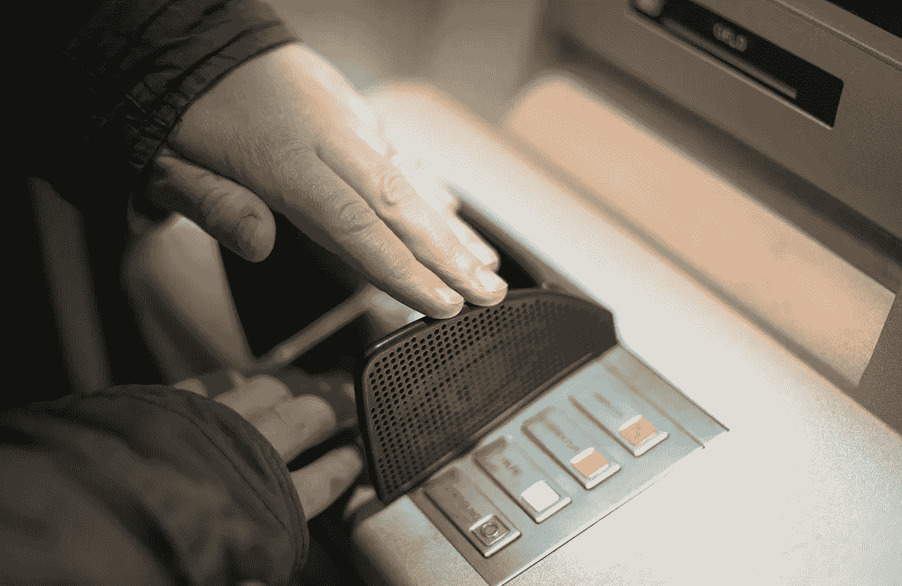
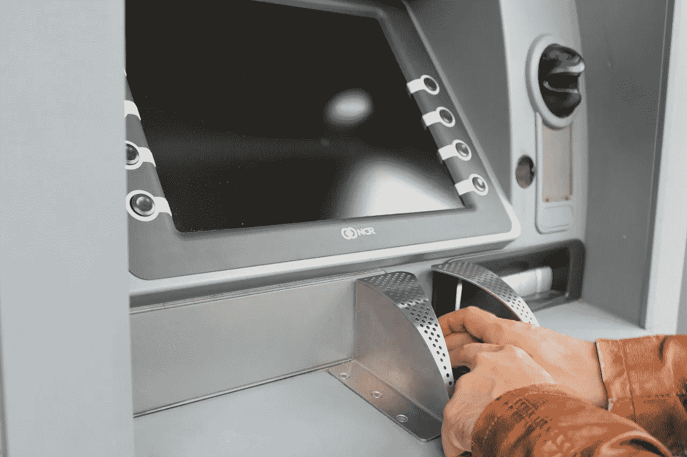

# 富国银行正在积累大量现金

> 原文：<https://medium.datadriveninvestor.com/wells-fargo-is-accumulating-lots-of-cash-6298ac57a966?source=collection_archive---------5----------------------->

富国银行积累了大量现金。事实上，**富国银行(纽约证券交易所代码:WFC)** 积累现金的能力解释了沃伦·巴菲特对这家巨型银行的信心。

例如，富国银行在 2018 年 12 月 31 日拥有 1732.87 亿美元的现金和等价物。此外，截至 2018 年 12 月 31 日，富国银行的运营现金流为 150.34 亿美元，融资现金流为 169.75 亿美元，自由现金流为 150.34 亿美元。

因此，**富国银行(纽约证券交易所代码:WFC)** 就是伯克希尔**哈撒韦公司(纽约证券交易所代码:BRK。B)** 第五大持股。事实上**伯克希尔哈撒韦公司(纽约证券交易所代码:BRK。B)** 拥有富国银行 9.8%的股份，价值 12.63 亿美元，根据巴菲特 2018 年[股东信](http://www.berkshirehathaway.com/letters/2018ltr.pdf)。此外，这些股票为伯克希尔·哈撒韦公司带来了 8.09 亿美元的股息。

 [## 股票市场投资的机器学习——数据驱动的投资者

### 当你的一个朋友在脸书上传你的新海滩照，平台建议给你的脸加上标签，这是…

www.datadriveninvestor.com](https://www.datadriveninvestor.com/2019/01/30/machine-learning-for-stock-market-investing/) 

# **富国银行积累了大量现金，所以沃伦·巴菲特买下了它**

巴菲特继续持有这家大银行的股份，因为富国银行正在积累大量现金。事实上，尽管富国银行存在许多问题，但现金正是巴菲特拥有它的原因。

例如，富国银行 2018 年第四季度的毛利为 204.59 亿美元，尽管收入增长率为负 4.3%。值得注意的是，第四季度 WFC 的毛利和收入都有所下降。

具体而言，富国银行报告 2018 年第三季度收入为 213.61 亿美元，毛利为 213.61 亿美元。然而，这两个数字在 2018 年第四季度都降至 204.59 亿美元。

# **富国银行在一个不景气的季度积累了大量现金**

因此，富国银行即使在一个糟糕的季度也能获得大量现金。因此，富国银行显然是你的白痴侄子可以经营的公司之一。

“如果你有足够好的生意，如果你有一份垄断报纸，如果你有一个网络电视台——我说的是过去——你知道，你的白痴侄子可以经营它，”沃伦·巴菲特在 2010 年 5 月说。

值得注意的是，巴菲特向金融危机调查委员会(FCIC)发表了上述评论，商业内幕 [报道](https://www.businessinsider.com/warren-buffett-good-business-could-be-run-by-idiot-2016-3) s。重要的是，FCIC 正在调查 2008 年经济大崩溃的原因。

# **富国银行有一种垄断**

富国银行符合白痴侄子标准，因为它在某些领域几乎垄断了某些类型的银行业务。据 CNN 财经[估计](https://money.cnn.com/2018/01/12/investing/wells-fargo-shutting-branches/index.html)，尽管富国银行计划到 2020 年关闭 800 家分支机构，但其在美国运营着超过 5000 家分支机构。此外，富国银行在[运营着 13000 台](https://newsroom.wf.com/press-release/innovation-and-technology/wells-fargo-launches-13000-card-free-atms-its-20-million)无卡自动取款机(ATM)。

在这种情况下，富国银行是许多地区唯一能获得现金的地方。例如，富国银行运营着唯一的无卡 ATMS，允许人们在某些地方使用[近场通信](https://marketmadhouse.com/big-payment-app-battle-nfc-vs-qr-code/) (NFC)应用程序如 Apple Pay 和 Google Pay 来获取现金。

因此，许多人有强烈的动机开立或保留富国银行账户。例如，富国银行的自动取款机是一些社区唯一可以存放支票的地方。特别是，其他银行缺乏资源来匹配富国银行的足迹和 ATM 网络。

# **富国银行遇上巴菲特的傻逼侄子测试**

巴菲特认为，好的企业是即使由白痴来经营也能赚很多钱的企业。最近几年的新闻表明富国银行符合沃伦叔叔的标准。

例如，2018 年 8 月，富国银行支付了 20.9 亿美元的罚款，因为该银行根据高管知道的不正确信息发放了抵押贷款。所以富国银行高管表现的很傻逼但是公司赚钱了。

此外，20.9 亿美元的罚款还不到富国银行手头现金的 1.5%。据美国有线电视新闻网(CNN)报道，罚款为 20.9 亿美元，但富国银行在 2018 年 12 月 31 日手头上有 1732.87 亿美元的现金。因此，富国银行可以支付数十笔此类罚款，同时仍能支付可观的股息。

在这种情况下，富国银行的规模使其成为一项价值投资。为了解释这一点，规模保护了这家庞然大物银行，使其免受某些员工贪婪和无能的影响。实际上，富国银行的各种业务产生了足够的资金来弥补骗子或笨拙者造成的任何损失。

# **富国银行正在积累大量现金，因此它是一只很好的分红股票**

此外，**富国银行(纽约证券交易所:WFC)** 是一只出色的股息股票，于 2019 年 3 月 1 日支付 45 英镑。

令人印象深刻的是，尽管丑闻不断，Dividend.com 仍将连续 7 年的股息增长归功于富国银行。具体来说，富国银行的股息从 2018 年 6 月的 39 增长到 2018 年 7 月的 43，再到 2019 年 3 月的 45。因此，富国银行的股息一年增长了 5。

在这些条件下，富国银行股东在 2019 年 3 月 14 日获得的股息收益率为 3.16%，年化派息为 1.80 美元，派息率为 39.6%。因此，我认为富国银行在那一天每股 49.92 美元是很便宜的。

富国银行很便宜，因为它是巴菲特最喜欢的股票，股息高，但每股售价不到 50 美元。最后，富国银行可以给你上一课。

教训是赚钱的公司管理糟糕。因此，关于赚钱公司的坏消息可以通过降低其股价来帮助你。

最终，富国银行证明了沃伦巴菲特的白痴侄子可以帮你赚很多钱，如果你明白他是如何工作的。