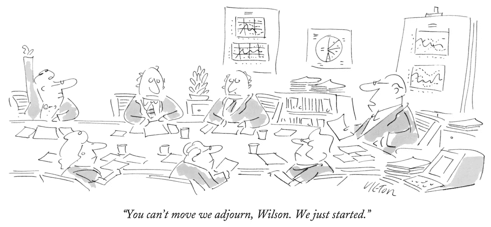

# 我们只是在聊天

> 原文：<https://medium.datadriveninvestor.com/were-just-talking-bcc7d292c840?source=collection_archive---------10----------------------->

**同。。。弗雷德·摩尔！**

与顶级董事会董事的对话

弗雷德·莫尔博士是外科机器人之父。他(加上 Jay Watkins 和 Al Chin 博士)创建了三家公共机器人公司，还共同创建了 Origin MedSystems(我是首席执行官)和 Gynecare，最近他为一家令人兴奋的新设备公司 [Auris Health，Inc.](https://www.aurishealth.com/) 筹集了创纪录的资金，他是该公司的创始人、首席执行官和董事长。弗雷德是一名创新者、企业家和经验丰富的董事会成员，我最近和他谈到了董事会治理。

*乔:弗莱德，你是医疗设备领域的偶像，尤其是机器人技术。你一直是一个才华横溢的梦想家，但你的董事会风格显然已经发生了变化。你能谈谈吗？*

弗雷德:我认为作为董事会成员，我的能力有限且专注。乔，你很了解我，知道说我不是这个星球上最有组织性和最受流程驱动的人是一种保守的说法。我认为我尝试创新和做新的事情可能与我成为一名优秀董事会成员的能力直接冲突。这是擅长某事的阴阳部分。如果你有创造力，你通常不会被结构化，我知道我更有创造力。

在我这个年龄，我想我已经接受了这些优点和缺点。

有充分的理由，对过程的关注是董事会会议的特征。从这个角度来说，我不是一个能做好审计委员会主席工作的人。那些能够吸收、记笔记，然后有条不紊地复述董事会议上发生的事情，包括结论和行动项目的人给我留下了深刻的印象。虽然这不是我，但我确实在努力倾听，以了解公司在哪里，它在挣扎什么，以及管理层正在做什么可能会妨碍移动价值创造针。换句话说，我在模式识别上的价值主要集中在产品上。

乔:你太谦虚了。你不仅仅是创新，弗雷德！你所做的事情已经超越了地心引力。我的意思是，你一起去找医生说，“我想让你买一个价值百万美元的机器人，而不是用手术刀来做手术。而且，我们将帮助您找到最佳的使用方式。”他们倾听，你帮助他们。这是外科手术全新方法的开端。太不可思议了！

*但是回到董事会议。。。我喜欢你在几次董事会上提出的关于创新不同阶段的观点。你能提醒我你给你的董事会看过几次的那张幻灯片的细节吗？我发现这是一个非常优雅的方式来帮助教育董事会面对眼前的挑战，重新想象手术。*

弗雷德:当然。大约十年前我就想出了这些阶段。根据我的经验——这是我展示的幻灯片——这些是创新的阶段:

极度恐惧–“你疯了吗？”

**迅速谴责**—“这不仅是个坏主意，而且很危险！”

**勉强接受**——“申请可能有限。”

**响亮的背书**——“其实我十年前就提出来了。”

乔:我喜欢！这与董事会及其角色有什么关系？

弗雷德:这是关于识别创新世界中发生的一种模式。作为一家创新公司的董事会成员，你必须具备模式识别能力。你必须看透新产品开发的各个阶段，并问自己:“什么是最重要的？这些企业家真的专注于公司重要的、创造价值的活动吗？如果是这样，我们如何帮助他们做更多的事情？”

乔:你的风格是从早期发展而来的。你早期是个叛逆者，但现在你欣赏某种程度的过程。能详细说说吗？

弗雷德:你完全正确。当我回想起我的早期，我都是关于产品，产品，产品。我的观点是，*没有合适的产品，你不会成功，其他的也会随之而来。*随后，我在产品发挥作用而组织却没有发挥作用的领域遇到了困难。

幸运的是，我和非常好的通情达理的人一起工作过。以[直觉](https://www.intuitive.com/)为例，在那里，拥有强大智力的人围坐在董事会会议桌旁，旁边是非常优秀的、以过程为导向的人。Auris 是一次成长经历，尽管我更欣赏过程，但我们现在面临着创造文化的挑战。不管你喜不喜欢，我必须在这方面带头——如果你不建立文化，没人会为你做。

我过去没有关注过文化。当我年轻的时候，我总是对“海外文化”嗤之以鼻，因为我认为它们是对时间的巨大浪费，但文化实际上是让产品制造业务持续下去的东西。在奥瑞斯，我意识到发展你想要的文化是多么的具有挑战性，因为文化总是会发生；如果你不这样做，它就会在你周围成长。

乔:没错！

弗雷德:在我职业生涯的早期，我让文化有机地成长，这并不好。我不喜欢对抗，但如果你不喜欢正在发生的事情，尤其是人们行为的微妙之处，你就不能回家希望他们会改变。你必须解决并解决它。

Joe:文化发展是董事会职责的一部分吗？

弗雷德:是的，我想是的。奥瑞斯董事会文化呈现了一个我以前没有经历过的有趣的情况。我们有两位年轻、精力充沛的投资者/董事会成员，他们在职业生涯早期就成为了非常成功的软件投资者。他们给董事会带来了科技投资者的心态，他们认为发展科技文化很重要；他们鼓励它。也就是说，他们以前没有投资过医疗设备公司，他们的技术观点也不总是和我所习惯的一致。关于我们属于哪个类别(技术还是医疗设备)的不同观点对董事会层面的文化和决策过程产生了影响。

乔:嗯，这是个有趣的挑战。你是怎么管理的？

弗雷德:董事会动态一直是一项进行中的工作，但我花时间教育他们，设备公司的文化与他们取得如此巨大成功的科技公司有什么不同。当他们说“为什么医疗设备一定是这样？”时，我试着接受他们的想法和挑战“当然，医疗器械行业很长一段时间以来都是这样运作的，但为什么你不能像 SaaS 模式一样经营器械业务呢？”他们提出了具有挑战性的想法，其中一些被证明是对医疗器械公司所走的传统道路的非常有益的挑战。

*乔:你是在董事会会议上，还是在董事会会议室之外与董事会成员进行一对一会谈时，开展董事会文化发展工作？*

弗雷德:乔，你教过我，你不能走进董事会会议室，对董事们说“好吧，你们认为怎么样？”你要确保在铃响之前知道他们要说什么。不过，所有的板子都不一样。我所在的一个董事会的主席在他工作的第一周说，“我只想从董事会成员那里知道两件事:谁管理公司，谁拥有公司？如果他们不谈论这些事情，我不想听他们说。”这就是他管理董事会的方式。

*乔:就这一点而言，在风险投资支持的公司中，创始人是首席执行官、董事长和大股东，她或他有时会试图发号施令。这些公司包括 Theranos、Snap、特斯拉、脸书等。你的董事会和那些公司有什么区别？*

弗雷德:我曾与那些绝对要求以某种方式做事的人共事过。如果你处于像伊丽莎白·霍姆斯在 Theranos 那样的权力位置，而你有一个无所事事的董事会，那么你就可以逃脱惩罚。也就是说，这种动态似乎更多地发生在科技投资领域，而不是其他领域。知名度高的企业家可以发展名人地位，伊丽莎白·霍姆斯和埃隆·马斯克以及其他偶像就是这样做的。他们失去了焦点，他们各自的董事会让他们侥幸逃脱

我可能与众不同，因为我很少对抗。我认为打架是浪费时间。

Joe:你认为医疗设备公司和软件公司的董事会在运营方式上有什么不同吗？

弗雷德:在医药公司，自然的制衡有助于董事会不被误导。我知道有几家机器人公司多年来一直在讲毫无意义的故事。他们侥幸逃脱，直到食品和药物管理局介入，明白他们没有任何意义，并阻止了他们。这些案例是董事会治理的失败。董事会让事情发展到这一步是失败的。

*乔:有了 Theranos，公司赚了一大笔钱。我认为董事会中没有业内人士的代表。董事会成员不了解这个行业，这是一个悲剧。你对董事会组成的描述听起来主要是财务人员，但你对设备行业有着非凡的感觉。是否有其他制衡措施，以相关理事会专业知识的形式存在？*

弗雷德:可能还不够。Bijan Salehizadeh 是一名独立的董事会成员，他是我们的制衡力量。他曾经在 Highland(资本合伙人)工作，在成为风险投资人之前，他在美敦力工作。他已经在设备投资领域工作了一段时间，了解设备行业，并且是一名医生。当技术投资者问“你为什么不能这样做？”时，他是裁判他已经看到了足够多的设备上涨、下跌和横盘，如果投资者说一些类似于“尽可能提高估值”的话，他会愿意说，“这未必是一个好主意，原因如下。”

思考我们董事会的方式是，我们有几个人努力推动医疗保健设备业务的创新，这是我以前从未真正经历过的动态。过去，我有过更传统的风险投资者，我们遵循的衡量标准是这样的，“需要多少才能得到一个原型？我们第一次向 FDA 提交申请需要多少钱？什么样的市场策略将与多少销售人员一起工作”等等。我董事会中的年轻、同样成功的风险投资者没有经历过这种情况，这意味着他们会问一些看似离谱的问题，让我不得不说，“嗯，有些事情很疯狂，但有些事情是关于突破界限的，这很好。”Bijan 和会议桌上的其他人经常对此进行权衡，包括前参议员 Bob Kerrey，他对美国医疗保健的发展方向提出了一个非常宏观的观点。

*乔:真有趣。你是否有过你认为非常优秀的董事会成员，而另一方面，你认为非常糟糕的董事会成员？*

弗雷德:我曾经坐在一块动力完全错误的板上。主要投资者个性很强。她有时对，有时错，从不怀疑。她没完没了地谈论一些不重要的话题。我们还有一位投资者董事会成员，他出现了，并试图做好工作，但没有时间集中精力。我们有一个傲慢的企业家，就像“如果这不是我的主意，那它可能一点也不好。”此外，我们有一个强大的创始人和发明家，他是首席执行官，但不善于倾听。哦，我们还有一个分心的公司法律顾问委员会成员。

首席执行官通常会在董事会上说，“这就是我们正在做的事情。这是我希望你们作为董事会要做的事情，除了我规划的筹资途径，别无选择。”

后来，这位创始人兼工程师，他并没有全职在那里工作，走进来说，“除了我所设计的产品开发和设计之外，别无选择。”

董事会议不涉及互动解决问题。它们是单方面的更新。我没有能力影响结果。这是浪费时间，我不干了。

乔:举一个你坐过的好的*董事会的例子怎么样？*

弗瑞德:[反射](https://www.reflexion.com/)董事会是一群投资者/董事会成员和管理团队完全同步的好例子。他们知道，我们对与新业务相关的挑战讨论得越多，我们成功的机会就越大。两位年轻的联合创始人萨姆·马津和阿克谢·南杜里发明了这一产品。他们绝对地、积极地致力于事业，他们足够聪明地把自我放在那扇门后。他们说，“我们真的不了解商业。我们知道这项技术，但我们会挨家挨户去做正确的事情。你会帮助我们吗？”

例如，他们请求由具有行业经验的资深投资者组成的董事会帮助招聘合适的首席执行官。他们还要求了解其他人失败的地方和原因。他们让自己在董事会中得到令人印象深刻的指导。

乔:太好了。有没有哪个董事会会议是你参加过的最好的会议之一，或者是最差的？

弗雷德:我觉得最没有成效的董事会会议是管理层在会议开始时宣布坏消息的会议。例如，当我们错过了 Auris 的产品开发里程碑时，我们不得不进来告诉新投资者，我们告诉他们的产品开发时间表不再准确。乔，我早些时候说过“没有惊喜”，这是你教我的。好吧。。。在这种情况下，尽管我们认为我们已经传达了坏消息，但董事会成员直到董事会会议的早上才完全消化或理解这个坏消息。突然间，我们的最新投资者明白了他们刚刚投资并为之兴奋的公司——特别是在获取与产品开发里程碑相关的价值方面——将会以不同于他们所模拟的方式增长。

他们很生气。因为这个消息在董事会前没有完全传达，董事会变得没有结果。会议中的争论变成了，“这怎么可能发生？”由此产生的争论影响了新形成的关系。这充分提醒了我，在你出席董事会会议之前，你真的必须进行艰难的对话。董事会会议不是传递没有经过充分沟通和审查的坏信息的地方，那会让董事会大吃一惊。

*乔:有正面的故事吗？*

弗雷德:是的。作为背景，让我假设，认为一个董事会成员能够在任何细节层次上理解新产品开发工作是怎么回事是危险的。任何首席执行官都在努力(或应该努力)应对与深入了解董事会成员可能不理解的细节相关的挑战。但是，我认为董事会会议是管理层的一个重大决策，在董事会层面建立了信心，我们在董事会会议之前传达了我们正在改变产品战略的消息，这一改变将对实现我们的产品目标所需的资本数额产生重大影响。考虑到董事会成员对我们为什么需要做出改变没有深入的内部了解，我担心我们不能也不会以一种对董事会成员有意义的方式沟通细节。我觉得他们理解的唯一方式是从客户口中听到基本原理。

所以，我请来了一位社区医院的外科医生，他从未和我们一起开发过产品，也没有和我们合作过，他是我们的潜在客户。他解释了肺癌的诊断和治疗，没有特别的议程或偏见，但非常有效。作为一个完全客观但感兴趣的当事人，他走进来说，“事情就是这样，从你的角度来看，这是最符合逻辑的途径。”他提供了董事会成员永远无法获得的视角。他消除了人们的疑虑，他们可能会想，“管理层为了证明他们所做的事情是正当的，会以他们想的任何方式来歪曲这件事，”

事实证明，他的“演讲嘉宾”角色非常有用，让我们重新思考产品需要做什么的工作变得更加容易。

乔:这是一个很有说服力的故事，弗雷德。换个话题，你相信董事长和 CEO 的结合或分离吗？这对你上面描述的有帮助吗？

弗雷德:在 Auris，我是董事长兼首席执行官，在我们的情况下，我认为这不是一个不健康的组合。然而，我确实知道不健康的董事长兼首席执行官的情况。我所在的一家公司的董事长不是首席执行官，但他把董事长的角色带到了一个不该去的地方。他想主持会议并制定议程，这很好，但随后他试图通过过多地参与管理活动来超越董事长应该做的事情。底线是，我认为如果你要有一个主席(而不是首席董事)，我认为你应该有一个主席，我认为如果你是一个有一定规模的公司，主席的角色应该与首席执行官的角色分开。

重要的是，董事会需要明确董事长的角色是什么，不是什么。如果你读到一位董事长可能会做什么，这个角色就足够模糊了，所以重要的是往下一层说，“这是你将要做的，这是你不应该越过的那种明线。”否则，角色和职责会变得非常混乱。

*乔:你有导师吗？在董事会会议和治理方面，给你的最好建议是什么？*

弗雷德:作为董事会导师，我会感谢你给我的建议。你说，“不要给任何人惊喜，并且事先协商好一切。”

朗尼·史密斯(直觉外科公司的联合创始人兼董事长)告诉我，你必须对人严格要求，严格管理。在直觉公司，拉塞尔·赫希、约翰·弗罗因德和我是董事会成员。我们都有不同的意见，朗尼非常有效地说，“我明白你的意思，但我们不会再谈论这个了。”在某些方面，他做得有些过火，但他也以铁腕手段有效地管理董事会。他把握住了董事会成员知道的和不知道的界限。他没有要求董事会成员对他们不知道的内部事务发表意见，因为那很危险。他知道会有太多的观点而不是事实，事情会变得混乱。从这个意义上说，他是我的董事会导师。

乔:如果你能给一位创始人兼首席执行官提一条建议，他是一家拥有他人资金的高增长公司的董事会成员或董事长，你会提什么建议？

弗雷德:睁大眼睛，不要自大。如果你不不断地质疑你在做什么，你为什么要这么做，你是否在以最有效的方式创造价值，以及你自己对你的商业模式和产品的信念，你将会慢慢失去你如何取胜的远见。对我来说，最重要的事情是始终对产品、流程、模式和人员的改进持开放态度。

这是一个。另一条建议是，试着抛开你对别人能提供什么的先入为主的观念。我一直对那些没有“合适的”背景，或者年龄不合适，或者没有“合适的”经验的人感到惊讶。如果你努力不从某个特定的角度去看和你一起工作的人，比如，“他们不可能擅长那个，因为他们没有任何经验，或者他们不够老，或者他们不是这个，那个，或者其他什么，”那么你就可以在你意想不到的地方发现令人惊讶的天赋。真正尝试去理解一个人——不要对他们应该擅长什么和他们真正擅长什么有偏见——并尝试残酷地诚实对待自己对这个人的看法，这很重要。

*乔:那这个 CEO 变名人的神话呢？如果董事会可以做一件事来防止这种情况发生，它应该怎么做？*

弗雷德:改变一个人要对公司的这么大部分负责的观念。正所谓“权力腐败；绝对的权力绝对的腐败。”我可能很天真，但我对联合首席执行官的想法很着迷。我不知道这实际上是否有意义，但我确实认为注意不要太强调头衔是个好主意。围绕头衔的创新可以推动组织行为向不同的方向发展。我认为唯一的梦想家，史蒂夫·乔布斯的想法是有害的，也是有益的。这可能是有帮助的，因为人们想要尊敬一个人并说，“我可能不知道所有的事情，但我猜她或他知道，”你需要一些这样的话。但我认为，对首席执行官的英雄崇拜走得太远是危险的。

我们已经讨论了强调一个形象和一种文化的例子——ther anos 是一个完美的例子。那是一条危险的道路。

*乔:弗莱德，你给了我一些很棒的教训，可以提供给读者。谢谢大家！*

弗雷德是一个谦虚、有远见的领导者。我很高兴他花时间与我交谈，并向我(和你)提供了他对高增长风险投资公司治理经验的想法。

这里有一个链接，链接到我们采访的[部分。(在网站上，点击左上方的箭头，并享受！)](https://clyp.it/rpy4kx5s)

最后，这是 Fred 服务过的董事会的部分列表。

****—**经导管二尖瓣置换术。弗雷德是主席。**

**[**汉森医疗**](http://hansenmedical.com/us/en/why-robotics) —用于微创心脏护理的医疗机器人。弗雷德是联合创始人、首席执行官和董事长。**

****—公开上市的达芬奇腹腔镜手术系统制造商。弗雷德是联合创始人、董事长兼首席执行官。****

****[**MAKO Surgical**](https://www.stryker.com/us/en/portfolios/orthopaedics/joint-replacement/mako-robotic-arm-assisted-surgery.html)——关节置换的机器人手术；2013 年被 Stryker 收购。弗雷德是董事会成员。****

****[**MIVI 神经科学**](https://www.mivineuro.com/) **—** 神经介入手术的临床解决方案。弗雷德是董事会成员。****

******——肿瘤治疗的生物导向放射治疗。弗雷德是董事会成员。******

******[**冲击波医疗**](http://shockwavemedical.com/) —心血管介入治疗设备。弗雷德是董事会成员，而且******

****[**修复机器人**](http://www.restorationrobotics.com)——公开交易的植发手术机器人。弗雷德是联合创始人兼董事长。****