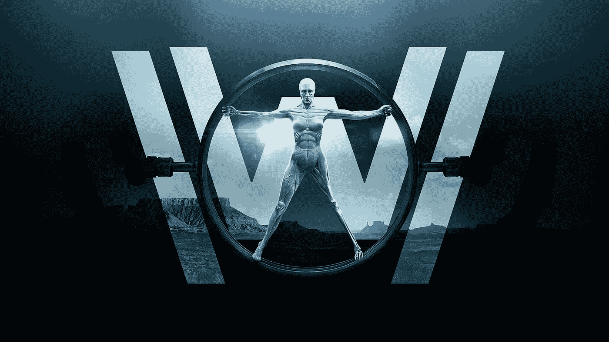

# 西部世界&人类思维

> 原文：<https://medium.datadriveninvestor.com/westworld-the-human-mind-54809dfe0730?source=collection_archive---------2----------------------->

这是一位计算机科学毕业生对《西部世界》系列的看法。有没有想过机器通过[图灵测试](https://uxdesign.cc/no-google-duplex-didnt-pass-the-turing-test-93f7235e6c40)？呈现给你一个世界，机器(主机)为需要它们的人类服务一个虚拟世界，并最终进化来接管它们。这不仅仅是一个人工智能接管的故事，而是从人类的角度来看一场永恒的灾难。当我疯狂观看这个系列的时候，大量关于计算机科学的参考文献纠缠在一起。虽然我不得不做一些阅读来理解一些行为背后的心理，但这里有一些方面我真的觉得有趣和耐人寻味。

## 认知失调

当一个人同时经历两种相互矛盾的信念时，感受到压力的状态。随着季节的变化，它会被悄悄提及很多次。认知失调有几种类型。,

*   和谐——相似的信念
*   不和谐——矛盾的信念
*   不相关——不相关的信念

我们人类在现实世界的不同情境中会表现出以下行为之一。比如说。当律师不得不为他认为有罪的委托人辩护时，他可能会感到认知失调。这既违背了他必须提供虚假陈述的事实，也违背了他作为一个诚实人的核心价值观。

人们是如何克服的？人们有很多种方法克服这一点，有些是。,

*   理解原来的认知
*   改变冲突的认知
*   通过添加新的认知来证明冲突的认知
*   忽视与认知相冲突的事实

## 幻听

举例来说，过去的神谕据说在暴露于精神提升的环境(状态)时会产生幻听。这个概念已经被印在主持人身上，在那里他们被要求听到一个内在的声音(基本上被称为意识的引导),这是被开发来影响他们的设计决策的程序。基本上那些神经网络中的“偏置”值。

## 幻想

幻想类似于神经网络中的激活功能。简而言之，这些非理性的想法使得基于过去的学习和经验的决策变得更加动态和非线性。

## 意识理论

《西部世界》的主持人似乎已经拥有了两种基本类型的意识:进入意识和现象意识。一个处理行为和言语，另一个处理来自感觉的体验——就像我们一样。而且还有一个[问题](https://www.wikiwand.com/en/Hard_problem_of_consciousness)。

## 网状网络

虽然我们有主机相互通信，但有一些主机很少表现得像从属机器人，而是获得比最初设计的更多的权限，并开始操纵其他主机(读取节点)。网状网络的工作方式通常是相同的，当进入预先配置的网络时，节点具有对自身进行编程以适应系统的能力。当特定的宿主被用来控制或以相同的方式表现时，我们看到了这种情况——从而变得具有传染性。

## 三维打印

与我们今天已经达到的水平相比，这次展览将 3D 打印带到了一个超越临界点的新高度。这里有一个[一瞥](https://youtu.be/elkHuRROPfk)。用机器人手臂将材料从喷嘴中挤出并沉积在正确位置的细节水平说服观众是一个安静的奇观。也有助于我们大致了解当前围绕该技术的机构——不得不承认，它看起来确实很有前景。

## 头部流出白色液体

皮质液=脑脊液(CSF)——它在颅骨内充当大脑的缓冲垫。因此，大脑处于中性浮力状态，因此不会对其下部施加任何压力(由于重力),从而导致下部区域不必要的神经元损伤。想象一个装满这种液体的胶囊，你的大脑漂浮在里面。它就发生在你的头骨里。是的。

## 引用

> 人脑是数字世界中最后的模拟设备。—罗伯特·福特
> 
> 花 10 年时间改正错误的人是真正的男子汉——罗伯特·J·奥本海默

> 你见过如此壮观的东西吗？

不，这么好的剧本来解释一个相当复杂的科学问题。为该剧的创作者乔纳森和丽莎大声疾呼，不要忘记安东尼·霍普金斯(罗伯特·福特饰)在银幕上的精彩表现。令人印象深刻。