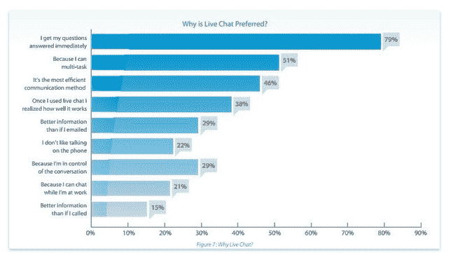
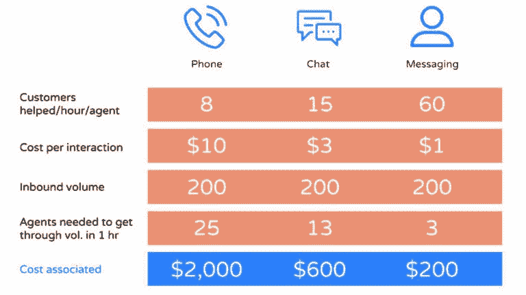

# 我们终于挂断了陌生电话。现在怎么办？

> 原文：<https://medium.datadriveninvestor.com/weve-finally-hung-up-on-cold-calls-now-what-2dda1982d6ca?source=collection_archive---------0----------------------->

那些记得寒冷电话处于鼎盛时期的人会庆幸他们缓慢但即将到来的死亡。像大多数行业一样，电信销售技术的前景在过去几年里发生了翻天覆地的变化。

# 为什么我们会看到电话推销的消亡？

Donnie would have a hard time competing with automated messaging. [Yahoo](https://www.yahoo.com/entertainment/bp/jonah-hill-60k-payday-wolf-wall-street-181050126.html)

因为在现代市场中，消费者把关系看得比什么都重要。因为沮丧的客户可以选择“不要打电话”名单，以避免收到来自离岸呼叫中心的垃圾电话。但主要是因为企业现在已经找到了比不请自来的电话拜访更好的接触消费者的方式。

举个例子，集客营销消除了陌生来电。

为什么它能更有效地确保转化？

这一策略之所以奏效，是因为它鼓励消费者掌控一切。如果顾客不喜欢某样东西，他们会扔掉它。集客营销的本质在于，它围绕着为客户创造愉快的体验，而[陌生来电不再属于这一类别](http://blog.freshchat.com/traditional-sales-not-really-dead-hybrid-inbound-sales-abm/)。一点也不。

如果你想要证据，看看千禧一代就知道了。如果他们没有阅读评论、研究公司或与其他品牌比较价格，就不会在网上订购任何东西。对于这类消费者来说，如果不先了解陌生人一点点，就从他们那里买东西是很有挑战性的。

因此，网络营销变得越来越谨慎，消费者总是希望感觉他们在控制。当一个潜在客户感觉到一种强有力的销售方式在催促他们结账时，他们就开始怀疑了。一个产品应该能够独树一帜。因此，相对激进的销售方式，即电话推销，正在逐渐成为历史。

# 现在销售沟通已经转变，什么是重要的？

我要给你一个概念，如果你能融入你的公司，你将有可能茁壮成长；**顾客不想再被当作顾客对待了。**

为了理解这一点，我们将追溯到电话营销的开始。电话推销奏效了，因为在 50 年代，人们热衷于炫耀他们的财富。中产阶级大幅增长，人们需要拥有每个人都必须拥有的下一件珍贵物品。

那是一个不同的时代，百科全书可以在门口以极高的价格出售，因此家庭可以显得富裕和有知识。潜在客户并不存在。这不是今天存在的市场。

改变的是围绕购买的意识。人们没有同样的动力去证明自己买得起商品，相反，这被视为一种炫耀的做法。但是人们仍然在购买，如果你能通过网络营销来推销你的产品，看起来对他们个人来说是最好的决定，那么你将有更大的机会把他们的兴趣转化为销售。

那么，销售沟通转移到哪里了呢？概括地说，有以下三个方面。

# 1.以人为中心的销售方法

企业需要[以人为中心的销售线索培育](http://blog.freshchat.com/saas-startups-can-build-human-centric-relationships-faster-scale-supported-automation/)。你希望你的销售工具帮助你的产品实现这一点。这可能会让人觉得自动化可能会削弱以人为中心的关系建设，并且这个过程可能会淹没在算法中的人类交流中。但在现实中，自动化让你的精神气质更清晰地传达给你的目标受众。

> “我们都在寻找与消费者相关的方式，创造相关的内容、相关的体验、相关的产品。没有什么比在需要的时候提供合适的帮助更重要的了。”

—蒋曦儿·伊丽莎白·德米尔，SaaS 营销人员和顾问

# 2.建立信任而不是要求信任

我在文章中讨论的大部分内容都围绕着“热情引导”这个支点，即在向客户销售你的产品或服务之前，先与他们建立关系。随着客户期望的转变，这是销售团队所寻求的。当你主动联系时，热情的领导已经对你的公司很好奇了。虽然这听起来比电话推销容易，但培养潜在客户需要很大的决心和毅力来建立客户网络。

对于 B2B 公司来说，这可以通过 LinkedIn 博客来完成。也许有人喜欢你的文章，你决定给他们发送实时消息。另一方面，B2C 销售线索更多地来自社交媒体，无论是广告还是联盟营销。

电子邮件活动仍然是今天最有效的营销方法，但你有一个微妙的界限。你需要创造一种个人风格，并在最佳的时间间隔进行联系。

我来解释一下原因。

你必须在吸引你的领导和不因为内容过多而激怒他们之间找到平衡点。客户很容易会觉得你在他们的收件箱里发送日常内容。

# 3.客户指标的变化

客户分析被普遍低估，在销售和营销中经常被放在优先列表的底部。《福布斯》的一项调查结果表明**只有 29%的高管**认为**使用客户分析“极其重要”。**让统计数据来驱动你的营销决策有助于你将业务从无效的活动中分离出来。相反，你可以看到什么可以吸引你的客户，并应用正确的工具和技术，使你的产品对他们更有吸引力。

让我们引入一个场景来帮助更好地理解这一点。假设你的客户是一名 25 岁左右的男性。让我们叫他蒂姆吧。

Tim 是一名新潮的千禧一代，他最近从贵公司的网站上购买了一份车辆保险计划。这是蒂姆的照片:

你的分析告诉你，蒂姆最初是通过脸书找到你的，他花了 15 分钟给他的车上保险。这里有几个显而易见的要点，你可以从中设计出一个有效的、个性化的活动。

理想的销售方法应该从向他抛出一个聊天弹出窗口开始，建议他以每月 2 美元的价格购买路边援助。你还应该注意到，他很快就完成了订单，这表明他可能是一个冲动型买家。基于这个数据，你可以制造一种紧迫感，给他未来 48 小时的医保打 7 折。

借助实时分析，您可以根据具体情况与客户沟通，并最大限度地提高销售额。

# 那么，我们现在去哪里？

对此的快速答案是网络营销。然而，我们将重点关注客户信息和聊天机器人等渠道如何增强买方和卖方之间的沟通。

# 实时聊天和实时消息

在他的一篇博客中，[尼尔·帕特尔](https://neilpatel.com/blog/live-chat/)举例说明了他是如何利用实时聊天将一位客户的转化率提高了 45%。如果使用得当，网站上的实时聊天是帮助解答客户问题的强大工具，这样他们就可以轻松完成购买。聊天可能永远不会取代电子邮件，但它提供了一种即时互动，在客户参与方面产生了更好的火花。

下面的图表展示了实时聊天如此受客户欢迎的原因。

根据你公司的基调，为你的业务采用一款[现代信息应用](https://www.freshworks.com/live-chat-software/)可能是一项智能投资，有助于挖掘潜在客户。虽然实时聊天有助于你变得即时、易接近，但实时信息让你能够以一种**更具对话性、更友好的方式抓住你的领导的注意力(和他们的数据)。**

客户信息应用程序可以帮助您创造可观的收入机会。CRM 软件和其他客户参与工具让所有团队成员都集中精力，了解大局以及他们对公司成功的影响。这与那些蜷缩在小隔间里的陌生来电者完全不同，他们对如何改变公司的动态没有任何真正的想法。

当你通过信息与消费者交流时，会发生很多事情。这对卖家和客户来说都是一种更积极的体验。卖家被授权去倾听他们的顾客真正在说什么。它在一个反馈循环中工作，卖家可以利用这一点来调整他们的销售技巧，以迎合客户的需求。他们不再在不了解电话另一端接电话的人的情况下随意输入数字。

在很短的时间内，技术和销售成本都发生了巨大的变化。因此，忽视实时信息，后果自负。不相信我？

# IVR 很无聊，聊天机器人会一直存在

聊天机器人可以回答基本的查询，并在需要时将客户的查询发送给人类代表。聊天机器人可以让潜在客户更快地做出决策，从而加快销售线索的生成。没有陌生电话和类似的耗时营销策略，您的团队可以专注于线索培育和增加销售。

# 让您的企业获得成功

数字销售渠道的生态系统比过去的冰冷电话脚本强大得多。它的挑战来自如此多的角度，以至于销售部门从来没有把他们的目光从新兴技术上移开过。它是你公司资源的一个来源，占用了你公司大量的资源。

实时聊天是实时信息的现代化身，由交互式聊天机器人和自动化支持，为您的客户创造量身定制的体验。它释放了您的资源，同时使您能够接触到更多个人层面的线索。借助自动化消息传递，您可以创建一个比以往任何时候都更具吸引力和成本效益的销售漏斗。