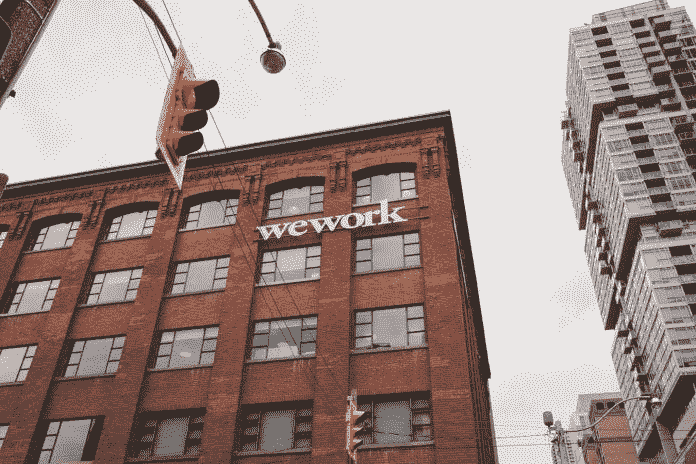
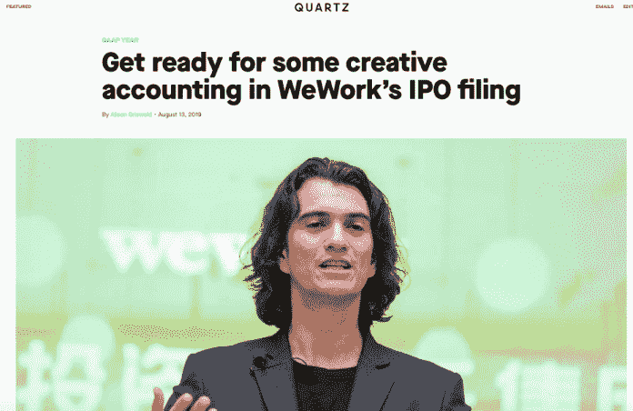
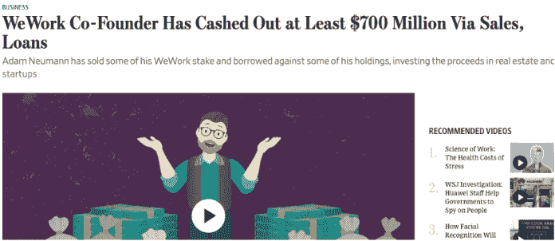
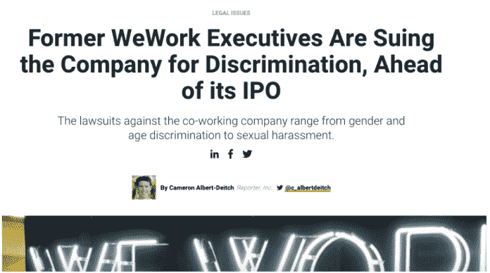
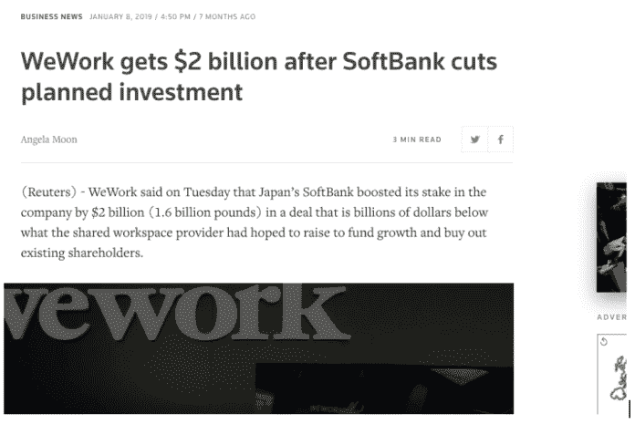

# WeWork:上市前替代数据分析

> 原文：<https://medium.datadriveninvestor.com/wework-a-pre-ipo-alternative-data-analysis-11909815c914?source=collection_archive---------12----------------------->

大多数投资者都会听说，合作公司 WeWork 计划今年秋天上市。

surfer dude 首席执行官亚当·诺伊曼(Adam Neumann)畅饮龙舌兰酒，让租用办公空间听起来像是一场精神运动。尽管 WeWork 出现了惊人的亏损，但该公司的私人估值为 470 亿美元，并有望筹集超过 35 亿美元的资金，这将使其成为今年美国第二大 IPO。

 [## 机器学习的外汇交易挑战|数据驱动的投资者

### 机器学习是人工智能的一个分支，之前占据了很多头条。人们是…

www.datadriveninvestor.com](https://www.datadriveninvestor.com/2019/02/18/the-challenge-of-forex-trading-for-machine-learning/) 

那么，WeWork 会成为 2019 年最令人印象深刻的独角兽，还是令人失望地从蓝天恩典中坠落的伊卡洛斯？

看你咨询谁了。

**备选数据分析**

典型的[替代数据来源](https://www.datadriveninvestor.com/alternative-data/)为 WeWork 描绘了一幅美好的画面:据苹果公司称，应用程序下载量正在增加，WeWork 地点的客流量正在稳步上升(以脸书的签到数量衡量)，LinkedIn 显示，WeWork 员工人数在去年增加了 73%。

对社交媒体数据的分析显示，情绪在很大程度上是积极的。它的租户看起来很开心，一般来说，人们喜欢 WeWork 品牌。

毫无疑问:WeWork 的增长是实实在在的，从许多方面来看，它都是一家令人印象深刻的公司。

**完整故事**

但是有些事情不太对劲。

为了了解 WeWork 背后的完整故事，并真正了解它的长期潜力，我们需要另一种替代数据:一些超越模糊细节的数据，这些细节可能重要，也可能不重要，比如应用评论和网络流量。我们需要的是背景和历史。

例如，Meltwater 的新工具为“WeWork”显示了一些严重的危险信号。

给你一点背景:我们与客户协商建立了[信号](https://fairhair.ai/solutions/signals)，客户告诉我们他们在决定是否投资一家公司时认为哪些新闻事件是重要的。我们为每个信号找到了数千个相关的例子，并通过一个[机器学习](https://www.datadriveninvestor.com/glossary/machine-learning/)模型来运行这些文章。

现在，该系统能够自动发现对投资者来说很重要的文章。

以下是为 WeWork 标记的文章，这些文章相当令人担忧:

这解释了 WeWork 如何设计新的会计类别，以帮助掩盖它消耗了多少资金。

诺伊曼公开炫耀该公司每月支出约 1.5 亿至 2 亿美元，2018 年净亏损 19 亿美元。他的首席财务官表示，他们为自己的投资感到自豪。

Quartz 的艾莉森·格里斯瓦尔德(Alison Griswald)表示，“除了烧钱之外，WeWork 的首次公开募股将考验投资者对虚构会计指标的容忍度。”她指出，WeWork 绝不是唯一一家使用这些方法的公司。优步也有一些有趣的会计技巧——但优步的首次公开募股至今令人失望。

这是我们算法强调的另一点:

这就是事情开始变得非常可疑的地方。

如果诺伊曼确信首次公开募股会如此成功，他为什么要套现他在 WeWork 的部分股份？

我一直与一家大型资产管理公司密切合作，该公司在 ESG 方面处于领先地位，他们最近向我解释了他们的理论，即投入大量时间和精力进行道德行为的公司是最好的长期投资，因为他们试图建立适当的东西，而不是只寻求短期收益。

Twitter 在周末被更多来自员工的抱怨点燃，所以故事的这一面似乎不会消失。

WeWork 是一家有趣的公司，但并不像其首席执行官所说的那样有趣，这一评估得到了以下信号的支持:

软银是历史上最大、最成功的科技投资基金之一。他们曾考虑向 WeWork 投入 200 亿美元，但今年早些时候，他们改变了主意，大幅削减了投资。

软银的团队显然认为，如果他们仍然愿意给公司 20 亿美元，WeWork 就有潜力，但他们将投资减少 90%的事实很有趣。很难知道到底发生了什么，但他们似乎在最后一刻决定不对该公司进行全面投资。

**直觉与数据驱动的决策**

围绕 WeWork IPO 的大肆宣传是直觉投资的一个很好的例子:人们喜欢这家公司，喜欢它的首席执行官，他们认为，如果有人能在面临潜在经济衰退的情况下不畏艰难，进行一次出色的 IPO，那就是亚当·诺伊曼。

正如何在 2017 年所说:“没有人会投资一家价值 200 亿美元的合作公司。那不存在。我们今天的估值和规模更多地基于我们的精力和精神，而不是收入的倍数。”

你不得不佩服这家伙的胆大妄为。即便如此，我们接收到的信号并不好。

看看这次首次公开募股如何收场将会很有趣。

*原载于 2019 年 9 月 2 日*[*【https://www.datadriveninvestor.com】*](https://www.datadriveninvestor.com/2019/09/02/wework-a-pre-ipo-alternative-data-analysis/)*。*