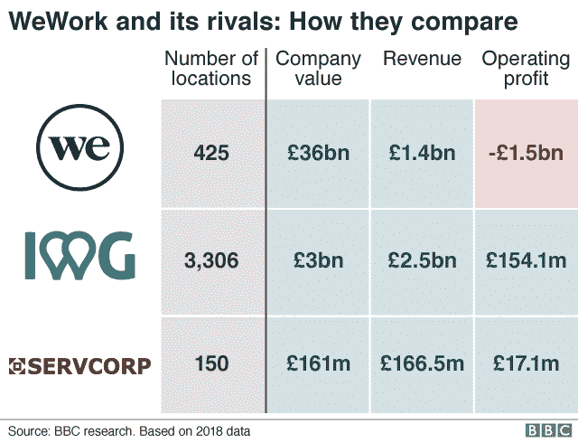
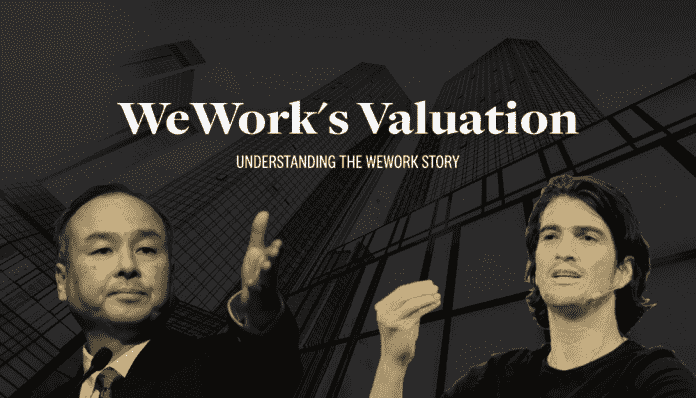

# WeWork 和 IPO 大戏

> 原文：<https://medium.datadriveninvestor.com/wework-and-the-ipo-drama-895a6260ba9e?source=collection_archive---------5----------------------->

WeWork 是世界上最有价值的创业公司之一，在 2019 年初的最后一轮融资中估值为 470 亿美元。WeWork 的母公司 We Company 在 8 月中旬申请了 IPO，从那以后，这家房地产初创公司的情况就变了。上市过程要求公司披露其收益、资产、收入和现金流(如果有的话)。虽然投资者很清楚 WeWork 每月都在烧钱，追逐增长而不是利润，但 IPO 文件揭示了这些数字是多么惊人！该公司的几位高管辞职，包括其“明星”首席执行官亚当·纽曼(Adam Neumann)，他在董事会和外部投资者的压力下辞职，其中包括软银首席执行官孙正义(Masayoshi Son)，WeWork 的最大支持者。这家初创公司是如何在不到两个月的时间里损失了几乎 300 亿美元的估值和 CEO 的？

# 上坡

Miguel McKelvey 和 Adam Newmann 都是设计专业的学生，他们在 2010 年卖掉了自己的小规模房地产公司 Green Desk，创办了 WeWork。他们的新企业很快获得了关注，在不到三年的时间里，他们从各种投资者那里筹集了超过 5000 万美元，其中最著名的是软银。他们成为软银愿景基金的早期组成部分，Masa Son 称 WeWork 为他们的下一个阿里巴巴。诺伊曼向投资者描述 WeWork 是一家寻求更高估值的科技公司(他得到了)，而实际上它只是一家房地产公司，向其他组织出租办公场所。没关系，WeWork 很快成为世界上最有价值的创业公司之一，并开始产生可观的收入。甚至像亚马逊、优步和 IBM 这样的公司也开始租用 WeWork 办公空间。在这九年中，他们已经取得了相当大的进展，在全球 32 个国家设有办事处。虽然他们还是没有赚到一分钱。

在所有的审查中，WeWork 简约而独特的设计应该得到应有的认可。他们的共同工作空间非常漂亮。

# 竞争优势(？)

甚至在 WeWork 之前，已经有其他公司在这个领域开展业务，那么 WeWork 有什么特别之处呢？基本上，诺伊曼把它作为一个技术游戏而不是房地产游戏来卖，这给了他们巨大的竞争优势。但它真的是一家科技公司吗？当然，他们有大量关于员工喜欢如何以及何时工作的数据。他们知道员工什么时候工作效率最高，也知道咖啡机放在哪里最好，但基本上就是这样。他们只是一家房地产公司，租赁办公场所，一个月周转一次，然后租给其他创业公司或公司。他们是一家房地产公司，融入了一些非常复杂的技术。

# 古怪的首席执行官

如果不谈论其(前任)古怪的首席执行官亚当·诺伊曼，我们就无法真正谈论 WeWork。传说诺伊曼一直想“改变世界”，并相信 WeWork 是下一个谷歌。据信，诺伊曼只用了 28 分钟就说服 Masa Son 投资 WeWork。看起来很糟糕，人们真的可以说诺伊曼拥有一位科技公司首席执行官的所有“明星特质”。那是什么突然出了问题？

诺伊曼从一开始就是一个有争议的人物。有人引用他的话说，他“想成为世界上第一个万亿富翁”。纽曼是 WeWork 最大的单一股东。纽曼是 WeWork 最大的单一股东。然而，他已经兑现了他的股份，最近还贷款，销售和债务交易总计 7 亿美元。至少可以说，在你的公司 IPO 之前套现这么多股票听起来确实可疑。除此之外，他还私下注册了“We”商标，并让 WeWork 向他支付了约 600 万美元的商标使用费。

# IPO 怎么样了

We 公司正在考虑大幅降低估值以上市，但它面前有太多的挑战。现在诺伊曼已经下台，董事会已经任命了两名联席首席执行官，WeWork 的 IPO 在不久的将来看起来是一个遥远的镜头。话虽如此，它们需要大量现金流入，才能保持目前的增长速度。看起来他们可能不得不再次求助于私人投资者，并承认一轮下跌，以获得新的资金。虽然什么都不能确定，但我们都只能等着看 WeWork 的故事从这里走向何方。

Adi 是一名创业爱好者和业余作家，目前正在印度理工学院攻读化学硕士学位。他大量阅读非小说类商业书籍，对经济和金融有着浓厚的兴趣。

*原载于 2019 年 9 月 29 日*[*【https://www.datadriveninvestor.com】*](https://www.datadriveninvestor.com/2019/09/29/wework-and-the-ipo-drama/)*。*