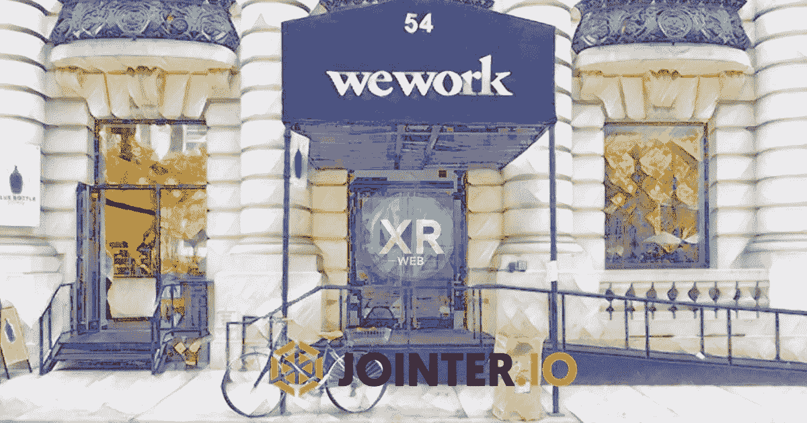

# WeWork 危机:两家创业公司如何拯救愿景基金和 IPO

> 原文：<https://medium.datadriveninvestor.com/wework-crisis-how-blockchain-could-save-the-valuation-and-the-vision-fund-1f8f3201c4ad?source=collection_archive---------6----------------------->

高额债务、薄弱的治理和微薄的利润导致一家快速增长的公司推迟了首次公开募股。WeWork 和他们的资助者软银需要考虑新的途径来增加市场对这一现在已被玷污的产品的兴趣。

“生命中唯一不变的是死亡和税收，”这是我们大多数人都听过的一句话。正如我们在 WeWork IPO 中看到的那样，他们不变的是长期租赁义务。不管他们的商业模式是否盈利，房东们仍会期望这些义务得到履行。所以这就引出了一个问题，承担更多债务的想法真的能让我们工作盈利吗？市场目前并不这么认为，也不愿意冒这个风险。

 [## 动荡迫使暴风雨中的平静|数据驱动的投资者

### 自然界中很少有东西是直线行进的，尤其是经济。当投资者和消费者希望平静时…

www.datadriveninvestor.com](https://www.datadriveninvestor.com/2019/03/25/volatility-compels-calm-amid-the-storm/) 

# 高负债和小利润导致更高的怀疑和更小的估值

彭博报告称，WeWork 欠下了 470 亿美元的长期租赁债务。这个数字让潜在投资者望而却步，但让房东们非常高兴。首席执行官亚当·诺伊曼已经采取措施购买房产，然后将它们租回公司。尽管这又一次让投资者感到畏缩，但这是 WeWork 继续发展的一种明智方式。

通过购买房产，WeWork 将能够扩大利差，同时降低债务风险，因为他们拥有商业建筑。这样做的问题是，WeWork 购买的 A 级物业需要大量的首付款和增值资本，WeWork 已经负债累累。即使是 Adam 不断增长的杠杆物业也不足以维持 WeWork 达到规模所需的增长，因为他们的大部分物业都是通过第三方房东租赁的。

# 区块链锻造的新路径

债务要求投资者对公司承担很大的风险。如果 WeWork 改变方针，不再签订长期租约，而是向办公室业主支付租金，他们就能更快达到规模。在业主模式下，我们努力工作，最终成为他们工作的大楼的业主，几年后，抵押贷款将被还清，但大楼的升值也将开始。

WeWork 可以增加利润，为公司创造新的利润来源，同时减少他们的长期负债。WeWork 从短期租赁和物业升值中获得双重利润，WeWork 将能够进一步降低租金成本，并创造一种相对于其他合作公司的不公平优势，这些公司没有及时复制的资本来源。

# 区块链如何降低 WeWorks 成本？

WeWork 和软银可以利用区块链提供的先进技术解决方案，在不扩大太多资本的情况下解决收购需求。例如，Jointer.io 可以提供 95%的购买房产所需的首付款，XR 可以降低营销成本并提高长期忠诚度。XRWeb 是谷歌的合作伙伴，PlugNPlay 的毕业生和联合者最近获得了由谷歌、软银、贝恩资本、汤森路透、斯坦福天使投资公司、宝马、安德森、NEA 和其他顶级风险投资基金组成的小组评选的颠覆性创业奖。

# 提供购买房产的首付款，以模仿麦当劳与 Jointer 的房地产策略

麦当劳的大部分收入是通过购买实体物业，然后出租给特许经营者获得的。Jointer.io 可以提供购买房产所需的 95%的首付款，同时允许 WeWork 拥有 50%的房产。

Jointer 将减少 WeWork 对长期租赁协议的依赖，并允许 WeWork 从短期租赁和长期房地产升值中获得双重利润。WeWork 将能够进一步降低租金成本，并为无法获得这种解决方案的公司创造巨大优势。

# 通过 XRWeb 下注扩大奖励

WeWork 有短期租赁者，他们依赖这些租赁者继续租用办公桌。区块链可能是激励长期忠诚的一种方式。WeWork 可以提供奖励，持有托管代币，最终将用于服务或租赁。

XRWeb 有一个实时的赌注模型，帮助创建了一个超过 38，000 名赌注用户的社区。XR 赌注者根据与网络上活动的接近程度获得奖励。利用 XRWeb 将允许 WeWork 以精益的方式发展社区，并通过这些基于邻近性的奖励获得社区。

来源:

针对企业、消费者、媒体、健康、能源和机器人的颠覆性创业奖@ Stanford Innovation，*数字杂志*http://www.digitaljournal.com/pr/4419565 T2

WeWork 的资产负债表看起来很丑，所以你的不会，*彭博*[https://www . Bloomberg . com/opinion/articles/2019-09-02/we work-IPO-lease-obligations-and-an-Ugly-Balance-Sheet](https://www.bloomberg.com/opinion/articles/2019-09-02/wework-ipo-lease-obligations-and-an-ugly-balance-sheet)

希尔顿支持的数据平台冲击区块链市场，*Cryptovest*[https://Cryptovest . com/news/hilton-Backed-Data-Platform-Hits-the-区块链市场/](https://cryptovest.com/news/hilton-backed-data-platform-hits-the-blockchain-market/)

**披露**

Jointer 是非营利性 stablecoin，Element Zero 的母公司。作者是 Jointer 的联合创始人，并从主席的位置上监督 Element Zero。作者并不拥有 Aqua，但他热爱加密，并投资了区块链技术。