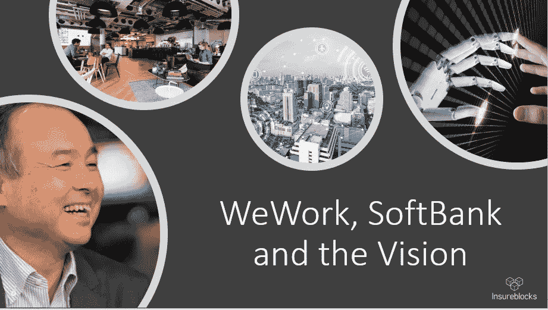
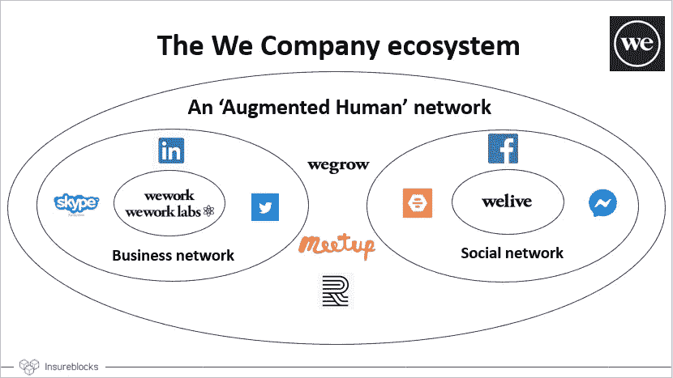
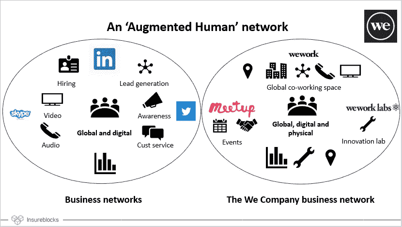
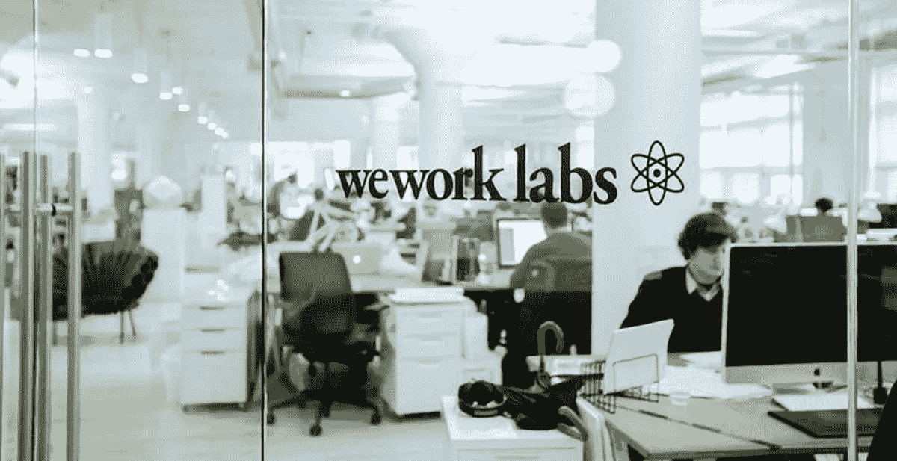
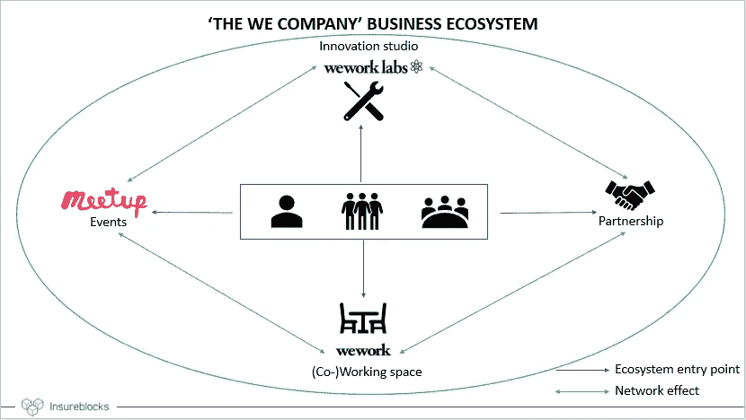
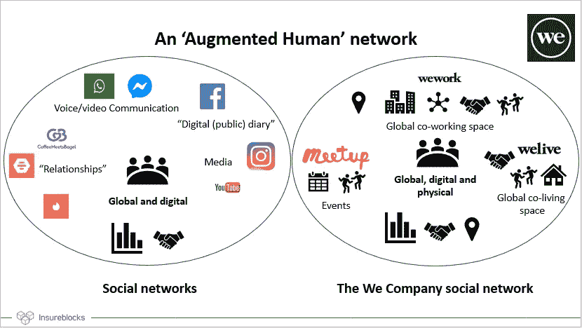
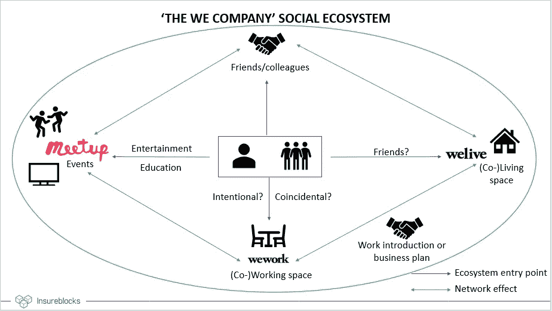
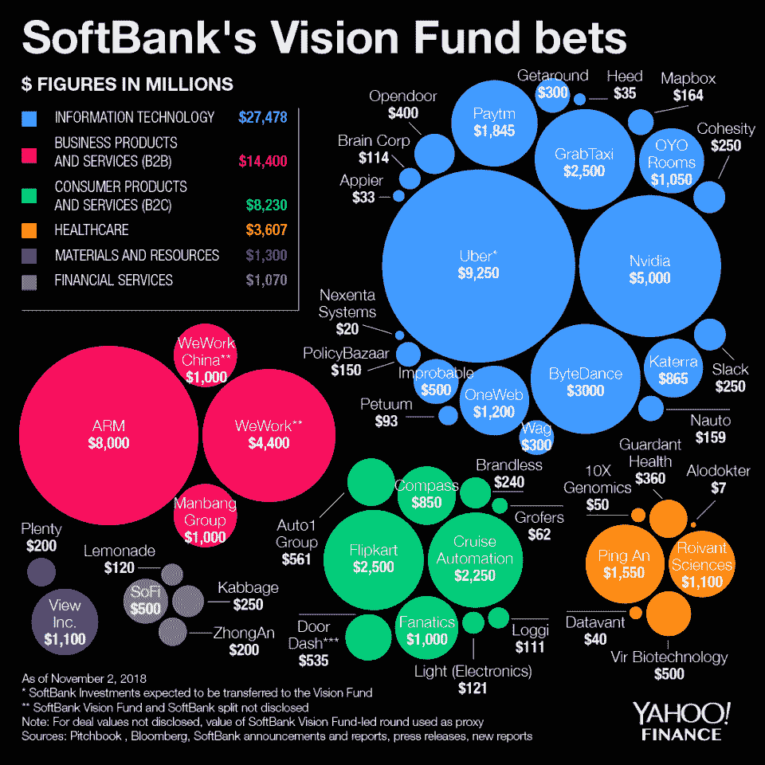
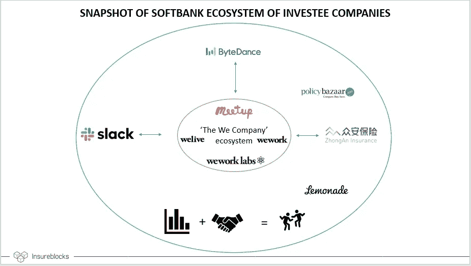

# WeWork、软银和愿景

> 原文：<https://medium.datadriveninvestor.com/wework-softbank-and-the-vision-28a33e328588?source=collection_archive---------6----------------------->

> “WeWork 是一个工作社区。当脸书发射时，没有人了解它的力量。”——孙正义上 [*WeWork*](https://www.wework.com/) *投资上* [*美国消费者新闻与商业频道面试*](https://www.youtube.com/watch?v=L53B2UZ9lpY) *。[2019 年 3 月 8 日]*

A preview of the contents of this article.

# 一.不仅仅是看上去的那样

如果我必须总结“我们公司”(WeWork)和[愿景](https://visionfund.com/)的最终目标，我会用这句话——“比看上去的要多。”从表面上看，很容易得出以下结论:

**WeWork** :“合作创业”——福克斯商业(2017)[【1】](http://coworking%20startup/)，“像科技公司一样估值的房地产公司”——CB Insights(2019)[【2】](https://www.cbinsights.com/research/report/wework-strategy-teardown/)(*)

视觉基金论文:采访如[【3】](http://fortune.com/2018/07/17/softbank-vision-fund-capital-investment-strategy/)似乎表明 SBVF 正在为**“增强人类”论文**即人类+人工智能投入资金。Masayoshi 自己说所有 SBVF 支持的公司都使用人工智能。这让许多人(包括我在内)相信 WeWork 是一家“智能房地产”公司，但这是真的吗？

**这篇文章的缘起是我在开头引用的 Masayoshi 的一段话。**

**首先，我想请您看一下“我们公司”生态系统的快照:**

A snapshot of the ecosystem that ‘The We Company’ is building

**我很想听听你的第一想法，**但是这篇文章(很不幸)是单向对话。如果你感到困惑，不要担心— **在我提出下面的假设之前，上面的图应该没有意义**。

 [## 金融科技初创公司正在扰乱世界各地的银行业-数据驱动的投资者

### 传统的实体银行从未真正从金融危机后遭受的重大挫折中恢复过来…

www.datadriveninvestor.com](https://www.datadriveninvestor.com/2018/10/20/fintech-startups-are-disrupting-the-banking-industry-around-the-world/) 

# 二。我关于“我们公司”的假设

# 1: **“房地产”(即共同工作和共同生活的空间)不是(最终)产品，而是一种促成因素(中间产品)。**

# 2: **全渠道专业和/或社交网络是“我们公司”正在销售的产品/服务。**

> *“增强人类的(社交和商业)网络。”—我关于“我们公司”产品的假设。*

**让我们从重温上面的生态系统快照开始，并关注“业务网络”——**

Comparing business networks today to the ‘We’ business network.

问问自己— **“左边的网络缺少什么，而右边的网络提供了什么？”**永久物理集线器。(**)

LinkedIn、Twitter 和 Skype 等数字平台(或服务)为企业和专业人士提供了全球联系、分享想法和结识其他专业人士的途径。在我看来，这些平台受到一个关键限制的困扰——缺乏实体存在。

在某种程度上， **LinkedIn** 已经能够通过**LinkedIn Local**[【5】](https://linkednlocal.com/)来解决这个问题。虽然它看起来很受欢迎[【6】](https://www.cmswire.com/digital-workplace/how-linkedin-social-changed-the-face-of-the-professional-network/)——这些**东道主推动的活动没有一个永久的地点或存在**。

Typical Sunday at the WeWork close to you.

**这就是 WeWork 的用武之地**——102 个城市的 617 个枢纽[【7】](https://www.wework.com/locations)。“共同工作空间”让志同道合的人聚集在一个永久的地方。

**回想一下，WeWork 允许单一会员**[【8】](https://www.wework.com/workspace/shared-workspace)和企业会员，即你可以作为个人成为全球网络社区的一部分——类似于 LinkedIn 这样的专业网络。

我不是心理学家——但是问问你自己——你会在没见过一个人的情况下就把他作为商业伙伴吗？你可能在一次社交活动中遇到过某个人，并说“如果他们能加入就太好了！”

这就是 2017 年被 WeWork 以 2 亿美元收购的**MeetUp**[【9】](https://www.businessinsider.com/wework-buys-meetup-for-200-million-2017-11)发挥作用的地方。MeetUp 是一款允许用户组织活动的应用程序，在这种情况下，是在 WeWork 地点。这些活动可以是社交活动，但也可以服务于商业网络的目的——就像 **LinkedIn** 和 **Twitter** 让你接触到人和公司一样，MeetUp 通过**促进面对面的商业互动**更进一步。

Where the innovation magic takes place.

让我们假设你遇到了一个潜在的商业伙伴/合作伙伴公司，并希望在 WeWork 探索一个商业想法，你可能想参观一个孵化器或加速器。**进入 we work Labs**[【10】](https://www.wework.com/labs)。**对于怀疑者来说**，WeWork Labs 于 2018 年 10 月在印度成立，31 家孵化的初创企业中有 11 家继续融资 550 万美元[【11】](https://www.thehindubusinessline.com/info-tech/wework-labs-launched-in-india/article25125332.ece)[【12】](https://tech.economictimes.indiatimes.com/news/startups/wework-labs-sees-11-of-its-incubated-startups-collectively-raise-5-5m/68395091)。

你可以很容易地争辩说，在 We 公司生态系统之外产生的创业想法也可以在 WeWork 实验室孵化。你说得对，但作为一名企业家，你可能希望在 WeWork 实验室建立实验室，因为在 WeWork 场所内存在其他初创企业/公司(合作伙伴关系、建议等等)…这开始**听起来有点像网络效应，对吗？**

这是一个企业家、专业人士和企业的闭环生态系统。网络效应是如何发挥出来的——当你观察到越来越多的人在你所在的城市的 WeWork 办公室工作，听到在 WeWork 地点举办的有趣活动，读到来自 WeWork 实验室的成功初创企业，你可能会越来越被吸引加入这个网络。这看起来很熟悉，对吗？嗯，我刚刚描述了你加入 LinkedIn 或 Twitter 的过程。

我将通过展示商业生态系统和网络效应来结束这部分的讨论。在下图中，一些生态系统的切入点也可能受到网络效应的影响。请记住，“我们公司”的商业生态系统的**关键组成部分是物理存在(WeWork)** 。

An info-graphic regarding the business network.

很容易看到类似的想法延伸到“我们公司”试图建立的“社交网络”。(***)

Comparing social networks today to the ‘We’ social network

如今，大多数社交媒体平台都试图通过鼓励视频内容的直播、滚动浏览无尽的迷因等方式来取代社交互动(我认为社交互动有很强的物理成分)的 T2。

**WeWork 和 WeLive 提供共同居住的空间——根据情况(和一天中的时间)，两者都可以有工作或社交元素**。无论是欢乐时光、办公时间、午餐&学习[【13】](https://help.wework.com/hc/en-us/articles/212045546-What-kind-of-events-does-WeWork-host-at-their-spaces-)—**这个想法就是把社区** **聚在一起互动**，学习，玩乐。

**我想深入探讨在社会背景下可能出现的“网络效应”——**

An info-graphic regarding the social network.

在我看来，**潜在的想法是将一个人带到我们的工作场所或我们的住所**(可能通过一个聚会活动)**以确保至少发生以下一种情况**:

1.  找到和你相处融洽或有共同兴趣的朋友。
2.  找到一个“合作伙伴”——让我们假设这是一个业务合作伙伴(****)
3.  如果需要的话，找合租人或室友(可能在 1 中的人当中)(考虑搬到一个新的城市)。
4.  找到一份工作或创办一家企业(可能是 2 的结果)。你可能会参观 WeWork 实验室。

如果你仔细观察，“我们公司”的社交网络似乎是一个闭环社交生态系统(类似于商业网络)。

**我认为社交和商业生态系统有一个非空的交集；为了避免混淆，我选择将这两者分开展示。**

**希望在这个阶段，我已经能够鼓励你认为“我们公司”不仅仅是一家“聪明的房地产公司”**——我喜欢把它看作是“增强人类”的商业+社交网络。

为了给你一个事情可能走向的暗示，一位前谷歌高管和她的团队最近被雇佣来将“WeWork”和“WeLive”概念带到一个智能城市——“we city”！简要回顾生态系统图片，记住一个反映城市的更大的圆圈。

如果你已经注意到，我在上面经常使用“增强人类”这个词——这是下一节的前奏，在下一节中，我将简要讨论“我们公司”如何融入软银愿景基金投资主题(或孙正义的愿景)。

# 三。软银投资“我们公司”

> “如果钱不是一个限制因素，在未来的 5 到 10 年里，你会有什么不同？”—孙正义向被投资公司提出的“十亿”美元问题。[【19】](https://www.youtube.com/watch?v=FT_OA8Cuc6c&t=1074s)

SBVF investment map courtesy of Yahoo Finance.

# 数字

让我们从这张由雅虎财经制作的截至 2018 年 2 月 11 日的 SBVF 投资信息图开始。

私人融资的性质使得很难估计软银和 SBVF 在投资“We 公司”方面的份额。

从多种渠道获取信息[【17】](https://in.reuters.com/article/wework-m-a-softbank/wework-gets-2-billion-after-softbank-cuts-planned-investment-idINKCN1P21P5)[【18】](https://www.crunchbase.com/organization/softbank-vision-fund/investments/investments_list#section-investments)(非常感谢 [Jack](https://www.linkedin.com/in/jackrizvi/) 在这里的帮助)，似乎软银和 SBVF 共同向“We 公司”投资了最多 104 亿美元(另外向 WeWork China 投资了 10 亿美元)。同样的消息来源表明，SBVF 的投资上限为 44 亿美元。

## 非常适合投资组合

如果你回到上面的信息图，将 WeWork 投资重新归类为未来的社交/专业网络，你可能会看到它如何扩大投资组合，并揭示其他投资如何补充 WeWork。

A snapshot of how ‘We’ rests within the Softbank investee family.

[注:我**只强调了一些有趣的协同作用**。强调上述组合中的每一种可能的协同作用可能会使分析受到确认偏差的影响；这已在“缺点”一节中解决]。

*   WeWork **(特别是 we work Labs)**可以与投资组合保险公司建立强有力的联系——每个机构都需要保险，SBVF 投资于三个主要地区(美国、中国/东南亚和印度)的技术优先保险公司。以科技为先的中小企业保险是这里的关键。
*   Slack 和 WeWork 之间的联系很简单——数字领域的生产力工具(Slack)可以轻松补充物理领域的生产力提升工具(WeWork)。
*   字节跳动(数字社交互动、媒体和娱乐)是对 WeLive、MeetUp 和 WeWork After Hours 活动的很好补充。我认为这是**大学生活和社交媒体(实体+数字)——实际上是不可分割的。**

## **很适合正芳**

"人类+技术的沙盒方法(即增强人类)."—我对 Masayoshi 的‘我们’观的猜想。

*   Masayoshi 对未来的愿景是**增强人类，即人类+人工智能。**“We Company”确实符合专注于人工智能的投资标准——它收集的数据用于提高员工生产率，充分利用房地产(空间优化)等——C**B Insights**[**【2】**](https://www.cbinsights.com/research/report/wework-strategy-teardown/)**对数据使用情况进行了深入分析**，我将避免重复。
*   **‘We Company’为 Masayoshi 提供了人类与技术互动的试验场(沙盒)**。每个算法都需要**训练数据** — WeWork 和 WeLive 收集构建人工智能工具所需的数据，以补充人类(记住，Masayoshi 希望未来有增强的人类——人类是这里的关键词！)
*   “增强人类”的另一个关键要素是**提高生产力**——今天的技术使我们能够做比以前多得多的工作(想想智能手机、工厂机器等)——我们的工作也可以作为测试高生产力劳动力的结果的实验。

**我对‘我们公司’的估值不予置评；我个人不知道如何去看重一个职业/社交网络(而且记住，这是数字+实体)。**

# 四。“网络效应”

我多次使用“网络效应”这个词。因此，我觉得有必要在“我们公司”的上下文中证明其使用的合理性。有一些关于网络效应的很好的资源。

网络效应的特征在于:

1.  **进入和退出壁垒**

参赛作品:“我们公司”有一个大多数公司只能梦想拥有的战争基金；我觉得公平地说，竞争对手确实难以跟上(最近对竞争对手的收购表明了这一点)。

**出口:WeWork 提供的便利设施堪比任何高端办公空间。使 WeWork 与众不同的是吸引有趣的初创企业和创建社区的能力——也许，当你离开时，你确实会觉得自己会错过什么。**

**2.**由数值驱动的高保持率****

****我对互联网上的流失率持怀疑态度**——流失率可能很高，因为 WeWork 对数字游牧民、短期游客等有吸引力。**我觉得你需要看看“锚定”租户**(大公司)的流失率——我找不到这方面的数据。在没有这些信息的情况下，我会假设这里没有问题，很明显，低流失率(如果是这样的话)将是包含在上述网络中的价值的结果。**

# **动词 （verb 的缩写）结论**

**我将通过强调**要点**来结束这篇文章**

1.  **“We Company”或许不是一家智能房地产公司——它是一家**(全渠道)专业和社交网络**。这可能**证明了从“WeWork”到“We Company”的重新品牌化**——听起来像是人类的网络。**
2.  **鉴于第一点， **WeWork 投资非常适合 SBVF 投资组合**(协同效应和向未来社交网络的多元化发展**——实体+数字**)。**
3.  ****‘We 公司’可以成为增强人类的沙箱**。(想想 WeWork 办公室有多“高科技”——你会如何表现/回应？)**

# **不及物动词缺点**

**我认为我有必要指出我的分析中的一些缺陷-**

1.  ****虚拟现实(VR)和增强现实(AR)对人类互动的影响****

**我的假设基于这样一个想法，即当今的社交和商业网络缺乏实体存在。物理存在很重要的假设在未来可能不成立，在那里，数字交互可能提供与面对面交互相同(或更好)的“体验”。**

**扩展现实的概念(以上的结合)可能会完全消除地理上接近的界限。[【20】](https://www.accenture.com/us-en/insight-xr-extended-reality)**

**2.**确认偏差的影响****

**我在这里提供的证据是基于我在形成“我们公司”是一个社交+专业网络的假设之前获得的新闻和信息。我已经尽了最大努力来减少确认偏见，但我可能会受到同样的影响。完全有可能‘我们’只是一家房地产公司，我已经把噪音当成了一种模式。**

**3.离群风险投资对 SBVF 投资理论的(建设性)批评。**

> **“平台垄断导致数据垄断，数据垄断导致人工智能垄断。”— Jamie Burke，Outlier Ventures 首席执行官。**

**这个缺点仅限于我关于 SBVF 的部分——Jamie 写了一篇很棒的文章[【21】](https://hackernoon.com/softbanks-300-year-vision-is-already-out-of-date-here-s-why-700fed5d1c35),讲述了 OV 的投资论点如何恰恰是 SBVF 的反论点。我不想在这里深究太多的细节，但是保持观点的平衡是**好的。****

**4.**杂七杂八的反驳****

****FinTech 举例** —物理似乎并不重要。你可以参考缺乏实体存在的挑战者银行，如 Monzo、Starling、N26 等。然而，我认为金融服务和社会/商业互动是分离的。**

****现有的沟通工具** —你可以指出，智能手机、Skype 和 Slack 减少了企业团队集中在一个办公室的需求。这是一个很好的观点——如果你注意到几个区块链项目是基于分布式团队的想法(以太坊项目是一个很好的例子，因为它可能比较小的项目更广为人知)。然而，WeWork 和 WeLive 的位置分布在全球各地——截至目前，分布式团队要求每个人都在某个地方有一个物理存在(我们的大脑尚未上传到云)。**

# ****免责声明****

**作者目前在[保险公司](https://www.insureblocks.com/)工作。本文中表达的观点是作者自己的，不代表 Insureblocks、其管理层、其员工或其附属公司的观点。**

**本文不构成投资或任何其他形式的建议。如果读者或任何相关方根据本文中的信息采取行动，导致经济或其他损失，作者不承担任何责任。作者在上述文章中提到的任何公司中没有任何经济利益；这篇文章是为教育目的而写的。**

**如有任何疑问或投诉，请发电子邮件至 rahul@insureblocks.com；或者，在 [LinkedIn](https://www.linkedin.com/in/rahul-jaideep-mathur/) 或 [Twitter](https://twitter.com/Rahul_J_Mathur) 联系我。**

## ****脚注****

**(*) —我非常尊重 CB Insights。然而，我想强调的是，数据可能并不总是提供完整的图片(希望这篇文章已经说服了你！)从一个培训中的统计师(我)到一个数据公司(CB Insights)。**

**(**) —我不会用通常的说法来烦你，即 WeWork 正在收集数据以提高员工生产率并最大限度地发挥工作空间的功能(例如办公室布局)。公平地说，今天的任何业务都是数据驱动的。**

**(**) —“关系”这个词有几个含义——我会让你发挥自己的想象力，但我相信你会明白的！**

**(****) —也可能是生活伴侣；随便说说。**