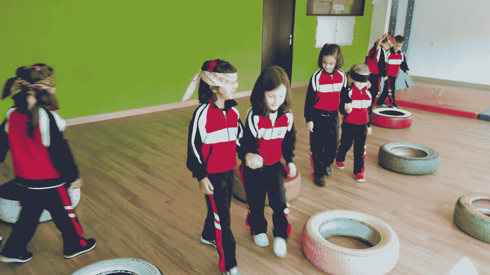
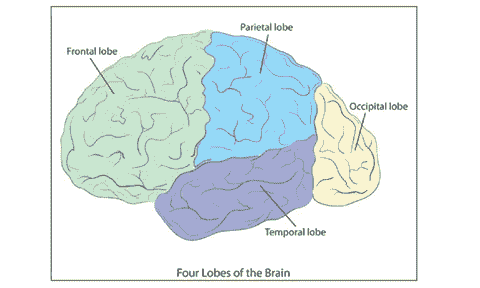
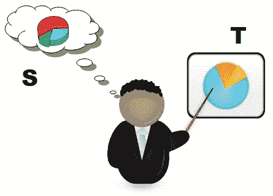
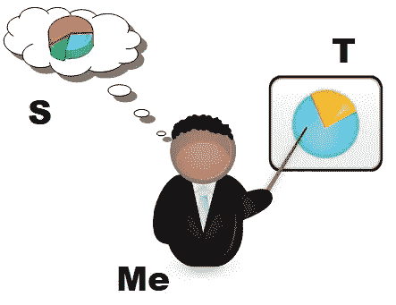
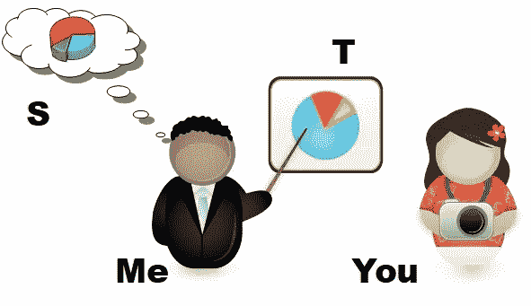
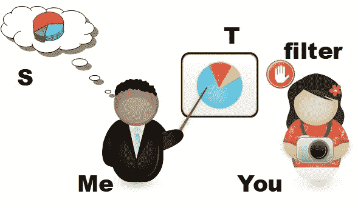

# 什么是务实的失败

> 原文：<https://medium.datadriveninvestor.com/what-already-pragmatic-failure-is-61d8931cd5d?source=collection_archive---------1----------------------->

## 从语言使用的杂质中理解知识的本质。

语言学中的语用学是对每个语境中所表现的东西的相关性进行研究的历史。如果我们能够知道要注意什么，我们也将能够知道在我们的循环网络中哪些记号必须在每次循环中存活。通常在每次重复之后在一起的实体将被它们的邻居重新定义。这就是为什么有必要知道在每次重现中什么必须开始被遗忘，或者实体将会有什么初始定义的原因。

为了解决这个最初的问题，我们可以求助于(乔姆斯基 1962)建立的原始词:**语用能力**。那是关于语言如何与它被使用的情况相关的知识。这个定义的问题是，它对工程师来说不是很有用:情况是什么，你如何计算映射能力的质量。

 [## DDI 编辑推荐:5 本机器学习书籍，让你从新手变成数据驱动专家…

### 机器学习行业的蓬勃发展重新引起了人们对人工智能的兴趣

www.datadriveninvestor.com](https://www.datadriveninvestor.com/2019/03/03/editors-pick-5-machine-learning-books/) 

> 或许有必要重新思考语用学的概念，与其说研究它的质量，不如说研究它的缺失。

因此，语用学在 20 世纪 60 年代和 70 年代成为语言学的总称，是一个 100%人工使用的术语。它获得了最稳定的定义:成为语言学的一部分，研究语言与使用者和交际环境的关系。例如，如果一个人是盲人，而另一个人不是，语用学将会衡量一个不是盲人的人在传达外部世界是什么样子时所做描述的质量。

考虑到上面的例子，我们可以理解( [Grice](https://en.wikipedia.org/wiki/Paul_Grice) 1989)为语用学建立的质量原则。这种看待语用学的方式导致了威尔逊等人的关联理论。2002)，它不能给我们关于如何实现的提示，例如，考虑到机器何时能够知道什么是或多或少相关的，一个[区别网络](https://en.wikipedia.org/wiki/Discriminative_model)用于一个[生成对抗网络](https://en.wikipedia.org/wiki/Generative_adversarial_network)。

为此，也许有必要重新思考语用学的概念，与其说研究它的质量，不如说研究它的缺失。

语用学给我们提供的最重要的东西之一是自动翻译的能力。原因在于，一个在其语境中被很好分类的短语完全可以被另一个语料库中的另一个短语替换，但具有相同的语用功能。这就好像我们有一个文学类型的故事，通过本地化故事的功能，我们只需要为其他人修改一些演员，自动地，我们就会有一个相同类型的新故事。(Propp 1984)对此做了更多的解释，我们已经成功地提取了自动故事生成器。因此，找到语用学的不同功能可能是关键。

# 语言暗示的功能

1934 年，Karl Bühler 对语言理论提出了一个[贡献](http://www.the-rathouse.com/Buhler_s_Program.htm)，并认为是功能:

*   面向内容的文本。具有代表性的文本，如新闻。
*   面向形式的文本。像诗歌这样更容易引起感情的文本。
*   意向性文本。意动文本，如宣传。

后来，(Ogden 和 Richards 1946)引入了指称的符号化。元语言在哪里出现。

> 语用失误是指说话人不能成功地表达自己的意图。

卡尔·布勒最好的学生可能是卡尔·波普尔，他在 1972 年改编了一些更具体的东西:

*   **富有表现力的**功能。你的感受。例子:你，*狗*！
*   **描述性**功能。你所描述的。例子:鲍勃是一只*狗*。
*   **信令**功能。你所理解的。例子:感觉自己像一只*狗*。
*   **议论文**功能。你所推测的。例:这是扎尔孜的一只*狗*。

注意，在例子 *dog* 中，同一个词有四种不同的意思。单词的性质根据上下文而变化。所以，你看到的生物和你想象的生物不能被认为是同一个*狗*:不同的性质指向不同种类的错误或相关性。

所以我们有了另一个更接近想象的线索，如何能把一个最手工的单词改编为一个字母，把它带到工程的阵营。但现在有一个问题，如果我们从缺乏质量——错误——来研究语用学，会不会更容易？

# 语用失误

学习第二语言的不同研究确保语用能力和语言能力是独立的。这意味着学生必须以不同的方式或能力学习这两种能力。

语言失误很容易理解，但是什么是语用失误呢？它是无法理解所说的话的含义。或者我们可以使用(Thomas 1983)的定义:语用失误是交际者将一种文化的社会规则强加于其交际行为的结果，而另一种文化的社会规则可能更合适。

但我更倾向于(Fernandez-Amaya 2008)的定义:语用失误是指说话人未能成功传达自己的意图。

正如(Fernandez-Anaya 2008)所解释的，一些作者将语用失误分为:

*   **语用语言失误**。一种语言结构的语用力量不同于本族语者通常赋予它的力量。*例句*::*你能把盐递过来吗？*"，**请求**为其**或**如果你能做到。
*   **社交语用失误**。源于不同文化对什么是恰当的语言行为的不同理解。*例子*:这个例子是一个很好的例子，可以让你理解这个想法。如果不是，这是一个很好的例子。*其他例子*:什么是好坏解释或者什么是善恶话。

另一方面，在(乔姆斯基 1965)中，语言的能力和表现是有区别的:这意味着遗传和学习是有区别的。

所以我认为我们有足够的原料来为一个智能(人工)将军烹饪我们自己的神经模型。

# 语用失误的神经模型

可计算性和编程的故事就是翻译的故事，一个想法必须如何翻译成命令，反之亦然。在机器中，代码中 bug 的分布概率可以用 [Erlang](https://en.wikipedia.org/wiki/Erlang_distribution) 来表示。但是，在大脑中，每次失败都取决于大脑的区域。

> 逻辑必须与多态一起工作

大多数逻辑手册关注语言本身的语法，当语法独立于它的语用时。

## 形式逻辑和人类逻辑不一致的例子

让我们学习下一个短语:

*   如果约翰在法国，伊娃就在伦敦。

这是否意味着伊娃在伦敦的原因是约翰在法国，或者我认为她在那里的原因是因为他在法国？语法对此没有答案。

*   约翰不在法国，或者伊娃在伦敦，或者两者都在。

在这种情况下，*两个*都模棱两可，到底是想表达什么？上下文太丰富了。

现在，想象一下语法的逻辑推理:

*   我要乘船去伦敦，我在一辆汽车里。所以车在赛欧。

只研究句法，下一个短语就可以被构造出来:

*   我要开车去伦敦，我在航行。所以帆在车里。

这指出逻辑必须与[多态、](https://en.wikipedia.org/wiki/Polymorphism_(computer_science))一起工作，就像在[面向对象编程中的](https://en.wikipedia.org/wiki/Object-oriented_programming)。但是，这些短语中的偏见可以被认为是不同类型的语用失误。

## 我打算如何分析不同的失败

我的建议是找到一种方法，从一种语言自身的能力中找到这种语言表现的结构。这种方式与(Anderson，Bothell et al. 2004)整合的非常著名的模型不同:在那种情况下，考虑一些不同的模块，包括与大脑部分相关的黑箱室。其中最黑暗的一个，*意向模块*:需要外界信息来决定……的模块，自己决定？

> 从柏拉图的观点来看，我并不是一个实质的、持续的概念

如果你和我一起旅行，你会更好地理解我对知识的理解。接下来的步骤是我的建议:

[Source](http://www.paulnussbaum.com/gettoknow.html)

## 时间语用学(表达功能)

这种操作旨在将源知识映射到目标知识。这种知识是表达性的，因此不需要文化、经验等。语用能力将被称为 **PC** ，考虑到语法的限制，Source ( **S** 和 **PC** 的组合将为我们提供目标( **T** )和一些更多的信息:暂时失败( **TF** )。

To allow an idea

*   **S**x**PC**→**T**x**TF**

这一级别的失败意味着不能与系统的其余部分同步地交流最简单的事情。原因是语用学的其余部分**必须**从中继承(就像在面向对象编程中一样)。

我用来缩写这个想法的动词是*允许*。

## 正面语用学(描述功能)

在这一点上，我们与代理( **Me** )及其性能( **P** )一起工作。需要解释所看到的以自己的方式表达出来( **P** 取决于代理 **Me** )。所以代理人决定表达的方式会产生正面失败( **FF** )。

To imagine an idea as allowed

*   **PC** → **P(Me)**
*   **TF** → **FF(Me)**
*   **S**x**P**(**Me**)→**T**x**FF(Me)**

这一级别的失败会产生注意力或羞耻的问题。这就指出，从柏拉图的观点来看，我不是一个实质的、持久的概念，而是被定义为在所见和所做之间游走的东西。

我用来缩写这个想法的动词是*想象*。

## 顶叶语用学(信号功能)

此时，目标代理被添加。所以现在被认为是我们说话的地方。在这种考虑下，现在的词语可以根据上下文来比喻。目标是告知目标代理不知道的事情。现在顶骨衰竭( **PF** )就要靠目标探( **You** )。

To say an idea to someone as imagined

*   **P(我)** → **P(我，你)**
*   **FF**(**Me**)→**PF(Me，You)**
*   **S** x **P** ( **我，你** ) → **T** x **PF(我，你)**

这一级别的失败将产生警报问题，即谁在哪里，bug 在哪里。向他人解释的问题。

我用来缩写这个想法的动词是*来表示*。

## 枕骨语用学(论证功能)

最后，我们必须添加目标代理的文化过滤器，它的文化(社会实用主义)。在这个层次，我们考虑新语言的抽象和符号。性能可以被认为是社会性能( **SP** )，这将取决于一个**滤波器**。枕部故障(**或**)将取决于对语言施加的过滤器。

To tell someone an idea as said

*   **P(我，你)** → **SP(我，你，滤镜)**
*   **PF** ( **我，你** ) → **(我，你，滤镜)**
*   **S** x **SP** ( **我，你，滤镜** ) → **T** x **(我，你，滤镜)**

这一层次的失败会产生虚构之类的错误想法，他们相信当它不是时，人们可以看到(一种主位的过度拟合等等)

我用来缩写这个想法的 **SP(Me，You，filter)** 动词是*告诉*。

# 结论

也许什么是一般知识和智力的想法在看完这篇文章后仍然是一个谜，但有时通过调整纠正错误的模型会更容易建立。

# 文献学

*   乔姆斯基，N (1962)。*语言学中的解释模型*。在:内格尔 E，苏佩斯 P，塔尔斯基 A(编辑)。逻辑、方法论和科学哲学。斯坦福大学出版社，斯坦福，第 528-550 页。
*   乔姆斯基，N (1965)。*语法学方面的理论*。剑桥麻省理工出版社。
*   托马斯(1983)。*跨文化语用失误*。应用语言学，4，91。
*   格莱斯，惠普(1989 年)。*以文字的方式学习*。哈佛大学出版社。
*   威尔逊博士；斯珀伯博士(2002 年)。[*关联理论*](https://www.phon.ucl.ac.uk/publications/WPL/02papers/wilson_sperber.pdf)(PDF)。 *UCL* 心理学和语言科学。检索于 2019 年 1 月 22 日。
*   Propp，v .(1984)*引言*。*民俗学理论与历史”。* Ed。阿纳托利·利伯曼。明尼苏达大学:明尼苏达大学出版社
*   奥格登角；Richards，I . a .(1946)*的意义*的意义。劳特利奇和凯根·保罗。伦敦。
*   Fernandez-Amaya，l .(2008)*教学文化:有可能避免语用失误吗？*《英国研究杂志》，21 卷 11-24 页。
*   安德森；博瑟尔博士；伯恩医学博士；道格拉斯；Lebiere C 秦岩(2004)“一个完整的心理理论”，美国心理学会《心理学评论》第 111 卷第 4 期，第 1036-1060 页