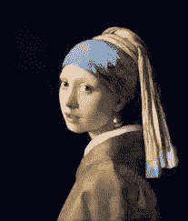
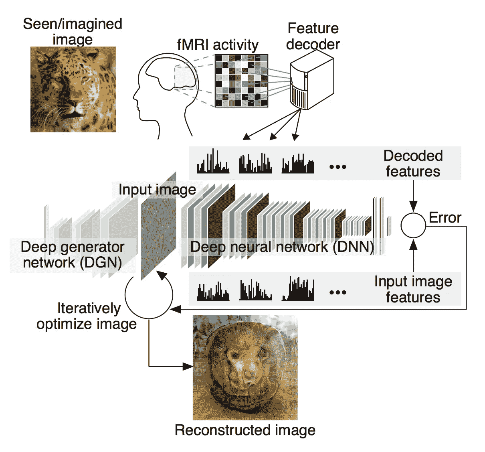
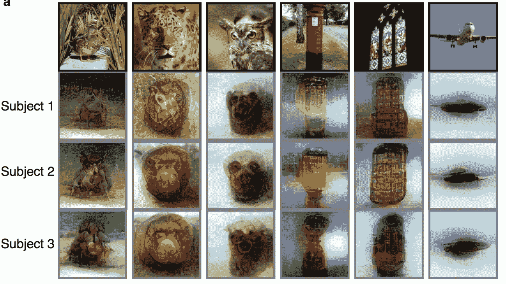

# “我在想什么？”—深度学习版

> 原文：<https://medium.datadriveninvestor.com/what-am-i-thinking-of-deep-learning-edition-24a5f04aa211?source=collection_archive---------24----------------------->

这真的有点像圣杯——如果我们能以某种方式找出所有大脑活动*实际上*对应的是什么，那么*将*改变一切，不是吗？由思想驱动的控制系统将从科幻变为现实🙌对隐私的滥用也是如此😡。也就是说，到目前为止，大脑对我们的探测是非常不透明的，所以我想未来仍然是未来，对吗？

也许在不久的将来。第一个破解来自于 [fMRI](https://en.wikipedia.org/wiki/Functional_magnetic_resonance_imaging) ，为了简化事情，实验者基本上把人放在 MRI 系统中，给他们看一张照片(比如说，一只豹子)，并记录大脑中发生的事情。
好消息是一堆东西会在大脑中亮起，同样的坏消息是*一堆东西会在大脑中亮起，没有人知道它意味着什么*。

一些研究人员对此进行了更科学的研究，他们会向受试者展示简单的东西，而不是豹子。例如，Kamitani & Tong 向受试者展示不同角度的直线，并记录 fMRI 结果。通过一些统计分析，他们能够更进一步，说类似于“*是的，受试者在 45* *角*看到了一个边缘”。
这很快[扩展到建立整个数据库](https://www.nature.com/articles/nature06713)(***大脑中的这个*** *图案意味着病人 X 看到了弗米尔的《戴珍珠耳环的女孩*》)。很好的东西，但离一般化还有很长的路要走，主要是因为
**a)你只能识别已经在数据库中的东西，而
**b)** 每个数据库都是病人特定的。**

**当然，这正是深度学习(DL)发挥作用的地方。早在 2017 年(那是大约一个世纪前的 DL 年)，[堀川&神谷](https://www.nature.com/articles/ncomms15037#ref14)使用深度神经网络(DNN)来绘制 fMRI 在受试者大脑中看到的内容与受试者正在看的图像之间的关系。更重要的是，他们发现视觉特征的复杂程度(想想*脸*对*椭圆*)直接映射到视觉皮层中大脑区域的分级刺激——这似乎意味着大脑逐渐招募视觉皮层的分级区域来解码(复杂！)眼睛所看到的任何东西的视觉特征。**

**这就把我们带到了现在，当[堀川&神谷](https://www.nature.com/articles/ncomms15037#ref14) ⁴(又来了！)把整个事情又向前推进了一步。他们找到了一种方法来重建视觉皮层“看到”的图像！
这里的诀窍是由[阿拉温德·马亨德兰和安德里亚·韦达尔迪](https://arxiv.org/abs/1412.0035) ⁵完成的工作，他们在 2015 年进行了反向的基于 DL 的图像识别，即通过查看图像在 DNN 中“表示”的方式，他们可以找出源图像是什么。**

**在这一点上的类比应该是清楚的，不是吗？fMRI 向我们展示了数据在大脑神经网络中的“表现”方式。Mahendran/Vedaldi 的技术可用于从这种编码中重建原始图像！**

****

**/via [https://www.biorxiv.org/content/biorxiv/early/2017/12/30/240317.full.pdf](https://www.biorxiv.org/content/biorxiv/early/2017/12/30/240317.full.pdf)**

**好吧，这比那要复杂一点。毕竟，大脑的神经网络实际上与 DNN 是不一样的，对吗？堀川&神谷解决这个问题的方法是用同样的图像训练另一个 DNN*。引用一下，***

> **重建算法从随机图像开始，迭代优化像素值，使得输入图像的 DNN 特征变得类似于从跨越多个 DNN 层的大脑活动解码的特征。**

**还有更多，更多，详情请看报纸。虽然显示了三个主题的结果，但很有趣——你可以清楚地看到特征、颜色和纹理的复杂程度。这里没有显示，但识别字母的结果甚至更好——可能是因为它们只涉及边缘检测和基本形状。
(顺便说一下，一些图像像“照片底片”的原因是亮度信息在 fMRI 到 DNN 的转换中丢失了)**

****

**/via [https://www.biorxiv.org/content/biorxiv/early/2017/12/30/240317.full.pdf](https://www.biorxiv.org/content/biorxiv/early/2017/12/30/240317.full.pdf)**

**确实是有趣的时代——按照这种速度，我们可能要开始考虑这个领域的隐私问题了！**

1.  **“ [*解码人脑的视觉和主观内容*](https://www.nature.com/articles/nn1444)”——神谷幸康、童**
2.  **[*从人脑活动中识别自然图像*](https://www.nature.com/articles/nature06713)——凯等人。**
3.  **“ [*使用层次视觉特征对看到和想象的物体进行一般解码*](https://www.nature.com/articles/ncomms15037#ref14)”—作者 Tomoyasu Horikawa 和 Yukiyasu Kamitani**
4.  **“[从人脑活动中进行深度图像重建](https://www.biorxiv.org/content/biorxiv/early/2017/12/30/240317.full.pdf)”——作者 Tomoyasu Horikawa 和 Yukiyasu Kamitani**
5.  **" [*通过反转理解深层图像表现*](https://arxiv.org/abs/1412.0035) " —作者 Aravindh Mahendran 和 Andrea Vedaldi**

***(* [*这篇文章也出现在我的博客上*](https://dieswaytoofast.blogspot.com/2018/10/what-am-i-thinking-ofdeep-learning.html) *)***