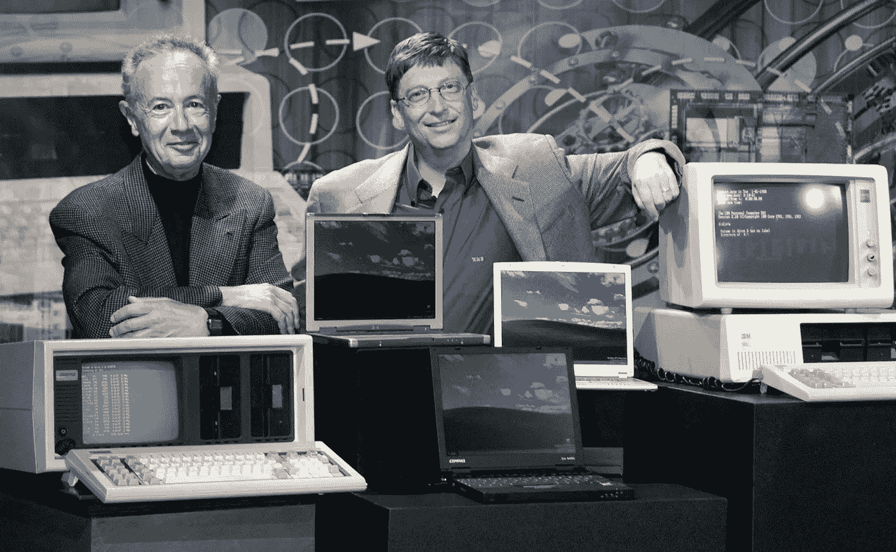
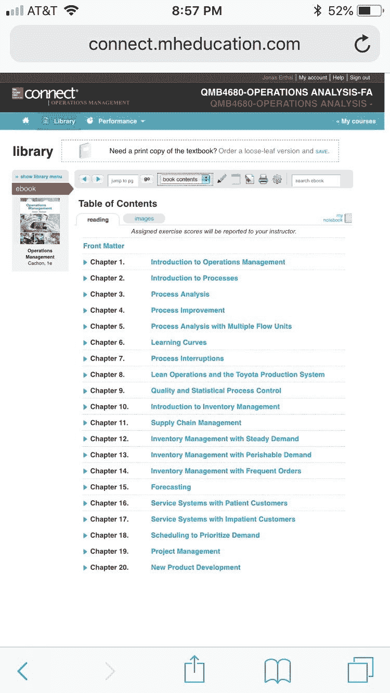
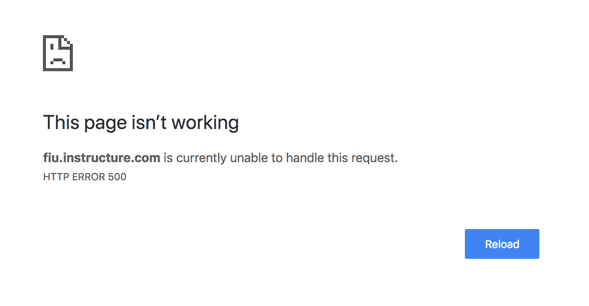
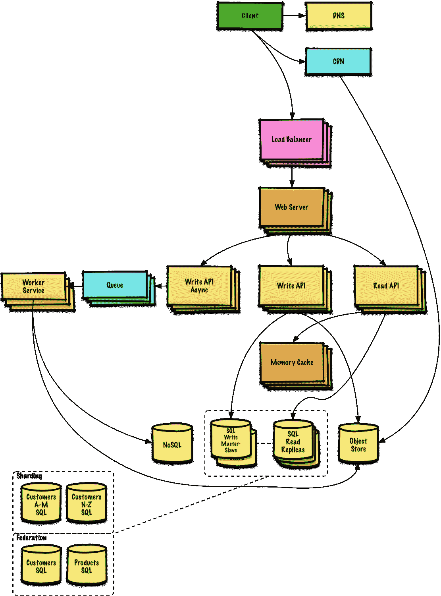

# 安迪给的，比尔拿走的:今天的软件质量

> 原文：<https://medium.datadriveninvestor.com/what-andy-giveth-bill-taketh-away-todays-software-quality-d33f1e92fb3e?source=collection_archive---------7----------------------->

Image from Fortune Magazine

1997 年，超级计算机“深蓝”在运算上超越了国际象棋特级大师加里·卡斯帕罗夫，这是一个奇迹。与今天的计算机相比，深蓝是一台庞大笨重的机器，其性能独树一帜。这台机器被宣传为“人工智能”革命的一部分，它以 11.8 [GFLOPS](https://en.wikipedia.org/wiki/FLOPS) 的计算能力强行完成了所有的国际象棋获胜计算。

哇！11.8 GFLOPS！太不可思议了！

对于 1997 年的这种尺寸和独创性的机器来说，它确实是。但是今天呢？

**iPhone X 以 600 GFLOPS 的速度上市。**

为什么要提出像 FLOPS 这样令人讨厌的指标呢？是的，我们都知道，在过去的半个世纪里，我们的硬件处理能力有了指数级的提高。那是摩尔定律！

但是除了摩尔定律之外，还有一个定律在今天更为相关，但并不为人所知:[安迪和比尔定律](https://en.wikipedia.org/wiki/Andy_and_Bill%27s_law)。

> 安迪给的，比尔拿走了

这是一句有趣的台词，因为它道出了真相。英特尔传奇首席执行官安迪·格罗夫领导他的公司创造了世界上功能最强大、应用最广泛的微处理器。比尔·盖茨和微软一起编写软件来吸收所有的处理能力。安迪会创造更强大的处理器，所以比尔也会用光它，如此循环往复。

随着硬件上有了更多的“喘息空间”，软件性能变得越来越不重要。如果你是 20 世纪 90 年代的微软，拥有近乎垄断的业务，你就更不会关心它了。谁没有在使用微软 Office 时感到沮丧？我们甚至不要进入 Windows 操作系统和 Internet Explorer 的某些迭代。

安迪和比尔定律在今天的软件生态系统中更加重要，因为它已经渗透到许多广泛使用的生产代码中。甚至许多软件开发人员都没有意识到这一点！我们认为编写程序的硬件是理所当然的，最终会写出不合格的代码，只是因为我们可以侥幸逃脱。

但它确实会影响软件用户。

我写这篇文章是因为我最近遇到了一些问题，特别是在教育领域。以下是一些例子:

# McGraw-Hill 是一家出版商，它试图为学生提供数字服务，就像穴居人试图在量子计算大会上向你推销石头一样。

当我通过 McGraw-Hill 购买一本教科书的(数字)版本时，我发现如果没有安全连接，我无法在线访问它:

我为此花了 140 美元。这不仅对于 web 开发标准来说是不可接受的，用户界面也是垃圾。如果我想在手机上阅读我那本超贵的书，我也不能，因为它不支持手机:

出于显而易见的原因，我尽量不显示任何包含我 140 美元在线书籍内容的页面。

页面滞后，图像加载时间过长。我发现自己在使用平台时经常抱怨，这使我脱离了我的“学习体验”。

当手机上有 **1 星**和*时，我为什么要下载手机应用程序，我最不想做的就是下载并安装另一个应用程序？*

最重要的是，它的许多在线服务仍然运行在 Flash 上，而 Flash 已经过时，无法在移动设备上使用。甚至 Adobe 也停止了这方面的工作。

# Canvas LMS 的稳定性也很差。

虽然学习管理系统不会被归类为“任务关键型软件”，但它对于学生的使用来说无疑是至关重要的，尤其是当所有课程的评分和跟踪都通过该平台完成时。简而言之，你真正昂贵的高等教育学位受制于别人的系统架构。我认为这绝对很重要。

当我试图在一个普通的工作日晚上访问 Canvas 时(大多数学生都应该使用这个软件)，我得到了一个内部服务器错误:

这件事发生在晚上的大部分时间里。对于一个学习管理系统(而且是一个昂贵的系统)来说，这不应该发生。

这并不像 Instagram 崩溃时那样，我会惊慌失措地哭泣，因为我看不到我的闺蜜们今天吃了什么早午餐。我感到沮丧，因为我有重要的工作要做。

Canvas 对此的回应是什么？完全没有。没有一条推文通知他们遇到了问题，也没有来自大学的电子邮件为不便道歉。不，就像从来没有发生过一样去面对崩溃吧！

我不确定运行这些系统的大多数人是否知道，但是一个好的软件架构是复杂的:

什么？他们认为他们可以永远用一个基本的整体作为他们的设计吗(对不起，我仍然爱你 Ruby on Rails)？*“CRUD 应用如此简单！”*是的，如果你正在黑客马拉松上构建一个原型。如果你是为了规模和性能而设计，就不会。

# 那么这有什么意义呢？

很明显，我不是那些遭遇劣质软件的最开心的人。但我不指望 Canvas LMS 和 McGraw-Hill 会很快做出革命性的改变。

我希望能接触到其他软件开发者和决策者，尤其是那些刚刚起步的人。不要“带走”。对你的软件质量要明智！“我的经历如何衡量？”，“功能对 XYZ 有多重要？”“我们系统架构的故障保险是什么？”。关于影响代码性能的抽象和面向对象编程的明显问题，还有更深入的讨论，但是这些可以留待以后讨论。

现在，你只需要问自己，“我想成为网络探险家吗？”