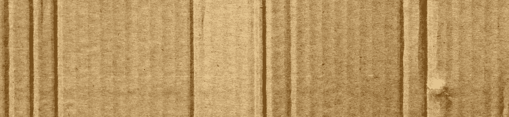

# 什么是亚马逊清算？

> 原文：<https://medium.datadriveninvestor.com/what-are-amazon-liquidations-e1c8b283df13?source=collection_archive---------33----------------------->

## 你有没有想过亚马逊是怎么处理他们退回的所有商品的？他们很少把它们放回市场..

*最初发表于*[*【millennialmoderator.com】*](https://millennialmoderator.com/what-are-amazon-liquidations)*。*

当有人从亚马逊收到一件商品，但不满意时，他们通常会退回。原因可能是产品不是他们所期望的，列表中的描述不准确，或者他们只是决定他们不需要它-甚至没有打开它。我说的是从苹果手机到毛衣、电器、玩具等等。

当亚马逊收到这些退货时，他们很少会把商品放回库存(质量保证等等)。那么他们到底用这些钱做什么呢？他们把它们打包，然后拍卖给出价最高的人！请注意，这不**不**包括那些直接坏掉的产品——我很确定那些会报废。

# 亚马逊清算

亚马逊与各种商业客户合作，向他们出售这些积压的退货库存。然后，这些经销商将各种产品进行分类，并拍卖给出价最高的买家。这是一个非常有趣的商业模式，产品本身是物有所值的，因为它们很容易获得。

[Liquidation.com](https://www.liquidation.com/c/SourcedFromAmazonLiquidations)就是这样一个亚马逊合作伙伴，拍卖这些清算的箱子，可以根据类别、条件、大小、价格等等进行筛选。有一段由萨菲娅·尼加德制作的有趣的视频，它出现在一个清算箱的开箱过程中。

# 含义

你可以利用这些信息做你想做的事情，但我认为在[假日购物](https://millennialmoderator.com/5-unique-holiday-sweater-ideas)、家电购物、服装购物等方面有很大的潜力！Liquidation.com 的[还包括一份货单，它会准确地告诉你箱子里会有哪些物品。虽然有些商品的标签很笼统，比如“健康美容什锦”，但其他商品都有确切的产品年份、型号、类型等。](https://www.liquidation.com/c/SourcedFromAmazonLiquidations)

除了实际用途，这些亚马逊清算可能只是一个有趣的方式来度过你的周末-与你的朋友一起挖掘随机的东西。价格明显低于建议零售价，所以你有什么损失？

你在亚马逊清算公司订过东西吗？在[推特](https://twitter.com/alekseyweyman)上和我分享吧！

标记为:[科技购物](https://millennialmoderator.com/what-are-amazon-liquidations#)

*最初发表于*[*millennialmoderator.com*](https://millennialmoderator.com/what-are-amazon-liquidations)*。*