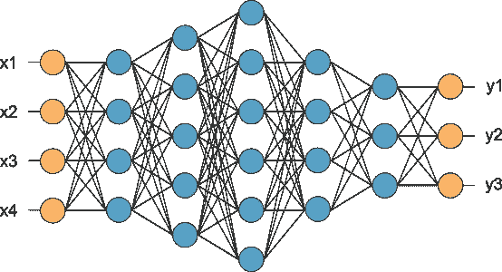

# 什么是人工神经网络？

> 原文：<https://medium.datadriveninvestor.com/what-are-artificial-neural-networks-really-ceb3108d0888?source=collection_archive---------8----------------------->

(Source: quora.com)

在过去的几年里，机器学习一直是一个受到很多关注的话题，部分原因是计算机硬件和软件的改进使这种概念的实验能够像我们希望的那样便宜。

每当我们谈论机器学习时，深度学习这个术语都会以这样或那样的方式出现。这是因为后者彻底改变了我们思考和应用机器学习更广泛方面的方式。

# 生物神经网络

A biological Neuron (Source: Wikimedia.org)

想想我们最不了解的东西——人类的大脑——是什么决定了我们作为人类的效率，这是非常重要的。一组数十亿个相互紧密连接的小组件(称为神经元)，它们交换电信号，电信号的值决定了周围的神经元应该与它们的邻居交换什么。这种主同步性描绘了大脑中的思想和记忆是什么。

# 人工神经网络

了解人类大脑能力的神经科学家和计算机科学家意识到，向世界介绍这种生物杰作的人工形式绝对没有好处。这种人工形式——被称为*人工神经网络*(ANN)——看起来像下面这样:

(Source: Houseofbots.com)

如果我们彻底观察，人工描绘仍然由我们谈到的小组件(神经元)组成，并且它们中的每一个都与几个相邻的组件相连。这种人工神经网络是通过代码构建的，从某种意义上来说，整个过程只需要一次调用就能产生效果(一个对模型的函数调用)。

值得一提的是，许多人认为生物和人工神经网络之间的相似之处仅限于此，强调人工神经网络只是看起来像大脑的任何一个非常小的部分，但并不像它一样，这归因于我们仍然没有完全理解大脑如何工作的事实——作为一个整体。

# 但是，我们为什么要经历这些麻烦呢？

是的，大脑的这种简单的表现形式可能会导致很多关于大脑如何工作的争论和错误信息，但它已经彻底改变了计算世界。从图像分类到语音和面部识别，大多数科技巨头已经将人工神经网络的概念应用到他们的应用中。在机器学习中，我们的目标总是构建一些能够很好概括的东西。这意味着我们不断尝试构建一个程序，并很好地训练它(通过调整数学函数和术语)，以便它可以对它从未见过的新输入做出*假设*。然而，我们经常面临的一个缺点是，许多应用不能局限于一个线性函数。也就是说，并非所有应用程序的输入和输出都在同一条线上。此外，一个数学函数不可能总是以一种能够预测真正复杂问题的方式来建模。

这就是人工神经网络发挥作用的地方。如果我们想到一个程序(或模型)可以预测房价，但不能很好地概括，我们可以引入一些非线性复杂性，并尝试在一定程度上完善新形成的组合。这就是人工神经网络。我们将我们的房价预测器复制到一个信息中(人工神经网络架构)，并将这些副本与显示一个对另一个有多重要的变量(权重)联系起来。在这种情况下，人工神经网络中的人工神经元扮演了复制品的角色。

# 人工神经网络的类型

人工神经网络有几种类型和形式，取决于两个因素:网络架构和激活。网络架构(即拓扑)是神经网络的设计方式。这包括神经元/节点的数量、层数以及这些神经元如何相互连接。激活包括神经元用来决定向邻近神经元提供什么输出的功能。不同的人工神经网络相似，但也有很大的不同。它们在概念上是相似的，因为它们遵循相同的理论背景，并且需要几乎相同的知识。然而，它们在应用的方式上是不同的。例如，由于卷积在图像处理领域的有效性，大多数图像分类应用包括卷积神经网络(CNN)。另一方面，语音识别应用严重依赖递归神经网络(RNNs ),因为没有其他体系结构以如此富有成效的方式表示顺序数据。

人工神经网络已经将机器学习引入到以非线性方式建模分类器的效率中。这改变了我们对复杂机器学习和模式识别问题的思考方式。