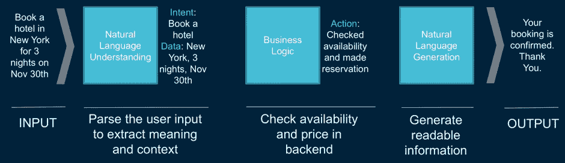
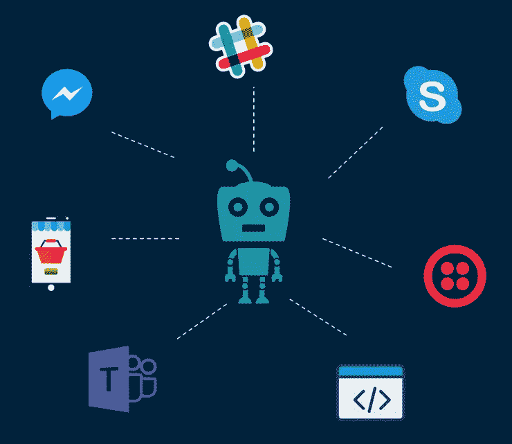

# 什么是聊天机器人？它们为什么重要？

> 原文：<https://medium.datadriveninvestor.com/what-are-chatbots-why-are-they-important-fce99cf934f7?source=collection_archive---------22----------------------->

聊天机器人是一种软件应用程序，它能让你通过语音或文本用自然语言与它们互动，从而简化人机之间的互动。与响应特定命令集的常规应用程序不同，与聊天机器人的交互将使用外行人的语言，就像人与人之间的对话一样自然。

聊天机器人近年来变得非常受欢迎，这主要是由于自然语言处理(NLP/NLU)和消息应用程序开放了他们的聊天机器人部署平台。今天的聊天机器人将会更聪明、反应更快、更有用。聊天机器人将是继移动应用程序之后的下一个革命性的东西。预测显示，到 2020 年，预计超过 80%的企业已经实施了某种聊天机器人解决方案。

像苹果、亚马逊、微软和谷歌这样的大公司已经开发了聊天机器人，并以 Siri、Alexa、Cortana、Assistant 的形式广泛使用。

这些超级机器人能够理解广泛的用户请求。另一方面，为个人和企业用例构建的聊天机器人将具有根据用户/业务需求定制的专门功能。出于显而易见的原因，为企业打造的聊天机器人不需要提供天气更新，同时苹果的 Siri 也不能提供客户订单的状态。

**Bot 数据流:**

上图描述了数据如何在用户和机器人之间流动。用户开始对话，请求 bot 在 11 月 30 日预订纽约的一家酒店，住 3 晚。基于用户输入，机器人理解用户的意图，在这种情况下是预订酒店。理解用户的请求/意图是聊天机器人的第一步，也是关键的一步。聊天机器人的核心 NLU 使这一切成为可能。

一旦 bot 理解了用户的请求，它就会让用户参与对话，以获取与请求相关的附加信息。为了简单起见，在上面的场景中，用户输入在一个语句中包含了所有的旅行细节。这在真实世界场景中是不真实的，机器人必须通过让用户参与对话来从用户那里获得所有需要的旅行细节。

一旦 bot 获得了与请求相关的所有必需的细节，它就用必需的参数调用 backend，在本例中是旅行日期、持续时间和目的地。后端处理请求并将其响应发送给 bot，bot 又以人类可读的格式呈现给用户。

**Bot 整合渠道:**

除了将聊天机器人与网站或移动应用程序集成之外，它还可以与消息平台集成。研究表明，普通用户将 80%的移动时间花在消息平台上。通过将聊天机器人与信息平台相结合，联系客户将变得容易，这有助于吸引新客户和留住现有客户。各种消息应用程序都开放了他们的聊天机器人部署平台，这也是最近聊天机器人流行的原因之一。Skype、Slack、Microsoft Teams、Facebook Messenger、Twilio 等等都支持聊天机器人的部署。

**好处:**

*性价比:*

实施聊天机器人比实施软件解决方案或为每项任务雇佣员工更便宜、更快捷。IBM 估计，到 2020 年，聊天机器人每年将为企业节省 80 亿美元。除了节省员工成本，使用聊天机器人还可以避免人为错误。为重复性任务部署聊天机器人使我们能够将人力集中在复杂和必要的任务上。

*快速反应:*

尽快响应客户的询问是提高客户满意度的关键因素之一。聊天机器人可以在几秒钟内回复用户，如果是人类来回答客户的询问，这几乎是不可能的。当人们打电话给客户服务中心时，平均要花 7 分钟才能有代理为他们服务。通过部署聊天机器人，客户将立即得到服务。像 TacoBell 和 Dominos 这样的公司已经在使用聊天机器人来接受顾客的订单。

*登机更快:*

聊天机器人的实现和部署速度比人类员工更快。毫不夸张地说，由于各种 bot 开发平台和消息通道对 bot 部署的支持，可以在几天内开发出具有基本功能的聊天机器人。另一方面，雇佣和雇佣员工需要很长时间。

*供货情况:*

随着业务的全球扩张，全天候可用性对于提高客户满意度至关重要。由于聊天机器人是虚拟助手，它们连续 24 小时工作，不需要休息。

*容量处理:*

聊天机器人可以高效地处理大量客户，这是人类无法做到的。与一次只能与一个用户交流的人类不同，聊天机器人可以一次与多个用户交流。随着业务的不断增长，让人类为客户服务将是一项艰巨的任务，而聊天机器人可以立即为每个客户服务。聊天机器人还让我们能够灵活地扩展服务器，以满足高峰时段/白天的流量需求。

*数据收集:*

聊天机器人使我们能够监控用户与聊天机器人的互动，并收集数据、趋势、指标等。这使我们能够调整我们的流程和响应，以增强用户体验。