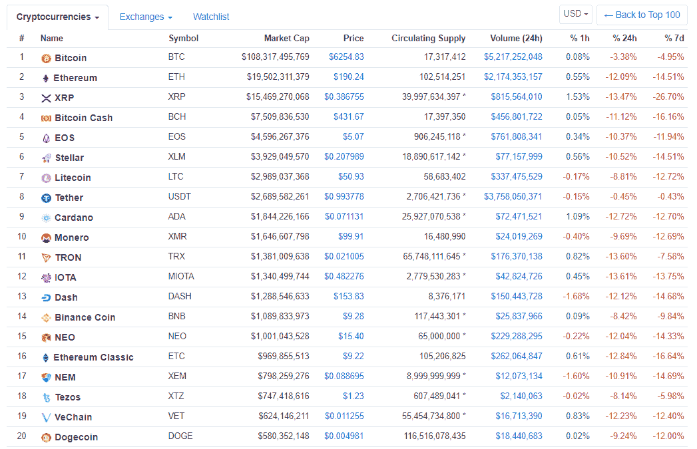

# 加密货币和区块链到底是什么？让我们理解大惊小怪！

> 原文：<https://medium.datadriveninvestor.com/what-are-cryptocurrencies-and-blockchain-exactly-about-lets-understand-the-fuss-47fd7d91d78b?source=collection_archive---------17----------------------->

加密货币和区块链是两个被广泛使用但却鲜为人知的术语。加密货币及其与区块链技术的集成是一个广阔的探索领域，因为它是成熟技术、虚拟价值和互联网的结合。

区块链是一种去中心化的技术，不受集中机构的控制，公开运行，同时以数字账本的形式存储其链中处理的所有交易。在这种技术上进行的交易具有计算机化的特定价值的面额，并被称为“加密货币”。

让我们用一种更简单的形式来理解这一点，比特币[BTC]加密货币世界最广为人知的术语是一种数字形式的货币。它运行在区块链技术上，BTC 的所有交易都存储在公开的区块链上。

例如:当甲与乙进行价值 100 美元的 BTC 交易时，该交易的历史记录被记录并保存在区块链的分类账中。每个块存储特定数量的数据，并连接到链中的下一个块。有验证交易的节点[计算机],它们检查 A 是否有 100 美元要发送给 B，并且通过解决允许它验证的数学难题来检查交易是否有效。

此外，交易被验证并完成，因为它被存储在区块链上。已批准的交易不能被篡改或更改，因为这将表明以后进行的交易必须重新进行。

任何人都可以看到 A 和 B 之间的这一 100 美元的 BTC 交易，尽管除了参与者的钱包地址之外，参与者的姓名、年龄、位置或任何个人详细信息都不会显示在网络上。

金融科技、银行、农业和更多行业也在利用和探索区块链的多种使用案例。除了对用户的交易价值，比特币还可以用于购买、出售和交易货物/商品。

由于许多公司受到比特币技术的启发，他们自己找到了自己的加密货币，并进一步引领这一游戏。市场上一些加密货币的例子有以太坊[ETH]、XRP [XRP]、比特币现金[BCH]、恒星流明[XLM]等。这些加密货币基于自己的技术，模仿比特币的区块链。

由于加密货币的波动性，加密货币市场图表不断变化，正常的一天看起来像这样:

根据经济学原理，每种加密货币都有特定的价值。他们的价格根据他们的需求和供给比率不断波动。需求越少，价格跌得越低，需求越高，价格涨得越多。需求取决于各种经济因素，正如在加密货币中观察到的那样，需求因素与传统因素略有不同。受欢迎程度、媒体影响、技术进步、政治广告、安全、社会采用等因素起着重要作用。

考虑到所有影响需求的因素，并出于投资目的分析记录的图表，这在人力上是不可能的。因此，人们依赖于一些洞察力提供者和投资组合经理，或者仅仅依靠他们自己对市场的理解。

这就是大惊小怪的原因。有什么问题我可以回答吗？给我的社交网络账户打电话。

结束，希望你们都有一个伟大的阅读！