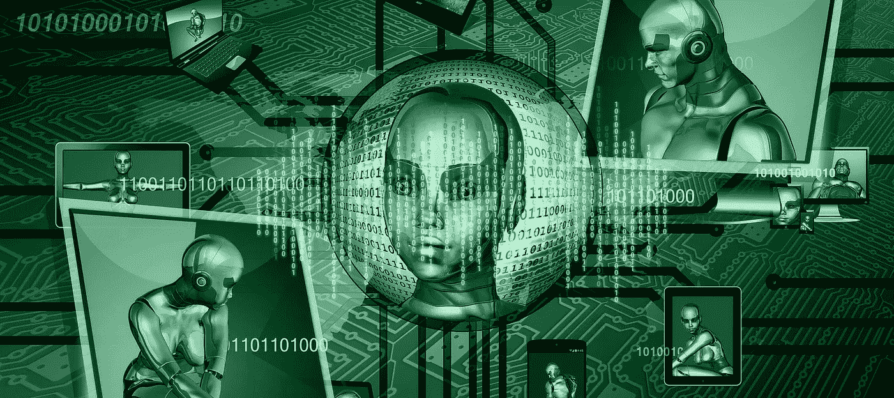
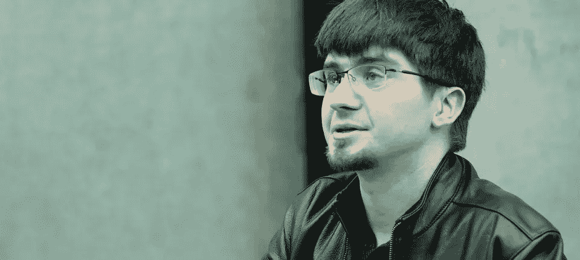
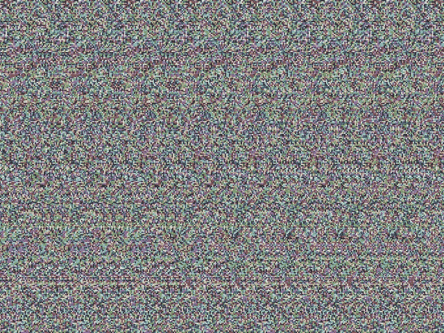
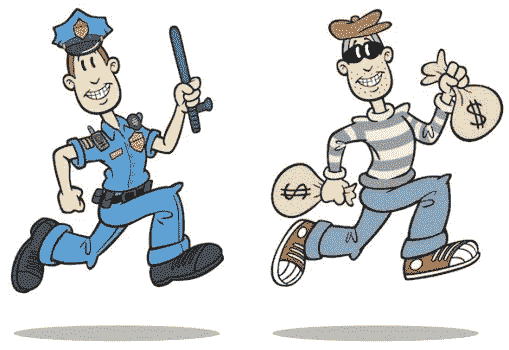

# 什么是生成性对抗网络？

> 原文：<https://medium.datadriveninvestor.com/what-are-generative-adversarial-networks-60ab7a1609f8?source=collection_archive---------6----------------------->

尼尔·阿姆斯特朗曾说过:“神秘创造奇迹，而奇迹是人类渴望理解的基础。”这是一件令人惊奇的事情，不是吗？创造力是想象力的简单展示。这样不可思议的能力很少被发现，但是机器学习证明两个人可以玩这个游戏。

Ian Goodfellow — GAN pioneer

# 那些是什么？

进入 GANs(Generative Adversarial Networks)，这是 Ian Goodfellow 和他的同事在 2014 年创建的机器学习领域的一项改变游戏规则的创新。简单来说，GAN 是由两个神经网络组成的生成模型，可以用来创建图像、音乐等图像。GANs 通过一个生成器和鉴别器学习，并使用一种叫做对抗学习的方法。

# 鉴别器是如何工作的？

鉴别者的工作是观察一段可能来自原始数据集或来自生成器的数据，并且必须决定它是真的还是假的。本质上，鉴别器是一个分类器神经网络，也用于面部识别和语言翻译。关于判别模型的事情是，它不关心数据是如何产生的，它的唯一目的是将给定的输入分类为 1 或 0。

Random Noise Input

# 发电机是如何工作的？

生成器是一种神经网络，可以生成类似真实示例的新数据。与鉴别器不同，生成器会考虑数据是如何生成的，并提出问题“哪个类别最有可能生成此信号？”虽然发生器得到随机噪声作为输入，然后生成图像，但某些随机噪声输入将提供输出的某些特征。

 [## DDI 编辑推荐:5 本让你从新手变成专家的机器学习书籍|数据驱动…

### 机器学习行业的蓬勃发展重新引起了人们对人工智能的兴趣

www.datadriveninvestor.com](https://www.datadriveninvestor.com/2019/03/03/editors-pick-5-machine-learning-books/) 

# 酷…那又怎样？

嗯，这两个神经网络一起工作建立一个 GAN。本质上，GAN 是鉴别器和发生器之间的**游戏**，为错误率而战。鉴别器想要低错误率，而生成器想要高错误率。生成器试图愚弄鉴别器，而鉴别器试图不被愚弄。然后使用鉴别器的**梯度**来帮助训练发生器，使得它们都得到改善。

# 那是什么意思？

让我们找一个更简单的方法来想象一下。让我们把生成器想象成一个没有经验的伪造者在印假币。让我们也把鉴别者想象成一个刚完成识别假币训练的菜鸟警察。有时伪造者会把假钱贴上真钱的标签来愚弄警察。但是，警察能够区分他们，不会被愚弄，并开始在工作中获得一些经验。因此，伪钞制造者再次尝试，但更加努力地工作，使得区分钞票变得更加困难。当警察和伪造者在他们各自的工作中越做越好的时候，这个过程重复进行。

# 但是梯度下降和什么有关呢？

让我们回到警察和伪造者的例子来解释梯度下降。在这个虚构的场景中，让我们假设警察腐败，警察希望伪造者在工作中表现出色。所以现在，每次伪造者失败后，警察都会给伪造者一些建议，告诉他如何达到让警察更加迷惑的目的。需要理解的重要一点是，对于真实的 GAN 模型,“建议”实际上是数学权重调整，而不仅仅是是好还是不好。

# 我应该从这篇文章中得到什么？

人工智能是目前世界上的一件大事，而机器学习是其中的一个重要分支。事实上，机器学习工程师的需求如此之高，以至于进入该行业的门槛越来越低，以至于没有正式学位也可以找到工作。机器学习是下一个大事情，我相信 GANs 是智能图像生成的下一个大步骤。

*   生成对抗网络(GAN)是由两个神经网络组成的生成模型，可用于创作照片和音乐等艺术作品。
*   GANs 通过使用发生器和鉴别器来学习
*   梯度下降用于通过关注它之前有多远来改进发生器