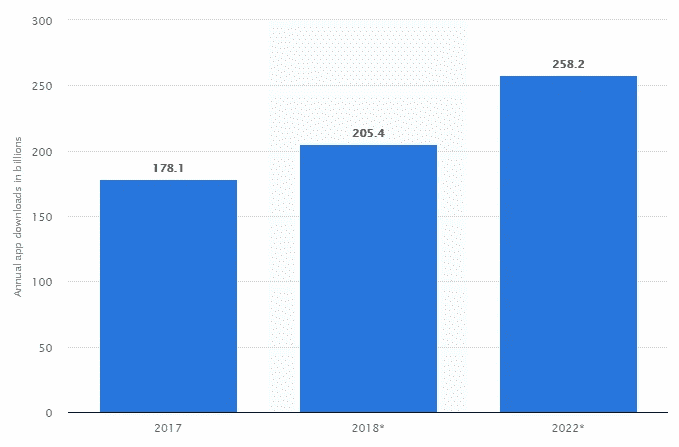

# 什么是重要的移动应用指标，如何计算？

> 原文：<https://medium.datadriveninvestor.com/what-are-important-mobile-app-metrics-and-how-to-calculate-them-a04de097b0a0?source=collection_archive---------2----------------------->

你发布了你的手机应用，接下来呢？当然，测量。你创建一个移动应用程序并不是为了说你有它，而是为了对你的业务有用。要了解你的应用带来的成本和收入之间的差异，最好的方法是通过计算不同的指标。我将向你解释其中的一些，并给你一些公式，你可以用它们来计算你的应用程序的成功率。

## **1。下载数量**

下载量是显示有多少用户参与你的应用的有力指标。每次当用户在新设备上安装你的应用时，它都被计为一次新的下载。

Source: Statista -Number of downloaded mobile apps in billions

但是如何统计哪个下载次数是你有收入所必需的呢？

这真的取决于你的收入目标。一些近似的衡量标准必须包括你每月的目标除以你在应用内购买的价格(我们将其标记为 a)。接下来你需要的是对将会遇到转换杠杆的用户的估计，用数字表示(即 10% = 0.10).我们称之为 b。你需要的第三件事是，实际购买的用户的百分比，并用数字表示。如果你在使用它们之前有一些数据，如果没有，让我们把这个数为 5%，用 c 标记。

下面是帮助你达到目标的公式:

*每月所需下载量:a * (1/b) * (1/c)*

## 2.每日活跃用户(DAU)和每月活跃用户(MAU)

一旦你知道你有多少下载量，你就应该知道你每天和每月有多少活跃用户。有人安装了你的应用并不意味着他们会使用它。该指标统计有多少人使用你的应用，它与每日活跃会话无关，而是与每天/每月使用你的应用的真实人数有关。

*DAU =一天内打开你的应用的个人用户数量*

*MAU =一个月内打开你的应用的个人用户数量*

DAU 和 MAU 超过 20%的应用被认为是好的，而超过 50%的应用被认为是例外。

## 3.每个 DAU 的每日会话数

每日会话显示用户一天内打开你的应用的次数。这可以帮助你了解你的用户是否像你希望的那样频繁地回到你的应用程序。例如，社交网络喜欢看到他们的用户每天打开应用几次。

*一天的会话数(或时间段内的平均每日会话数)/一天的独立活跃用户数(或时间段内的平均 DAU 数)= DAU*

## 4.粘性

粘性是指有多少人返回你的应用程序。用这个数除以 DAU 和毛。百分比越高，返回你的应用的用户就越多，他们对你的参与度就越大。

*DAU/MAU =粘性率*

10000 名每日活跃用户/ 5000 名每月活跃用户= 50%

## 5.保留率

这一指标向你展示了你的应用留住了多少客户。您将放入公式中的数字取决于您要测量的内容，但是您要比较的是最近一段时间内(例如本月)的用户数量与更早一段时间内(例如上个月)。

保留率:

*在设定的时间段内使用你的应用的人数/在之前设定的时间内使用你的应用的人数*

## 6.流失率

这是一个与保留率相反的指标。此指标显示有多少用户离开了你的应用。如果你的大部分用户都属于这个群体，这对你来说是个大问题。你最活跃的用户就是最赚钱的用户。你可以通过从 1 中减去你的留存率来计算流失率。

例如:

*1 —留存率=流失率*

1- 0.20 = 80%的流失率

## 7.崩溃次数

一些崩溃显示了你的应用程序在用户使用时突然关闭的次数。它们是应用程序性能问题的结果。这个数字应该是最小的，为了做到这一点，你应该在开发期间进行大量的测试来防止它。崩溃次数越多，客户流失率越高。

以下是计算方法:

*(崩溃发生的次数)/(总次数)*100*

**8。在苹果应用商店和谷歌 Play 商店的排名和评价**

应用评级是了解用户对你的应用评价的最简单快捷的方式。这可以吸引更多的用户，或者阻止他们下载你的应用。用户通常会在下载应用程序之前检查其评级，因此请确保您的应用程序具有良好的评级。

你的应用排名显示了你的应用在商店中的可见性。由于大多数用户在商店内搜索时会下载应用程序，算法会将那些排名较好的应用程序放在更高的位置，使它们更容易被用户看到。下面是 App Store 如何统计[排名](https://moz.com/blog/app-store-rankings-formula-deconstructed-in-5-mad-science-experiments)。

## 9.每次收购成本

这个指标衡量你需要支付多少才能得到一个活跃的付费用户。这些成本可能包括营销成本，主机或工资。

你需要根据你的收入目标来调整你的 CPA。你可能想让你的购买成本低于你的应用程序的价格。

*活动总成本/用户数量=每次收购成本*

## **10。投资回报(ROI)**

每个人都想计算他们整体移动营销努力的投资回报率，但这并不是一件容易的事情。你首先需要计算活动的成本，以及它如何影响你的利润。你必须决定你想关注的回报标准(即。净利润，毛利)。

*(投资收益—投资成本)/投资成本=投资回报率*

# 结论

这些是您应该遵循的一些指标，用于衡量您的应用程序性能以及它如何影响您的业务。在我的下一篇文章中，我将向您展示如何改进这些指标，以及如何充分利用您的移动应用程序。