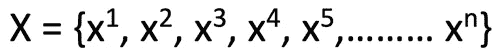
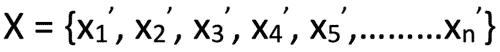
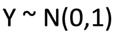
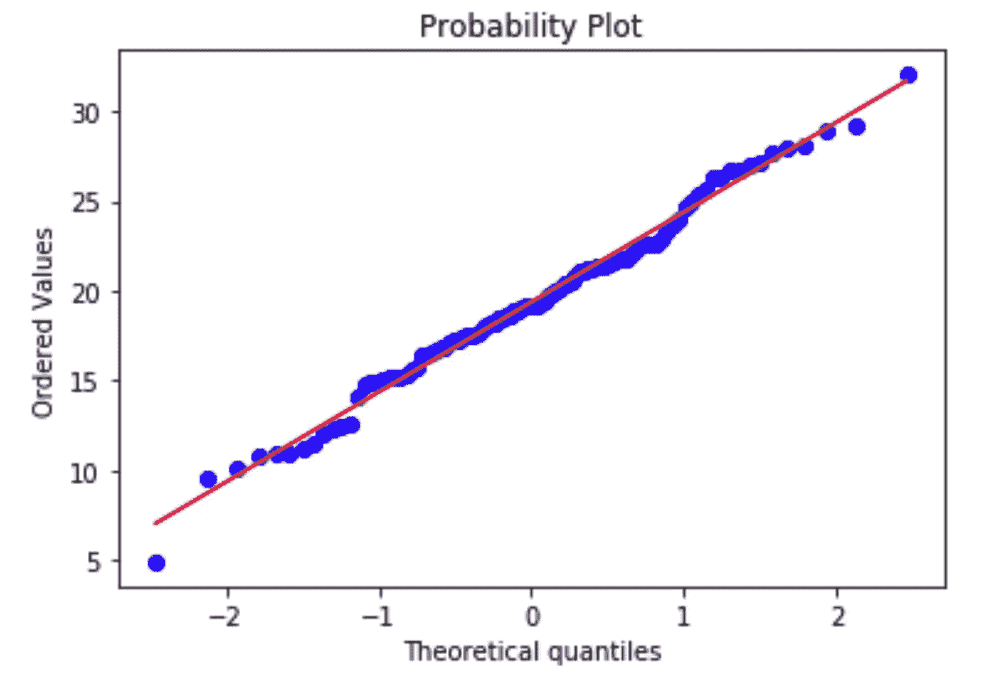

# 什么是 Q-Q 图？

> 原文：<https://medium.datadriveninvestor.com/what-are-q-q-plots-9c85a0bd7a14?source=collection_archive---------5----------------------->

在数据分析的真实场景中，最重要的部分之一是从可用数据中得出结论。由于数据收集在很多时候可能是一件非常昂贵的事情，因此尝试将可用的少量数据点作为众所周知和经过分析的分布的一部分进行拟合可能是应用预定义推理的有效方法。

检查可用数据集是否遵循分布的一种方法是绘制四分位数-四分位数图，通常称为 Q-Q 图。为了便于理解，下面的解释将检查可用数据是否正态分布。

 [## 数据科学和软件工程哪个更有前途？-数据驱动型投资者

### 大约一个月前，当我坐在咖啡馆里为一个客户开发网站时，我发现了这个女人…

www.datadriveninvestor.com](https://www.datadriveninvestor.com/2019/01/23/which-is-more-promising-data-science-or-software-engineering/) 

# 绘制 Q-Q 图的步骤

确定数据是否遵循正态分布的第一步是计算百分位数。

假设我们有一个包含以下数据点的集合 X:

第一步是为 x 的值创建一个按升序排序的列表，如下所示:

在我们将所有数据点的列表按升序排列后，我们需要计算上述列表的百分位值，并获得相同的百分位值(在这个场景中，我们取 100 个百分位值)。

现在，我们需要得到一个正态分布的集合(为了这个例子),如下所示，并计算这个列表的百分位数，类似于集合 x。

使得该分布的平均值为 0，方差为 1。

我们已经获得了这两个集合的 100 个值的列表(有序的 X 百分位数和来自 Y 的理论分位数)。将第一个列表视为 x 坐标列表，将第二个列表视为 y 坐标列表，我们将在图表上绘制这些点。这个图被称为 Q-Q 图。

# 绘图推理

如果图上的点位于一条直线上，那么我们可以很容易地得出结论，两组数据具有相似的分布(在这种情况下，我们可以说 X 是正态分布的)

# 限制

这种方法的一个主要限制是我们需要大量的数据点，因为根据较少的数据做出结论不是一个明智的决定。

# 结论

通过用期望的分布替换 Y 集，这个概念可以扩展到测试任何数据。分布的识别对于得出已经研究过的关于数据的推论是非常有用的。