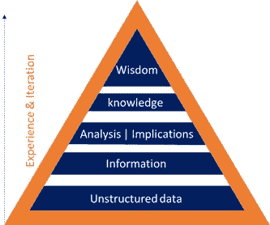

# 我们今天在 NLP 中面临的一些挑战是什么？

> 原文：<https://medium.datadriveninvestor.com/what-are-some-of-the-challenges-we-face-in-nlp-today-2e9d94da1f63?source=collection_archive---------0----------------------->

在 20 世纪 70 年代早期，执行复杂计算的能力掌握在人们的手中。手持计算器的发明节省了大量时间，因为这些小设备“理解”数字，并发展到拥有在数学、微积分、几何和统计中进行更高级计算的能力。今天，我们看到了自然语言处理(NLP)和自然语言理解(NLU)的类似道路，几家公司正在试验计算机和人类或自然语言之间的交互，以编程计算机成功处理大量自然语言数据。

曾经被认为是不可思议的，各种形式的 NLP 正在越来越多地自动化操作过程，从简单的，如回答 web 上的问题，到复杂的，如处理千兆字节的非结构化数据，生成术语，建立隐式连接，以及推断数据的上下文。

有趣的是，NLP 的工作方式相当人性化。当我们彼此交谈时，在大多数情况下，对话发生的背景或环境双方都能理解，因此对话很容易理解。然而，也有这样的时候，一个参与者可能无法正确地解释一个想法，相反，听者(信息的接收者)可能因为许多原因而无法理解对话的上下文。同样，除非经过适当和仔细的训练，否则机器可能无法理解文本的上下文。

对人类来说，幼儿时期的学习是以一种一致的方式发生的；儿童与非结构化数据进行交互，并将数据处理成信息。积累了这些信息后，我们开始分析信息，试图理解它在特定情况下的含义或特定问题的细微差别。我们明白，在某一点上，我们对我们的生活和环境有一种习得性的理解。只有在理解了含义之后，这些信息才能被用来解决一系列问题或生活状况。人类迭代多个场景，有意识或无意识地模拟一个解决方案是成功还是失败。经过对这些非结构化数据->信息->知识的实践，人类有望获得我们所说的智慧。

机器通过类似的方法学习；最初，机器将非结构化文本数据翻译成有意义的术语，然后识别这些术语之间的联系，最后理解上下文。许多技术共同处理自然语言，其中最流行的是 Stanford CoreNLP、Spacy、AllenNLP 和 Apache NLTK 等。

我们已经在 NLP 和机器认知方面取得了很大进展，但仍然有几个必须克服的挑战，特别是当系统中的数据缺乏一致性时。虽然这种不一致性实际上允许机器捕捉多样性和主观性，但它不是机器学习初始阶段的一部分。以下是 NLP 的机器学习过程中涉及的步骤和面临的一些挑战:

***断句***

正式称为“句子边界歧义消除”的这一打破过程不再难以实现，但仍然是一个关键过程，尤其是在包括结构化信息的高度非结构化数据的情况下。中断应用程序应该足够智能，能够将段落分成适当的句子单元；然而，高度复杂的数据可能并不总是以容易识别的句子形式出现。这些数据可能以表格、图形、符号、分页符等形式存在。需要对其进行适当的处理，以便机器能够以与人类解释文本相同的方式获得含义。

***标注词性并生成依存图***

人们理解，或多或少的程度；除了正式学习该语言之外，没有必要进一步理解对话或阅读中的各个词类，因为这些在过去已经学过了。为了让机器学习，它必须正式理解每个单词的适合度，即单词如何在句子、段落、文档或语料库中定位。一般来说，NLP 应用程序使用一组词性标注工具，这些工具将词性标记分配给给定文本中的每个单词或符号。随后，每个单词在句子中的位置由在相同过程中生成的依赖图来确定。这些 POS 标签可以被进一步处理以创建有意义的单个或复合词汇表检索词。

***构建适当的词汇***

使用这些词性标签和依存关系图，可以生成强大的词汇表，并随后由机器以类似于人的理解的方式进行解释。考虑以下段落:

*“所有员工都有责任管理风险，最终责任在于董事会。我们拥有强大的风险文化，这种文化通过清晰一致的沟通和对所有员工的适当培训而深入人心。在整个集团范围内应用全面的风险管理框架，以及治理和相应的风险管理工具。这一框架以我们的风险文化为基础，并得到汇丰价值观的强化。”*-汇丰 2017 年年报

句子通常足够简单，可以被基本的 NLP 程序解析。但是为了具有真正的价值，算法还应该至少能够生成以下词汇:

*员工；风险管理；最终问责制；董事会；强烈的风险文化；清晰一致的沟通；对所有员工进行适当的培训；全面的风险管理框架；治理和相应的风险管理工具；框架；风险文化；汇丰价值观*

不幸的是，大多数 NLP 软件应用程序不能创建复杂的词汇表。

***连接词汇的不同成分***

最近，已经开发了新的方法，其可以执行从文档(或“语料库”)中生成的任意两个词汇表检索词之间的链接的提取。Word2vec 是一个基于向量空间的模型，它为语料库中的每个单词分配向量，这些向量最终捕获每个单词与紧密出现的单词或单词集的关系。但是像 Word2vec 这样的统计方法不足以捕捉成对词汇术语之间的语言学或语义关系。

在上述示例中，“所有员工负责风险管理，最终责任在于董事会”，两个词汇术语“董事会”和“风险管理”与具有最终责任的董事会相关联，但由于这两个术语在统计上相距甚远，因此无论从语言上还是从语义上都无法确定这两个术语之间的关系范围。需要一种更复杂的算法来捕捉词汇表检索词之间存在的关系纽带，而不仅仅是单词。

***设置上下文***

在整个自然语言处理过程中，最重要和最具挑战性的任务之一是训练机器从文档中的讨论中获取上下文。考虑下面两句话:

“我喜欢在银行工作。”

“我喜欢在河边工作。”

这些句子的上下文大不相同。今天有几种方法可以帮助训练机器理解句子之间的差异。一些流行的方法使用定制的知识图表，例如，两种可能性都将基于统计计算而发生。当观察到新的文件时，机器将参考图表来确定继续操作前的设置。

构建知识图的一个挑战是领域特异性。从实际意义上来说，知识图表不可能是通用的。在上面的例子中,“享受在银行工作”意味着“工作、工作或职业”,而“享受在河岸附近”则是任何可以在河岸附近进行的工作或活动。如果被迫完全依赖知识图，在不同领域具有完全不同上下文的两个句子可能会使机器混淆。因此，关键是要加强与概率方法一起使用的方法，以便获得上下文和正确的域选择。

***提取语义***

词汇术语的语言学分析可能不足以让机器正确应用学到的知识。为了成功地应用学习，机器必须进一步理解文档上下文中每个词汇的语义。举例来说，考虑两个句子:

"根据美国公认会计原则，可供出售资产的损益包括在净收入中."

"根据国际财务报告准则，可供出售资产的损益包括在综合收益中."

两个句子都有收益和损失的上下文，接近某种形式的收入，但由于语义不同，需要理解的结果信息在这两个句子之间完全不同。它是一种组合，包含了语言学和语义学的方法，使机器能够真正理解所选文本的含义。

***提取命名实体(通常称为命名实体识别= NER)***

下一个大挑战是成功执行 NER，这在训练机器区分简单词汇和命名实体时至关重要。在许多情况下，这些实体被金额、地点、位置、数字、时间等所包围。建立并表达这些元素之间的联系是至关重要的，只有这样，机器才能完全解释给定的文本。然而，这个问题在很大程度上已经被一些著名的 NLP 公司解决了，如斯坦福 CoreNLP，AllenNLP 等。

***用例:将非结构化数据转换为结构化格式***

几家年轻的公司正致力于解决将非结构化数据转换成可重用格式以供分析的问题。历史上，同样的任务只能由人类手工完成。考虑下面的例子，它包含一个命名实体、一个事件、一个财务元素及其在不同时间尺度下的值。

*“最近的技术发展使得苹果的股价从 2017 年第三季度的 140 美元上涨了 20%，至 2018 年 2 月 20 日的 168 美元。”*

把这个句子分解成以下结构:

这在语言学上极具挑战性。并非所有的句子都是以一种单一的方式写成的，因为作者遵循他们独特的风格。虽然语言学是从文档中提取数据元素的最初方法，但它并没有就此止步。理解数据元素及其值和环境之间的关系的语义层也必须经过机器训练，以建议给定格式的模块化输出。

***结论***

几家年轻的大公司正在努力创建一个整体的认知平台，它将像我们一样理解自然语言。虽然这看起来有些牵强，因为 NLP 和 NLU 仍处于起步阶段；随着科技的飞速进步，我们永远不知道！！！

________________________________________

由[安东尼·萨金斯](https://www.linkedin.com/in/anthony-jude-sarkis-296a508)编辑