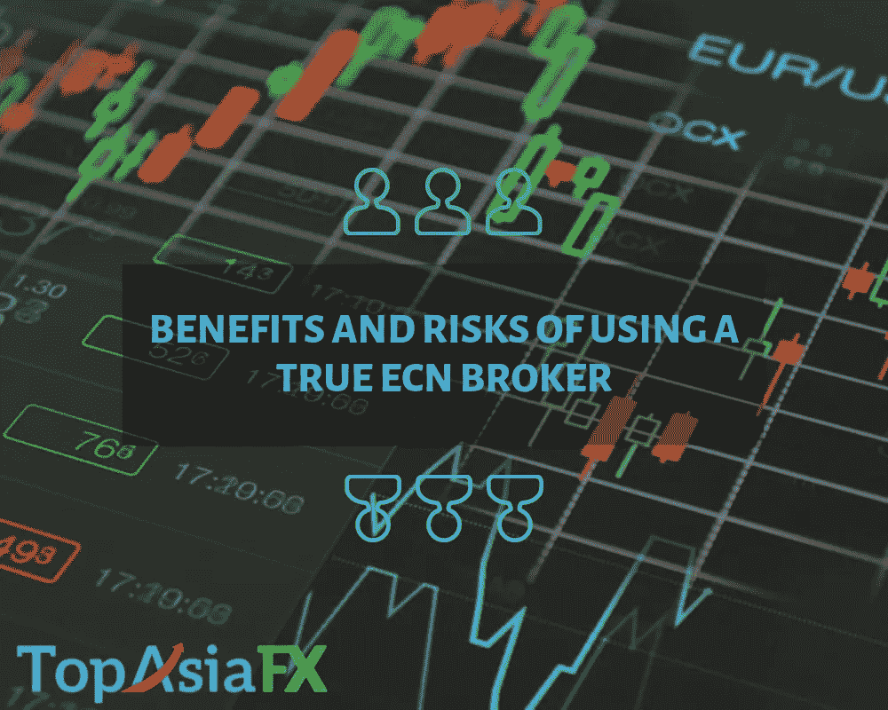

# 使用真正的 ECN 经纪人有什么好处和风险？

> 原文：<https://medium.datadriveninvestor.com/what-are-the-benefits-and-risks-of-using-a-true-ecn-broker-617caece3dfa?source=collection_archive---------2----------------------->

The Benefits And Risks Of Using A True ECN Broker

外汇或外汇交易现在是在线交易行业的顶峰。几乎每秒钟都有许多人加入外汇交易。所以，我的问题是—

你打算投资外汇吗？

如果是这样，那么你需要做的第一件事就是选择最适合你业务需求的经纪人。外汇交易利润丰厚，吸引了如此多的经纪人，以至于你不知道该从他们中选择哪一个。

 [## 机器学习的外汇交易挑战|数据驱动的投资者

### 机器学习是人工智能的一个分支，之前占据了很多头条。人们是…

www.datadriveninvestor.com](https://www.datadriveninvestor.com/2019/02/18/the-challenge-of-forex-trading-for-machine-learning/) 

在搜索[最佳外汇经纪人](https://www.topasiafx.com/)时，大多数人通常会查看佣金、利差、交易商的声誉等。，但理想情况下，你的出发点应该是验证公司经纪使用的商业模式。

*比如公司是做市商还是 ECN？*

**ECN 外汇经纪商**

有两种主要类型的货币经纪人提供交易者和投资者进入外汇市场使用完全不同的商业模式。

他们是 ECN 和做市商。ECN 经纪人(电子通信网络)是一种外汇经纪人，使用 ECN 操作员直接连接到银行间流动性提供商，如银行、对冲基金和共同基金。

他们也被称为非交易柜台经纪人，这意味着你的订单将被直接发送给流动性提供者，而不需要市场领导者的帮助。ECN 经纪人。

不像做市商在你交易的另一边，ECN 经纪人在市场参与者之间匹配你的交易，这意味着他们不能与你谈判。

他们从你的交易量中收取佣金，这意味着他们希望你赢，这样他们就能获利。

这就是 ECN 经纪人被认为是那里最纯粹的货币交易者的原因。

**与外汇经纪人合作的好处是真实的 ECN**

**1。完全匿名**

使用真正的 ECN 经纪人的一个优势是，他们提供了比市场领导者更大程度的匿名性。

这意味着，作为一个交易者，你将能够利用中性价格和实际市场情况反映在业务中。

此外，根据您的战略、战术或当前的市场地位，不会对中性价格有任何偏见。

有了真正的 ECN 经纪人，你还可以利用多种技术，如紧密价差的有效性和交易的快速执行速度。

**2。更可靠**

关于金融投资，你想把你的血汗钱委托给一个诚实可信的经纪人，这样你就可以最大限度地利用你的投资。

ECN 经纪人比市场的领导者更可靠有几个原因。

ECN 经纪人使用最新的技术来确保交易执行快速和无缝，并提供最佳的市场价格和可承受的差价。

他们通过对你的交易量收取佣金来获利，这意味着他们希望你赢。

它们为交易员提供了直接进入银行间市场的渠道，这样他们就可以讨论实际的市场价格。

正是因为这种诚实和透明，ECN 券商比做市商更有需求。

**3。接触流动性提供者**

如前所述，ECN 经纪人为客户提供了直接接触流动性提供者的渠道，包括银行和其他机构投资者。

因此，交易者能够与高度合格的、有竞争力的和受监管的金融机构的国际流动性池进行交易。这保证了订单价格的快速执行。

**4。干扰更少**

这可能是使用真正的 ECN 经纪人的最大优势。大多数 ECN 经纪人以知识渊博、值得信赖和可靠而闻名。

原因是他们不需要交易柜台的帮助，这意味着他们在处理客户订单时比市场官员更灵活。

这种灵活性使 ECN 经纪人能够不受干扰地执行客户的订单。

**与真正的 ECN 经纪人合作的风险**

与 ECN 经纪人合作的风险很小，存在的风险主要影响小散户。使用真正的 ECN 经纪人的两个缺点你应该记住。

**1。可变利差**

ECN 经纪人提供可变利差，这通常是由当前的市场条件决定的。

有时，这些差异可能会发生巨大变化，尤其是当波动性较高时，这可能会影响您的交易策略并影响您的未平仓头寸。

**2。交易成本可能很高**

与一个真正的 ECN 经纪人合作，直接将你与包括主要金融机构在内的市场参与者联系起来，代价是巨大的。

其中之一是在真正的 ECN 外汇经纪人处开立账户所需的初始投资。一些经纪人还收取每笔交易高达 3.50 美元的佣金，这对零售外汇交易员来说可能是不可持续的。

**总之**

当使用 ECN 外汇经纪人作为 IC 市场有很多好处，也有一些值得注意的风险作为一个交易者，你应该记住。

财务实力有限的小型零售交易商可能很难使用真正的 ECN 经纪商，而更喜欢做市商。

然而，如果你的预算允许，ECN 经纪人是最好的，如果你想在外汇市场赚一些真钱。