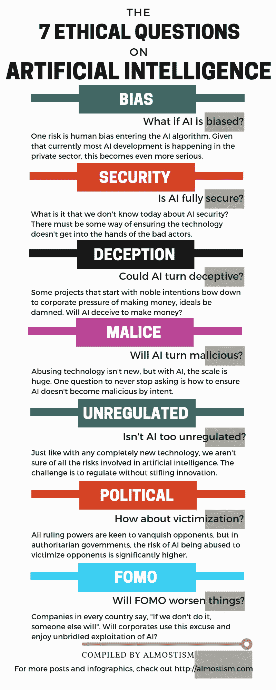

# 人工智能会带来哪些道德风险(信息图)

> 原文：<https://medium.datadriveninvestor.com/what-are-the-ethical-risks-we-run-with-ai-infographic-c88498c34c02?source=collection_archive---------3----------------------->

人工智能(AI)既令人兴奋又令人害怕，因为它有潜力，也因为缺乏正确的监管环境。

一方面，世界上一些最有价值的初创企业(私营部门)正在进入人工智能领域。另一方面，政府无法充分理解人工智能可能产生的影响，因此没有太多的法规来确保人工智能不会成为弗兰肯斯坦。

这里有一个信息图，问了 7 个关于人工智能的伦理问题。

1.  **AI 有偏差怎么办？**

一个风险是人工智能算法中的人类偏见。鉴于目前大多数人工智能开发都发生在私营部门，这变得更加严重。

 [## 人工智能预测:“颠覆，然后是生产力”——数据驱动的投资者

### 人们越来越担心，随着机器学习和互联网的普及，所有白领工作都将消失

www.datadriveninvestor.com](https://www.datadriveninvestor.com/2018/08/06/ai-forecast-disruption-then-productivity/) 

**2。AI 是否完全安全？**

关于人工智能安全，我们今天不知道的是什么？必须有某种方法来确保技术不会落入坏人之手。

**3。AI 会骗人吗**

一些以高尚的意图开始的项目屈服于公司赚钱的压力，让理想见鬼去吧。AI 会骗人赚钱吗？

**4。AI 会转恶意吗？**

滥用技术并不新鲜，但对于人工智能，规模是巨大的。一个问题

永远不要停止询问如何确保人工智能不会变得恶意。

**5。AI 是不是太不规范了？**

就像任何全新的技术一样，我们不确定人工智能涉及的所有风险。面临的挑战是在不扼杀创新的情况下进行监管。

**6。受害情况如何？**

所有执政权力都热衷于征服对手，但在威权政府中，人工智能被滥用来迫害对手的风险明显更高。

**7。FOMO 会让事情变得更糟吗？**

每个国家的公司都说，“如果我们不做，别人会做”。企业会利用这个借口，享受对人工智能的肆无忌惮的开发吗？

这里有一个关于人工智能伦理问题的详细帖子。