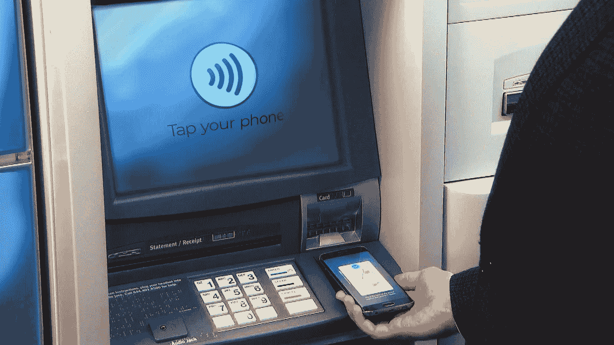
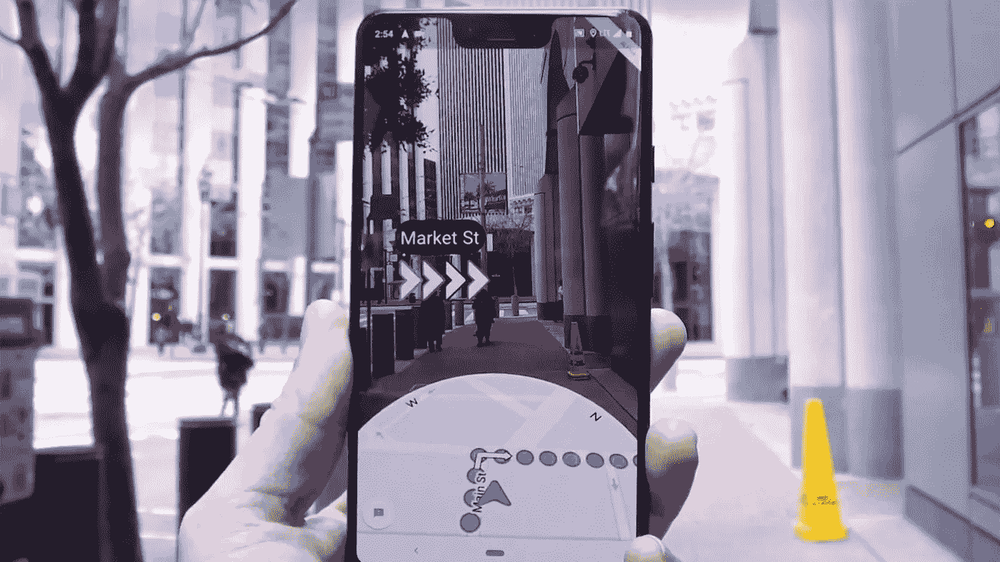

# 领先的数字银行有哪些不同之处？

> 原文：<https://medium.datadriveninvestor.com/what-are-the-leading-digital-banks-doing-differently-d61994be52fd?source=collection_archive---------2----------------------->

银行一直采取以客户为中心的运营方式，这种方式在过去 30 年里越来越受到技术的推动。

从允许客户避免排队进行简单交易的自动柜员机，到将银行带到家中的互联网，以及将银行带到任何地方的智能手机，我们已经看到客户被赋予更多功能的持续趋势。

 [## 金融科技初创公司正在颠覆全球银行业|数据驱动的投资者

### 传统的实体银行从未真正从金融危机后遭受的重大挫折中恢复过来…

www.datadriveninvestor.com](https://www.datadriveninvestor.com/2018/10/20/fintech-startups-are-disrupting-the-banking-industry-around-the-world/) 

总的来说，整个行业都在关注未来，关注什么能最好地服务于客户。然而，我认为你现在只需要四处看看，看看一些更具前瞻性的金融机构已经在做什么，就能获得灵感，了解你的客户不仅想要什么，而且很快就会要求什么。

实现转型的技术以及卓越的[客户体验](https://perspectives.mobilelive.ca/blog/why-cx-needs-ai)从未像现在这样容易获得、可行或强大。今天，我将带您了解即将成为行业标准的内容，我们将参观数字银行如何确保在走向成熟的过程中超越[客户的期望](https://perspectives.mobilelive.ca/infographics/customer-expectations)。

**全渠道**

在顾客便利的时代，曾经是美好事物的东西很快变成了必需品。无论是智能电视、平板电脑、手机、手表、汽车还是台式机，客户都希望能够随时随地进行银行业务。虽然技术使这变得越来越可行，但它也带来了新的挑战，如保持 UX 和用户通过这些渠道的旅程。数字银行让这种体验变得简单、引人入胜、持续不断。

**用户体验**

谈论以客户为中心而不触及用户体验是不可能的。和 UX，更确切地说，无缝和愉快的 UX 已成为客户的期望前进。不幸的是，这并非没有挑战。银行迎合不同的客户群，每个人都有自己的需求。这需要细致入微的工作；然而，通过直观和对话式的设计，银行在保持客户参与的同时简化了这一过程。

**无卡银行**

曾经有一段时间，没有人认为我们会看到一个无现金的世界，然而，我们在这里。今天，我们正处于另一个转变的开端，一个向无卡银行的转变，这个转变是没有人怀疑的。自动柜员机的自然演变；许多具有前瞻性思维的银行正在提供同样的体验，但没有实体卡。取而代之的是，只需简单地扫描二维码，或者轻触手机或其他智能设备，就可以在不使用借记卡或信用卡的情况下提取现金。

**P2P 支付**

个人对个人支付(P2P)是金融科技的一个蓬勃发展的领域，而且没有减弱的迹象。这些支付允许双方通过在线平台或移动应用程序，利用各自的银行账户或信用卡进行资金转移。P2P 支付被用于多种用途，从在朋友之间分摊 27 美元的午餐账单到支付房租，它正在增加价值并保持客户的参与。

**艾&分析学**

银行拥有商业中最强大的优势之一— [数据](https://perspectives.mobilelive.ca/blog/data-management)。事实上，银行坐拥大量客户数据；可用于更好地了解客户并管理其体验的数据。利用[人工智能和高级分析](https://perspectives.mobilelive.ca/blog/15-artificial-intelligence-opportunities)，银行正在利用他们已经拥有的数据，并使用这些数据主动向正确的客户展示正确的产品，不仅节省了大量的营销费用，还通过及时和相关的促销活动向现有客户进行追加销售和交叉销售。

**物联网**

想象一下，在高速公路上行驶时，只需简单地询问一下，就可以查看你的账户余额。或者打开冰箱发现没有牛奶了，却马上从冰箱屏幕上订购。当谈到[物联网](https://perspectives.mobilelive.ca/blog/smart-city-2.0)时，可能性似乎是无限的，5G 网络[即将到来，汽车、家庭、电器、可穿戴设备等联网设备的增长；银行面临着一个理想的机会，为他们的客户增加一个新的便利水平。](https://perspectives.mobilelive.ca/blog/5g-spectrum)

**增强的&虚拟现实**

随着银行将注意力转向吸引和留住下一代客户，它们必须开始利用最吸引它们的技术。对于未来和现在的几代人来说，这项技术就是 AR 和 VR。想象一下，使用增强现实引导您的客户到最近的 ATM 或虚拟现实，以令人眼花缭乱、引人入胜的视觉效果展示投资产品及其回报。与移动设备相结合，AR 和 VR 技术正在以前所未有的方式为客户提供支持，并很快在 5G 网络中成为现实。

**聊天机器人**

[聊天机器人](https://perspectives.mobilelive.ca/blog/chatbots-user-experience)在许多行业已经司空见惯，包括 BFSI；然而，为它们提供动力的技术正在不断发展，它们的能力正在增长到令人兴奋的新水平。基于人工智能和 NLP 的工具使客户能够转移资金、检查余额、支付账单、找到最佳信用卡利率或申请抵押贷款；一切都带着前所未有的轻松。

**开通银行业务**

开放银行是一种使用 API 的实践，允许第三方开发人员围绕金融机构构建应用程序和服务；比如银行，以及客户的财务数据。这有可能打开无数新产品、服务、工具和伙伴关系的大门，而这些曾经被认为是监管上不可能的。PSD2 在欧洲的实施已经表明，市场已经准备好采用开放式银行，金融科技正在利用这一点，让北美决定他们是否愿意迅速采取行动，保持客户参与，并确保他们的银行需求得到满足，不仅是现在，而且是未来几年。

很少有人会认为银行已经在技术上投入巨资；然而，最重要的是不要忽视他们为什么要这样做。技术是优秀的，但不是为了技术而技术。不要想象你能做什么，开始评估和投资你必须做的事情，从把客户和他们的期望放在第一位开始。

今天的客户甚至可能会根据他们的数字体验转换银行。关注整个客户之旅，而不是销售单一的银行产品或服务，这是势在必行的。速度和效率对客户来说很重要，他们在与数字银行打交道时的舒适度也很重要。他们必须相信他们的需求和偏好得到了满足，并且有一定程度的[个性化](https://perspectives.mobilelive.ca/blog/how-to-personalize-experiences)来满足他们的日常银行需求。将在未来几年推动客户体验的技术就在眼前，它们只等着您去利用它们。

阅读来自 mobileLIVE 的 [**原文**](https://perspectives.mobilelive.ca/blog/digital-banking)