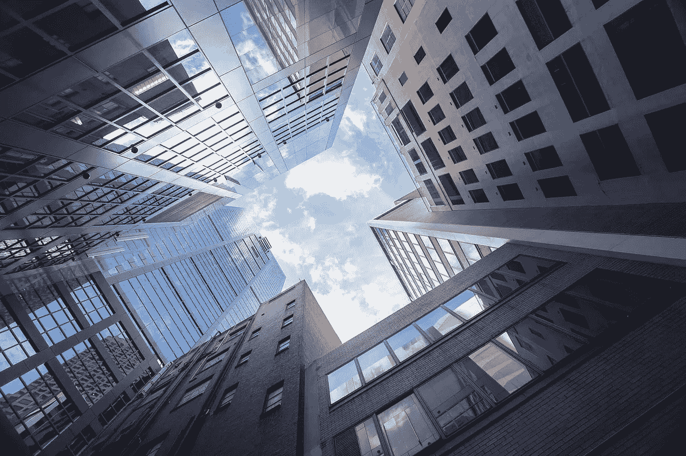

# 辛迪加收取的最常见的费用是什么？

> 原文：<https://medium.datadriveninvestor.com/what-are-the-most-common-fees-syndicators-charge-ef27dabe32f5?source=collection_archive---------2----------------------->

参与房地产辛迪加投资的被动投资者非常清楚辛迪加是做什么的。毕竟，他们亲眼目睹了他们的主要投资者是如何选择房产的，市场是如何通过数字来决定这是否是一笔好交易，以及他们是如何让贷款人为项目提供资金的。

一旦交易完成，还有更多的工作要做，因为财团不仅谈判交易和获得融资，还管理财产，直到他们出售。

所有这些加起来就是大量的艰苦工作！一般来说，辛迪加通过两种方式获得补偿:股权分割和费用。作为主要投资者，辛迪加还与参与交易的其他人一起分享房地产投资的收入。这可能包括两个主要的收入来源:租金收入，以及如果房产持有时间足够长而升值的话。

***股权分割***

股权分割意味着财产产生的收入在作为普通合伙人的辛迪加和作为有限合伙人的投资者之间进行分割。常见的股权分割是 30%-70%或 20%-80%(其中有限合伙人获得较大的股权)。

此外，每个辛迪加都从出售财产的收益中分得一份股权。它可以与财产收入的股权分割相同，也可以更高。辛迪加从收入中分得 30%-70%的股权，再加上 50%的销售收入，这种情况并不少见。

另一种股权分割形式是瀑布式，如果辛迪加设法向投资者提供一定的回报，他们将获得更高比例的股权。例如:如果投资给投资者带来 15%的 IRR，则 30%的权益；如果投资者获得 16%的 IRR，则 40%的权益。这样，辛迪加是激励最大化被动投资者的投资回报。

***银团费用***

除了股权分割之外，辛迪加通过收取辛迪加费用来补偿他们努力。在这篇文章中，我将只讨论最常见的。

***交易费用***

多家庭投资不会在一夜之间发生。事实上，辛迪加经常花费 3 到 6 个月(有时甚至更长)来寻找合适的交易。在被认为是“热门”的房地产市场尤其如此，在那里，买家愿意为投资支付过高的价格。

辛迪加的交易费通常是交易额的 1%到 3%。这将补偿他们几个月的辛苦工作。他们在寻找和获得房产的过程中也涉及到运营成本，如旅行、酒店、支付员工工资等。

***资产管理费***

虽然有些财团会在交易完成后亲自管理物业，但大多数会聘请专业的物业管理公司来处理日常管理。他们这样做有各种各样的原因。

首先，物业管理公司对市场有广泛的了解。他们知道空置率、租金结构以及哪里可以找到优质租户。第二，他们有能力处理酒店的日常运营。这包括收取租金、处理单元或物业的运营问题或维修，以及在出现问题时让有能力的分包商解决问题。

最后，他们致力于管理租户流动。在辛迪加交易中，没有什么比空置公寓更能损害现金流的了，因此物业管理公司努力让所有单元保持出租状态。

辛迪加找到物业管理公司，与他们签约并管理他们，从而获得报酬。这包括审查业务预算，以确保费用和收费与市场上其他物业管理公司一致。

辛迪加定期与物业管理公司会面，通常是每周或每月一次，以确保物业得到妥善管理。如果酒店计划进行翻新或重新定位，辛迪加会监督施工，并确保成本保持一致，所有工作都按计划完成。

银团除了管理物业管理公司，还管理投资银团。这意味着他或她定期与所有被动投资者交流投资表现。辛迪加还努力确保投资者根据他们最初的协议按时获得补偿。

资产管理费通常为有效收益的 1%至 2%，按季或按年支付。如果对该资产的被动投资者承诺了优先回报，则只有在被动投资者收到优先回报后，银团才会收取资产管理费。

***处置费***

大多数投资者在房地产辛迪加赚取收入的两个来源:租金收入和物业升值。许多房地产财团持有房产 3-5 年或更长时间，然后出售。这就是收入增值部分实现的时间。

辛迪加因管理销售过程而获得报酬。这包括执行市场分析，与经纪人合作出售财产，并监督实际销售。这项工作的报酬或处置费通常是实际售价的 1-2%。

如前所述，投资者从租金收入和房地产升值中赚取辛迪加交易的资金。那么辛迪加应该持有多久的财产？没有明确的答案。但辛迪加努力向他或她的投资者提供最佳的财务结果，如果财务状况表明有充分的理由这样做，他或她可能会持有一处房产更长时间或更快地退出。

当向投资者介绍买入并持有投资时，通常会有一个提议的持有期，但这可能会因各种因素而变化。这些因素包括房地产市场波动、人口趋势变化、建筑成本——不胜枚举。然而，预计随着时间的推移，房地产投资将会增值，这使得这些房地产成为长期财富创造的良好基础。

***汇总***

辛迪加和投资者可以从财产的收入和销售收益中获得股权分成，辛迪加通过他们的知识、经验和努力工作赚取费用。最常见的费用是交易费、资产管理费和处置费——针对财产生命周期的每个阶段；从寻找交易和谈判，到管理房产，最后出售。

**关于作者**

埃莉是蓝湖资本的创始人，这是一家专门在美国进行多户投资的房地产公司。她还是名为“[REllie happen”的每周播客的主持人？！难以置信的房地产故事](https://www.ellieyogev.com/podcast)。