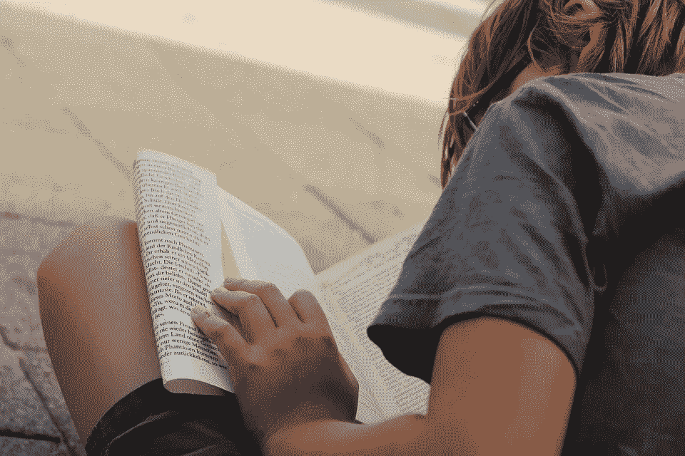

# 如果不落实到教育中，新技术有什么用？

> 原文：<https://medium.datadriveninvestor.com/what-are-the-new-technologies-for-if-they-are-not-implemented-into-education-4bf83dfb59bc?source=collection_archive---------33----------------------->

我们生活在一个“新千年”,它可以通过周围的一切看到和感受到——手里拿着智能手机的人、他们的行为、建筑、政治，甚至是值得称赞的——通过新的环境解决方案。教育系统是个例外。

当我在 1999-2008 年还是一名小学生的时候，我大部分时间都没有手机(更不用说智能手机这样的奇迹了)，我只是天真地梦想着制作无限数量照片的可能性，并且在我的口袋里有 20-Sk(大约。0.70€)，我被认为是一个大老板，因为我有能力购买我们学校自助餐一半的东西。但是十年后，事情发生了迅速的变化。毫无疑问，人们可能会拍成千上万张自拍照(只是为了保留最好的一两张)，七毛钱不够买一块口香糖，似乎不可能的事情在我们身边随处可见。我不会去想这种变化是在哪里、什么时候、以什么方式发生的。我只是问在教育领域是如何体现的。因为虽然这个世界与我童年记忆中的世界完全不同，但学校里的一切都是一样的。

现在，在我离开基础学校 10 年后，我有机会看到我 13 岁的弟弟也在这所学校上学。看着他做着和我过去完全一样的事情——背着十公斤重的背包，在没有上下文的情况下通过无意识地记忆词汇来学习语言，用石灰粉笔在黑板上写笔记，按照同样愚蠢、无效的课程学习，这些课程涉及孩子们永远不会详细使用的主题，而忽略了重要的内容。——我真的需要问:如果这些新技术没有应用到教育中，它们有什么用？

有人可能会说，我没有能力审查重要和不重要的主题，但可以判断一些事情，你需要的只是常识。例如，我记得在没有元素周期表知识的情况下(因为根据我们化学老师的说法，你不需要知道或使用元素周期表来学习化学)，没完没了地记忆化学公式名称的后缀(这仅在一种语言中是有用的——并且只有当你理解化学公式的意思时)。

虽然我并不热衷于现代带给我们生活的一切，但我认为我们绝对应该利用它提供的好东西。为什么不通过保存教科书来挽救孩子们的脊柱呢？pdf 格式？Duolingo 作为额外的语言教育代替冗长的家庭作业有什么问题？此外，今天所有的孩子都有智能手机。在我以前的学校，老师不利用它的方便和有益的功能，甚至不允许孩子拍下他们的考试照片(在家里回顾他们做错了什么)！这种对现代技术的拒绝真的是一种非常具体的保护儿童的方式吗？或者这只是前共产主义教师顽固的蒙昧主义，他们拒绝放松过时的教学、辅导、领导…生活的方法？

不是所有新的都是好的，也不是所有旧的都是坏的。但尽管如此，我认为没有理由让孩子们感到厌烦，因为已经发明了这么多有趣的方式来教他们(为什么只有那些把工作视为使命的人才应该当老师)，这是有逻辑的， 没有理由仅仅为了保留过去的遗迹而否认新技术的优势，也没有理由仅仅因为“我们年轻的时候情况更好”，就教授在当今世界没有用的旧东西，而忽视新东西(有人真的应该开始考虑在学校实施金融教育)，完全以旧方式进行。 也许到那时，就不会有 IT 教师一直只学习 Excel 的基础知识(当学生比他们的老师有更好的知识时，这是一种耻辱)，不会有年轻时脊柱弯曲的问题，也不会有“把计算机上而不是手写的项目带给我，你会得到 F-但如果我不能阅读它，你也会得到 F”。

当然，新技术是一件伟大的事情。它们拯救生命，使我们以前做梦也想不到的事情成为可能。但是，既然一切都始于教育，而没有快速有效地——通过可能经常是实验性地——将它实施到学校系统中，为什么还要费心去尝试和发明一些东西，只是把它们留在一个假设的层面上呢？

“Bring me that project written on computer and not by hand and you’ll get F — but if I won’t be able to read it, you’ll get F too!” Photo: Pixabay.com