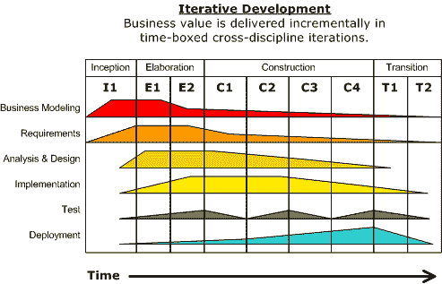
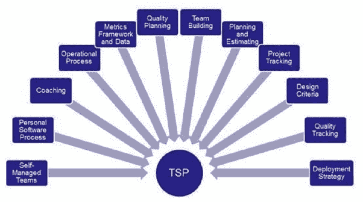
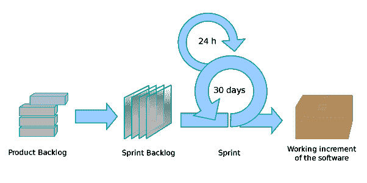

# 在敏捷项目中工作的利弊是什么？

> 原文：<https://medium.datadriveninvestor.com/what-are-the-pros-and-cons-of-working-in-agile-projects-36a2f26800c6?source=collection_archive---------10----------------------->

为了更好地理解答案，让我们先来看一些历史。

软件开发自 20 世纪 60 年代初就存在了。那时软件的创建方式是完全不同的，正式的方法在那时是有意义的，因为它们是为那种开发而创建的。需要很多开发人员来编写代码，项目需要很多时间。它很贵，只有大公司才有能力负担得起。重量级的方法。

但是，到了 20 世纪 80 年代，事情发生了变化，个人电脑发明了，新的语言出现了。现在你不需要一大群软件开发人员来开发软件，也不需要又大又贵的机器。团队现在小了很多，因为一切都简化了，很快每个人都意识到现在旧的软件开发方式已经过时了，而且是多余的。

这是开发人员的认识，在 20 世纪 90 年代，许多轻量级软件开发方法在流行的重量级方法的反应中发展起来，如[快速应用开发(RAD](https://en.wikipedia.org/wiki/Rapid_application_development) )、[动态系统开发方法](https://en.wikipedia.org/wiki/Dynamic_systems_development_method) (DSDM)、 [Scrum](https://en.wikipedia.org/wiki/Scrum_(software_development)) 、Crystal、[极限编程](https://en.wikipedia.org/wiki/Extreme_programming) (XP)和[特性驱动开发](https://en.wikipedia.org/wiki/Feature-driven_development) (FDD)。尽管这些都起源于敏捷宣言出版之前，但是现在它们被统称为敏捷软件开发方法

2001 年，17 名软件开发人员在犹他州雪鸟的一个度假胜地聚会，讨论这些轻量级开发方法，其中包括肯特·贝克、沃德·坎宁安、迪夫·托马斯、杰夫·萨瑟兰、肯·施瓦伯、吉姆·海史密斯、阿利斯泰尔·考克伯恩和鲍伯·马丁。他们一起发表了敏捷软件开发宣言。

目前最常用的工作方式是 Scrum 或[看板](https://en.wikipedia.org/wiki/Kanban_(development))，对于软件开发团队来说，他们工作得很好，因为它消除了以前的正式方法所具有的所有官僚作风，例如，IBM 的[Rational Unified Process(RUP)](https://en.wikipedia.org/wiki/Rational_Unified_Process)，这是一种目前仍在使用的正式方法，表明开发软件需要许多不同的角色和许多不同的过程。

[TSP](https://en.wikipedia.org/wiki/Team_software_process) / [PSP](https://en.wikipedia.org/wiki/Personal_software_process) ，其他被创建来一起使用的正式方法有更少的过程和角色，我实际上很喜欢它们，但是它们负载了大量的度量。

另一方面，像 scrum 这样的敏捷方法消除了所有这些，并通过简化软件过程来关注软件开发，使得软件项目用更少的人持续更少的时间。例如，这就是 scrum 过程。

所以，这就是软件方法论的魅力，更少的时间，更少的人和更低的难度，但是这是有代价的。

敏捷方法没有很多正式方法所具有的安全特性。被忽视的、大量的需求/故事和没有经验的开发人员很容易使项目失败。

此外，由于敏捷方法没有设计阶段，对于长期项目来说，缺乏这方面的规划使得它们随着时间的推移更加难以实现故事，因为它需要大量的代码来重构。项目越大，就越难改变大量代码来适应一个故事。

许多人捍卫他们不关注这个计划的权利，因为敏捷并不鼓励他们，但有趣的是他们也不禁止他们。

我已经看到，从正式的方法学中借用好的实践和模型会产生偏差，但是敏捷正统认为这是一种罪恶。有一次，我没有得到一份工作，因为我在面试中说我混合使用了敏捷和正式的方法，面试官觉得我没有资格领导一个项目。

所以，我认为敏捷方法很棒，但是你需要学习正式方法所代表的原则，不断改进你的工作方式，即使你觉得你已经很擅长了。

对于大型复杂的项目，我仍然推荐使用正式的方法，因为它们降低了项目失败的风险。许多人说他们不工作，但是他们真正说的是他们没有被适当地训练去使用那些方法。

[Kobu 机构](https://unsplash.com/photos/7okkFhxrxNw?utm_source=unsplash&utm_medium=referral&utm_content=creditCopyText)在 [Unsplash](https://unsplash.com/search/photos/software?utm_source=unsplash&utm_medium=referral&utm_content=creditCopyText) 上拍摄的照片