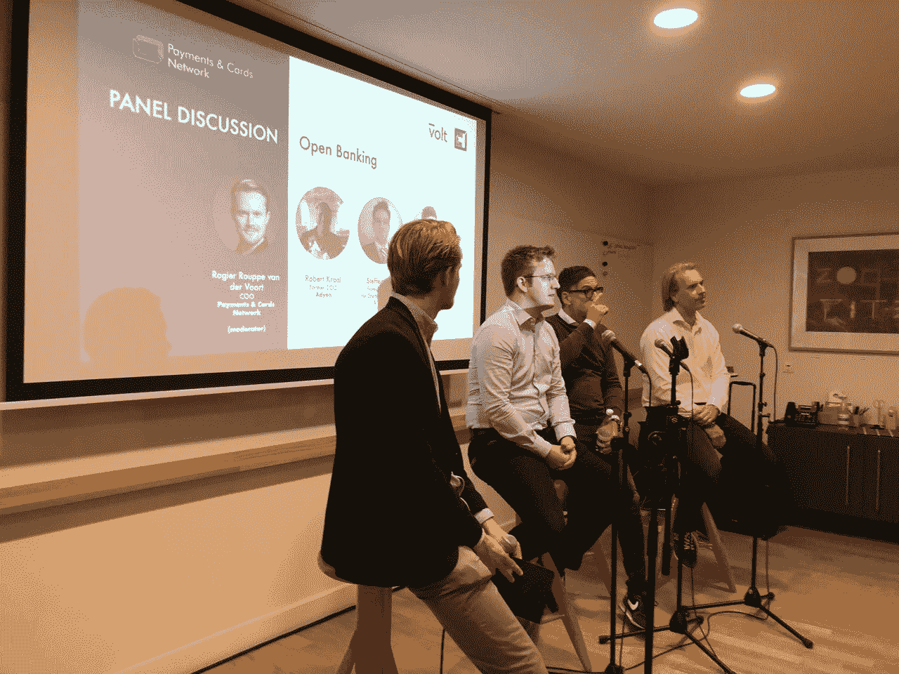

# 欧洲银行业开放带来的利弊、机遇和挑战是什么？

> 原文：<https://medium.datadriveninvestor.com/what-are-the-pros-cons-opportunities-and-challenges-brought-by-open-banking-in-europe-99657d27c107?source=collection_archive---------0----------------------->

# 支付和信用卡网络行业会议的主要收获:开放银行业务

Our panel discussion moderated by Rogier Rouppe van der Voort, COO at Payments & Cards Network, with speakers from the Executive Board of Volt, including Robert Kraal, former COO of Adyen, Tom Greenwood, Founder of IFX Payments and Steffen Vollert, Independent Fintech Consultant.

2019 年 4 月 24 日，[Payments&Cards Network](https://www.teampcn.com/)在其阿姆斯特丹总部附近的 Spaces Herengracht 举办了一场非常成功的新一届行业会议。围绕开放银行的话题，我们很荣幸地邀请到开放银行支付平台 [**【伏特】**](https://www.getvolt.io/)[**免费女孩**](https://www.freeagirl.nl/en/) 作为我们的慈善合作伙伴。

我们在支付&卡网的罗吉尔·鲁普·范德沃特、首席运营官主持下，就开放银行业务进行了一次富有成果和深入的小组讨论，发言人来自 Volt 的执行董事会，包括**罗伯特·克拉尔、** [**阿德延**](https://www.adyen.com/) **的前首席运营官、** [**支付**](https://www.ifxpayments.com/) **的创始人汤姆·格林伍德和独立金融科技顾问斯特芬·沃勒特**

 [## 金融科技初创公司正在扰乱世界各地的银行业-数据驱动的投资者

### 传统的实体银行从未真正从金融危机后遭受的重大挫折中恢复过来…

www.datadriveninvestor.com](https://www.datadriveninvestor.com/2018/10/20/fintech-startups-are-disrupting-the-banking-industry-around-the-world/) 

开放银行业务是支付服务指令 2 (PSD2)的一部分，是这一代金融监管变革中最具变革性的一项。PSD2 背后的整个使命是创造一个公平的竞争环境，推动创新和客户选择。法律规定该法案将于 2019 年 9 月 14 日生效，由两个主要部分组成:

1.  **账户信息服务提供商(aisp)**:aisp 的企业必须提供一个 API 并将其公之于众，以便任何其他机构能够在用户明确同意的情况下访问用户的账户信息
2.  **支付启动服务提供商(pisp)**:作为 pisp 的企业被授权代表客户进行支付。PISPs 通过使用银行自己的工具直接向付款人的银行账户转账或从付款人的银行账户转账来实现这一点

除了介绍 Volt 提供的开放式银行支付服务之外，我们的小组发言人还讨论了围绕开放式银行的关键问题，包括这一革命性法规带来的利弊、潜在机遇和挑战。通过观众和演讲者之间高度互动的讨论，以下是一些关键要点:

*   开放银行业务不仅仅发生在欧洲，类似的规定也在全球范围内展开，如美国、加拿大、日本、澳大利亚等国家。例如，中国有自己的国家支付网关(NPG)，这是一个类似于开放银行的框架，由支付宝的创始人马云发起。
*   对于那些创建一个中间层来连接所有银行的第三方提供商(TPP)来说，由于市场结构不同，在执行监管的难易程度上可能会有所不同。例如，与德国和波兰相比，荷兰的银行数量有限，可能更容易实施，德国是一个非常分散的市场，波兰是一个相当封闭的高端市场，有着自己的解决方案。
*   随着银行业的开放，它为初创公司和现有公司创造了大量机会，让它们思考围绕 AISP 和 PISP 建立的新商业模式。这也使他们能够迅速扩展到欧洲，因为基本上整个欧盟的法规都是一样的。

> -一些公司专注于改善 AISP 和 PISP 的支付体验，以创建一种新的支付方式，该方式具有自己的国家/地区规则，使支付过程更简单、更便宜、更方便消费者
> 
> -一些公司专注于汇总不同银行账户的账户信息，以提供一系列不同的服务:
> 
> 1.提供所有账户余额的单一概览，并使用这些信息建议更好的优惠，例如关于客户的经常性付款
> 
> 2.专注于财务管理，例如，通过分配预订和对资金进行优先排序来管理用户的支出、成本和节约，以避免预算超支

*   新公司可能具有优势，因为它们不受旧基础设施的束缚，可以灵活地满足客户的需求。有许多年轻的公司专注于开发一种新工具，在某个时候，这些公司可能会合并以提供涵盖法规所启动的各种功能的产品。另一方面，现有的支付公司应该研究如何从监管中受益，要么为客户/零售商提供更多服务，要么降低内部/外部成本。

*   开放银行业务也带来了潜在的障碍，特别是在监管方面，监督系统的运作和功能，并确保公司以适当的服务水平获得信息技术，例如，银行应如何达到它们应达到的标准？银行如何审批 TPP？在消费者方面，由于越来越多的公司可以访问他们的数据，消费者有权知道许多方面，例如，谁实际上在监控这些信息？这些监测的质量如何？那些等等的安全标准是什么？
*   风险也可能会向银行转移，因为银行将负责投资和安全监控方面的大型基础设施项目，以促进支付启动，这在一定程度上有助于了解客户(KYC)和反洗钱。银行和 TPP 之间的责任需要探讨，在某个时候需要进行监管调整。
*   有了 TPP 作为中介，银行就进一步远离了负责直接客户关系的客户，这意味着银行需要重新思考一些问题，比如:如何交叉销售自己的产品以盈利？如何更好的了解客户？当交易没有全部数据或数据通过中介时，如何对交易运行风险模型？因此，银行需要重新评估或改进整个风险调节流程，包括需要根据 PSD2 处理强客户认证(SCA)。
*   由于消费者习惯于他们现有的支付方式，改变支付行为无疑是困难的。由于不同市场的支付行为不同，开放银行业务对消费者行为的影响因国家而异。例如，一些市场会相对容易，因为在智能支付方面竞争较少。尽管其他市场已经有了相当不错的产品，但要获得充分的吸引力可能会更复杂，公司可能必须向消费者提供额外的东西。因此，零售商面临的挑战之一是如何说服消费者使用基于开放银行的更便宜的支付方式，而不是他们现有的方式。

## 对于那些有兴趣参与我们未来活动的人，请点击这里加入我们的 Meetup 群组[！](https://www.meetup.com/paymentsandcardsnetwork/)