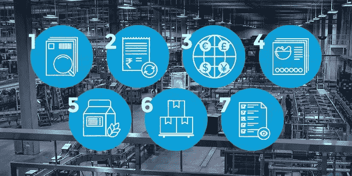

# 餐饮企业 ERP 软件的 7 大必备功能是什么？

> 原文：<https://medium.datadriveninvestor.com/what-are-the-top-7-must-have-features-of-f-and-b-business-erp-software-42cc465f015a?source=collection_archive---------7----------------------->

你不应该依赖过时的商业分析和计划方法。规划是任何组织或企业中最重要的过程之一。你应该考虑 ERP(企业资源规划)系统，它可以帮助公司达到，甚至超过组织目标。

为了在当今市场中保持竞争力，自动化和数字化转型需要快速发展。不管组织的规模如何，最重要的是业务的功效、实现结果的效率以及实现这些结果所涉及的成本。

 [## 2019 年即将改变世界的技术|数据驱动的投资者

### 很难想象一项技术会像去年的区块链一样受到如此多的关注，但是……

www.datadriveninvestor.com](https://www.datadriveninvestor.com/2019/01/17/the-technologies-poised-to-change-the-world-in-2019/) 

ERP 是一个完整的业务管理系统，帮助组织管理其当前和未来的规划、会计、客户、供应商、人力资源和所有业务运营。企业资源规划系统的实施是一个漫长、费力的过程。然而，一旦实施完成并且您的业务在系统企业资源规划 ERP 上运行，回报(或 ROI)就显而易见了。

一个好的 ERP 会把你所有的业务流程都集中在一个单一的框架下。一个好的 ERP 会让你有能力做出聪明、明智和及时的决定。一个好的 ERP 将为你提供你所需要的数据和业务各个方面的可见性，从而允许适当的分析、计划和管理。

没有真正通用的 ERP 系统。但是，一个好的 ERP 也将足够灵活，允许您配置系统，以适应组织的要求。

# 餐饮 ERP 软件的 7 个必备功能

食品和饮料行业是全球增长最快的行业之一。然而，随着技术和客户期望的不断变化，它面临着许多挑战。如果您能有一个解决端到端挑战的集成解决方案，它将帮助企业更快地发展。

如果您计划自动化您的流程并以无与伦比的体验吸引客户，那么这是选择 ERP 解决方案的最佳时机。这是餐饮 ERP 软件的功能清单，请看一下。

*   **通用或行业专用:**

市场上有很多提供多样化服务和成本计算的 ERP 供应商。在选择 ERP 软件之前，请确保它是针对您的业务的。

*   **批次跟踪和可追溯性:**

在快速发展的 F&B 行业，批次跟踪和可追溯性是建立和维护消费者信任的重中之重。确保你的 ERP 支持供应链的实时可见性。它应该同步采购订单、提货单、标签和运输文件。

*   **法规和客户审计:**

全球贸易标准并不一致。随着业务扩展到多个国家和地区，it 应该支持多语言和多币种交易。如果您当前的系统不支持全球贸易和税收法规，这可能会给可伸缩性造成障碍。确保您的 ERP 符合全球会计、财务和税务标准。

*   **配方和配料管理:**

如果您的系统断开连接，食谱和配料管理可能会变得困难。一个维护良好的食谱和配料管理系统将保存多个食谱的记录。它允许创建新的配方、配方开发、文档和生产说明，以有效保持质量。

*   **食品标签:**

一个高效的以餐饮为中心的 ERP 平台可以自动生成标签。该平台可以维护营养数据，包括成分和过敏原信息。从今以后，公司可以自动化流程，节省时间，减少人为错误。

*   **库存管理:**

不管规模如何，库存管理是食品和饮料行业的首要因素。库存太多会花钱，库存太少会影响客户体验。正确的库存管理系统:

1.  集成仓库管理系统
2.  跟踪并保持适当的库存水平
3.  消除浪费
4.  避免生产过剩，实现高效运营

*   **质量控制:**

质量是 F&B 工业的最终目标。特定于行业和定制的 ERP 可确保实时数据可视化，从而做出更好的决策。它利用合适的工具来跟踪、报告、记录和遵守法规，以建立忠诚度并提高客户的偏好和期望。

# NetSuite 如何帮助餐饮业务？

许多 F&B 企业在拼凑拼凑的应用程序来运行业务时面临挑战。面向食品和饮料行业的 NetSuite Cloud ERP 是同步组织各个部门和自动化底线流程的最佳解决方案。它包括:

1.  优化供应链
2.  定制销售周期
3.  全渠道卓越

有关 NetSuite 实现的相关查询，请联系*[***Amzur Technologies。***](https://amzur.com/contact/)*